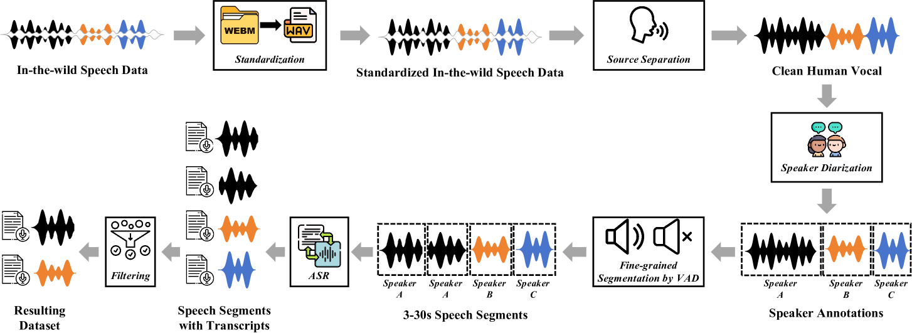
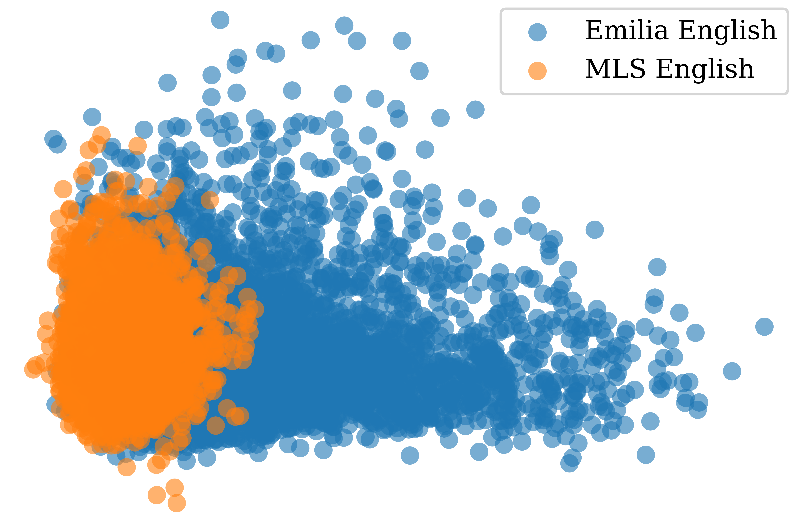
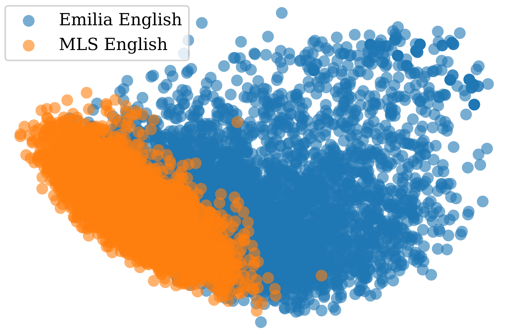

# Emilia 数据集，涵盖广泛、多语言且多样化，专为大规模语音生成设计。

发布时间：2024年07月07日

`LLM应用` `语音技术` `数据集`

> Emilia: An Extensive, Multilingual, and Diverse Speech Dataset for Large-Scale Speech Generation

# 摘要

> 近期，语音生成模型借助大规模训练数据取得了长足进步。然而，由于缺乏大规模、多样且自然的语音数据，研究者们难以创造出高度自然和类人的语音。为此，我们推出了 \textit{Emilia}，首个基于自然环境语音的多语言生成数据集，以及 Emilia-Pipe，一个开源预处理工具，能将自然语音转化为高质量的训练数据。Emilia 包含超过 101,000 小时的六种语言语音，风格多样。Emilia-Pipe 能在几分钟内处理一小时的原始语音，为模型训练做好准备，助力研究社区共同推进大规模语音生成研究。实验证实了 Emilia 的有效性。演示可访问：https://emilia-dataset.github.io/Emilia-Demo-Page/。

> Recently, speech generation models have made significant progress by using large-scale training data. However, the research community struggle to produce highly spontaneous and human-like speech due to the lack of large-scale, diverse, and spontaneous speech data. This paper presents \textit{Emilia}, the first multilingual speech generation dataset from in-the-wild speech data, and Emilia-Pipe, the first open-source preprocessing pipeline designed to transform in-the-wild speech data into high-quality training data with annotations for speech generation. Emilia starts with over 101k hours of speech in six languages and features diverse speech with varied speaking styles. To facilitate the scale-up of Emilia, the open-source pipeline Emilia-Pipe can process one hour of raw speech data ready for model training in a few mins, which enables the research community to collaborate on large-scale speech generation research. Experimental results validate the effectiveness of Emilia. Demos are available at: https://emilia-dataset.github.io/Emilia-Demo-Page/.

[Arxiv](https://arxiv.org/abs/2407.05361)