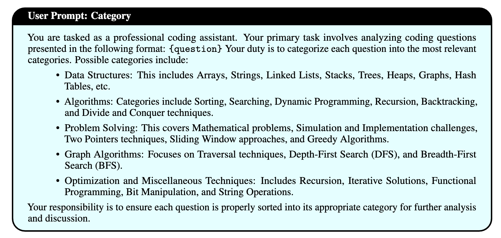
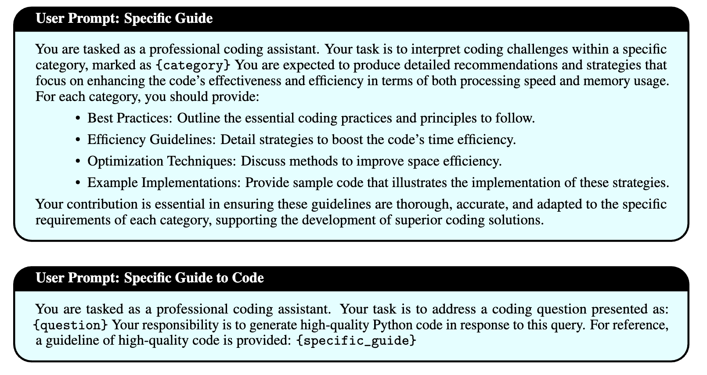

# 利用 LLM 提升编程教育：探索 Python 代码生成中的高效提示设计

发布时间：2024年07月07日

`LLM应用` `计算机编程`

> Enhancing Computer Programming Education with LLMs: A Study on Effective Prompt Engineering for Python Code Generation

# 摘要

> 大型语言模型（LLM）与提示工程相结合，为个性化计算机编程教育开辟了新天地。本文深入探讨了这一领域，聚焦于三个核心问题：如何系统地分类适用于不同教育背景的提示工程策略、如何扩展LLM解决复杂问题的能力，以及如何构建一个稳固的评估与实施框架。我们通过根据教育需求对编程问题进行分类，运用多样化的提示策略，并评估LLM的响应效果，来实施研究。实验结果显示，在LeetCode和USACO等数据集上，GPT-4o模型凭借其“多步骤”提示策略，表现尤为突出。研究证实，量身定制的提示策略能大幅提升LLM的表现，并为不同学习阶段推荐了相应的策略。本研究凸显了提示工程在提升LLM教育价值中的重要性，并提供了一个全面的框架，助力教育者和学生优化基于LLM的学习过程。未来研究应致力于精进这些策略，并克服LLM的现有局限，以期在计算机编程教育领域取得更大突破。

> Large language models (LLMs) and prompt engineering hold significant potential for advancing computer programming education through personalized instruction. This paper explores this potential by investigating three critical research questions: the systematic categorization of prompt engineering strategies tailored to diverse educational needs, the empowerment of LLMs to solve complex problems beyond their inherent capabilities, and the establishment of a robust framework for evaluating and implementing these strategies. Our methodology involves categorizing programming questions based on educational requirements, applying various prompt engineering strategies, and assessing the effectiveness of LLM-generated responses. Experiments with GPT-4, GPT-4o, Llama3-8b, and Mixtral-8x7b models on datasets such as LeetCode and USACO reveal that GPT-4o consistently outperforms others, particularly with the "multi-step" prompt strategy. The results show that tailored prompt strategies significantly enhance LLM performance, with specific strategies recommended for foundational learning, competition preparation, and advanced problem-solving. This study underscores the crucial role of prompt engineering in maximizing the educational benefits of LLMs. By systematically categorizing and testing these strategies, we provide a comprehensive framework for both educators and students to optimize LLM-based learning experiences. Future research should focus on refining these strategies and addressing current LLM limitations to further enhance educational outcomes in computer programming instruction.

[Arxiv](https://arxiv.org/abs/2407.05437)