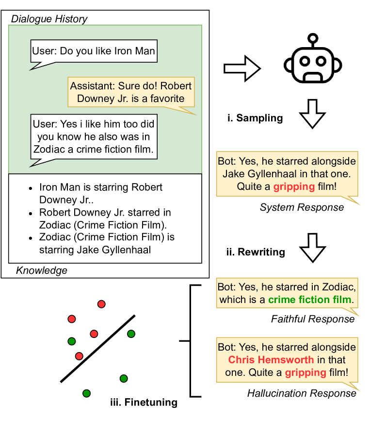

# 利用基于扰动的合成数据生成技术，提升系统响应中幻觉检测的效能。

发布时间：2024年07月07日

`LLM应用` `人工智能`

> Enhancing Hallucination Detection through Perturbation-Based Synthetic Data Generation in System Responses

# 摘要

> 检测 LLM 输出中的幻觉至关重要，但传统微调方法因昂贵且迅速过时的标注过程而受阻。本研究提出一种新方法，通过重写系统响应自动生成忠实与幻觉输出。实验显示，微调后的 T5-base 模型在准确性与速度上均优于现有技术，证明了我们方法的有效性。

> Detecting hallucinations in large language model (LLM) outputs is pivotal, yet traditional fine-tuning for this classification task is impeded by the expensive and quickly outdated annotation process, especially across numerous vertical domains and in the face of rapid LLM advancements. In this study, we introduce an approach that automatically generates both faithful and hallucinated outputs by rewriting system responses. Experimental findings demonstrate that a T5-base model, fine-tuned on our generated dataset, surpasses state-of-the-art zero-shot detectors and existing synthetic generation methods in both accuracy and latency, indicating efficacy of our approach.

[Arxiv](https://arxiv.org/abs/2407.05474)