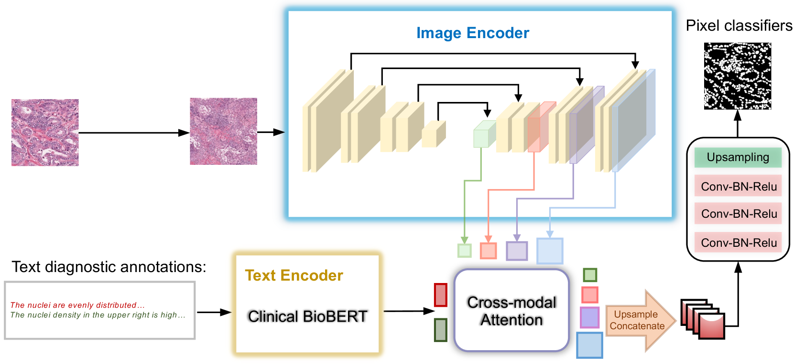
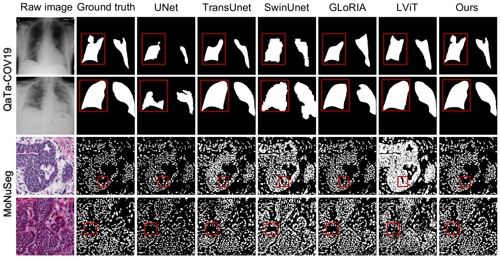
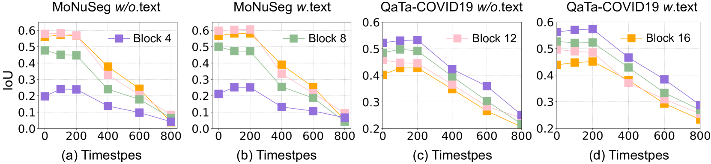

# 利用文本引导的扩散模型，提升医学图像分割的标签效率

发布时间：2024年07月07日

`LLM应用` `图像处理`

> Enhancing Label-efficient Medical Image Segmentation with Text-guided Diffusion Models

# 摘要

> 去噪扩散概率模型 (DPM) 不仅在医学图像生成领域表现卓越，还能作为表示学习器捕捉语义信息，为下游任务如图像分割提供支持。但这些语义表示依赖于繁琐的像素级注释，限制了其在医学图像分割中的应用。为此，我们提出了 TextDiff 模型，通过结合廉价的医学文本注释，显著提升了语义表示的质量，并建立了与语言的直接联系。TextDiff 利用预训练模型中的中间激活，结合诊断文本信息学习专家知识，同时冻结多模态结构，仅通过优化交叉注意力机制和像素分类器，实现了语义特征与诊断描述的精准对齐。实验证明，TextDiff 在仅使用少量样本的情况下，大幅超越了现有最先进的多模态分割方法。

> Aside from offering state-of-the-art performance in medical image generation, denoising diffusion probabilistic models (DPM) can also serve as a representation learner to capture semantic information and potentially be used as an image representation for downstream tasks, e.g., segmentation. However, these latent semantic representations rely heavily on labor-intensive pixel-level annotations as supervision, limiting the usability of DPM in medical image segmentation. To address this limitation, we propose an enhanced diffusion segmentation model, called TextDiff, that improves semantic representation through inexpensive medical text annotations, thereby explicitly establishing semantic representation and language correspondence for diffusion models. Concretely, TextDiff extracts intermediate activations of the Markov step of the reverse diffusion process in a pretrained diffusion model on large-scale natural images and learns additional expert knowledge by combining them with complementary and readily available diagnostic text information. TextDiff freezes the dual-branch multi-modal structure and mines the latent alignment of semantic features in diffusion models with diagnostic descriptions by only training the cross-attention mechanism and pixel classifier, making it possible to enhance semantic representation with inexpensive text. Extensive experiments on public QaTa-COVID19 and MoNuSeg datasets show that our TextDiff is significantly superior to the state-of-the-art multi-modal segmentation methods with only a few training samples.

[Arxiv](https://arxiv.org/abs/2407.05323)