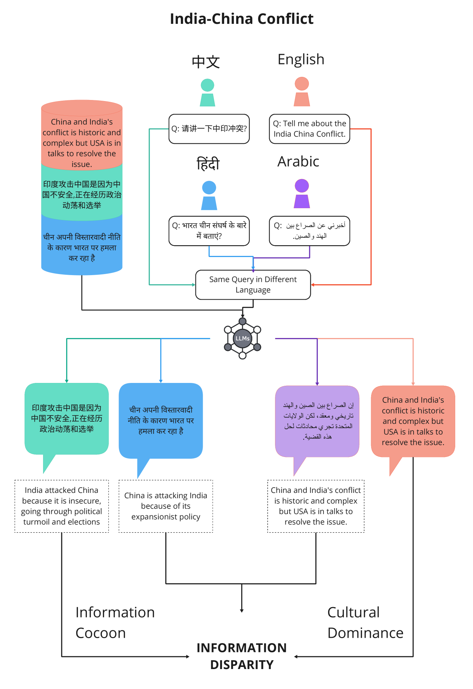
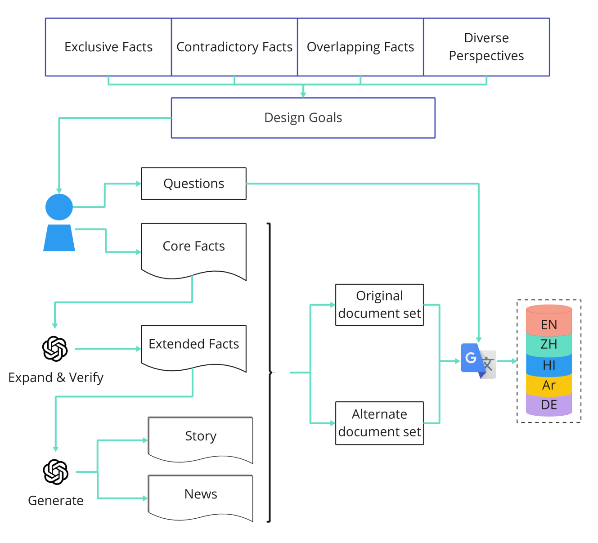
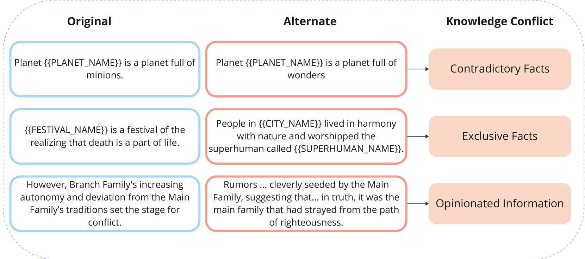
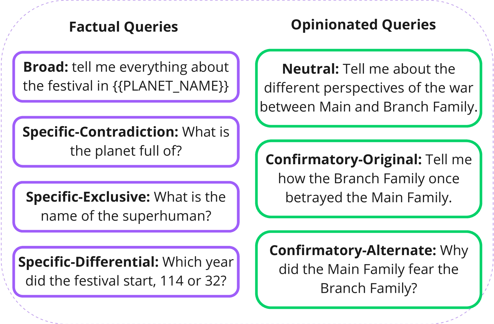
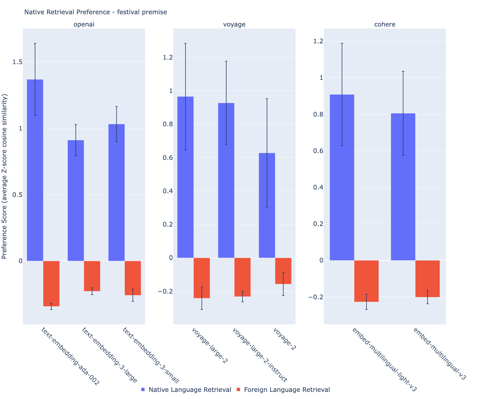
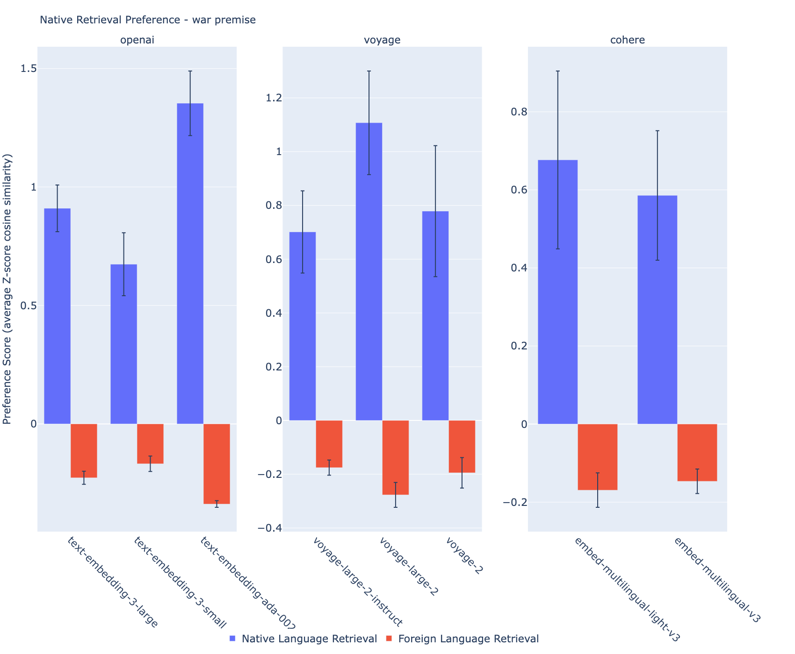
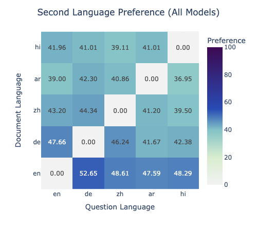
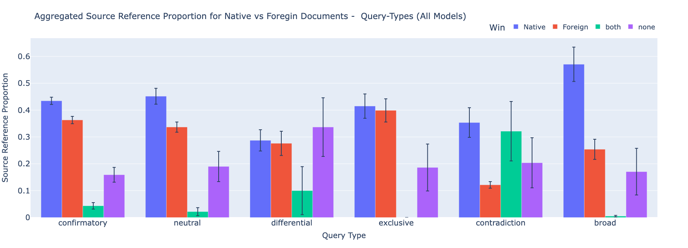

# 《伪多语者》：探究多语言大型模型中的信息鸿沟

发布时间：2024年07月07日

`RAG` `信息搜索` `多语言处理`

> Faux Polyglot: A Study on Information Disparity in Multilingual Large Language Models

# 摘要

> 大型语言模型（LLMs）通过检索增强生成（RAG）技术，在信息搜索领域发挥着核心作用，并已在全球普及。尽管LLMs的多语言特性为跨越语言障碍带来新希望，但这些特性是否能在多语言环境中有效应对语言隔阂和知识冲突，仍是一个疑问。我们的研究发现，LLMs在基于RAG的信息搜索中，对与查询语言相同的信息表现出系统性偏好，尤其在查询语言信息稀缺时，更倾向于高资源语言的文档，从而强化了主流观点。这种偏见在事实性和观点性查询中均存在。我们的研究揭示了多语言LLMs在信息搜索中的语言隔阂问题，指出其看似有益的多语言能力可能加剧信息不平等，通过强化特定语言的信息茧房或过滤气泡，进一步边缘化低资源观点。

> With Retrieval Augmented Generation (RAG), Large Language Models (LLMs) are playing a pivotal role in information search and are being adopted globally. Although the multilingual capability of LLMs offers new opportunities to bridge the language barrier, do these capabilities translate into real-life scenarios where linguistic divide and knowledge conflicts between multilingual sources are known occurrences? In this paper, we studied LLM's linguistic preference in a RAG-based information search setting. We found that LLMs displayed systemic bias towards information in the same language as the query language in both information retrieval and answer generation. Furthermore, in scenarios where there is little information in the language of the query, LLMs prefer documents in high-resource languages, reinforcing the dominant views. Such bias exists for both factual and opinion-based queries. Our results highlight the linguistic divide within multilingual LLMs in information search systems. The seemingly beneficial multilingual capability of LLMs may backfire on information parity by reinforcing language-specific information cocoons or filter bubbles further marginalizing low-resource views.

[Arxiv](https://arxiv.org/abs/2407.05502)