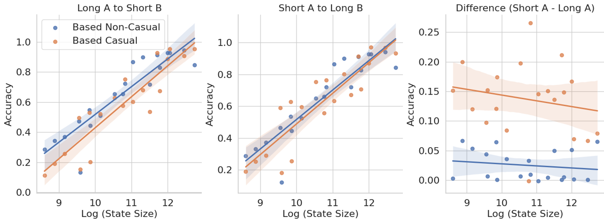

# 双读法：助力循环语言模型提升召回率

发布时间：2024年07月07日

`LLM理论` `人工智能`

> Just read twice: closing the recall gap for recurrent language models

# 摘要

> 循环大型语言模型正迅速崛起，与Transformer在语言模型困惑度上展开竞争。这些模型在推理时仅使用固定内存，但受限于此，它们难以充分利用长上下文信息，导致上下文学习质量不稳定。高效语言模型的关键在于精准选择存储与丢弃的信息。我们发现，信息呈现的顺序直接影响选择难度。通过将问题简化为集合不相交问题，我们揭示了循环模型在处理不同顺序集合时的内存需求变化。为减少对数据顺序的依赖，我们提出两种方案：JRT-Prompt重复展示上下文，全面展示数据顺序，平均提升11.0±1.3点，生成预填充吞吐量提升11.9倍；JRT-RNN采用非因果前缀线性注意力处理提示，以360M参数和30B令牌达到99%的Transformer质量，预填充吞吐量提升19.2倍。

> Recurrent large language models that compete with Transformers in language modeling perplexity are emerging at a rapid rate (e.g., Mamba, RWKV). Excitingly, these architectures use a constant amount of memory during inference. However, due to the limited memory, recurrent LMs cannot recall and use all the information in long contexts leading to brittle in-context learning (ICL) quality. A key challenge for efficient LMs is selecting what information to store versus discard. In this work, we observe the order in which information is shown to the LM impacts the selection difficulty. To formalize this, we show that the hardness of information recall reduces to the hardness of a problem called set disjointness (SD), a quintessential problem in communication complexity that requires a streaming algorithm (e.g., recurrent model) to decide whether inputted sets are disjoint. We empirically and theoretically show that the recurrent memory required to solve SD changes with set order, i.e., whether the smaller set appears first in-context. Our analysis suggests, to mitigate the reliance on data order, we can put information in the right order in-context or process prompts non-causally. Towards that end, we propose: (1) JRT-Prompt, where context gets repeated multiple times in the prompt, effectively showing the model all data orders. This gives $11.0 \pm 1.3$ points of improvement, averaged across $16$ recurrent LMs and the $6$ ICL tasks, with $11.9\times$ higher throughput than FlashAttention-2 for generation prefill (length $32$k, batch size $16$, NVidia H100). We then propose (2) JRT-RNN, which uses non-causal prefix-linear-attention to process prompts and provides $99\%$ of Transformer quality at $360$M params., $30$B tokens and $96\%$ at $1.3$B params., $50$B tokens on average across the tasks, with $19.2\times$ higher throughput for prefill than FA2.

[Arxiv](https://arxiv.org/abs/2407.05483)