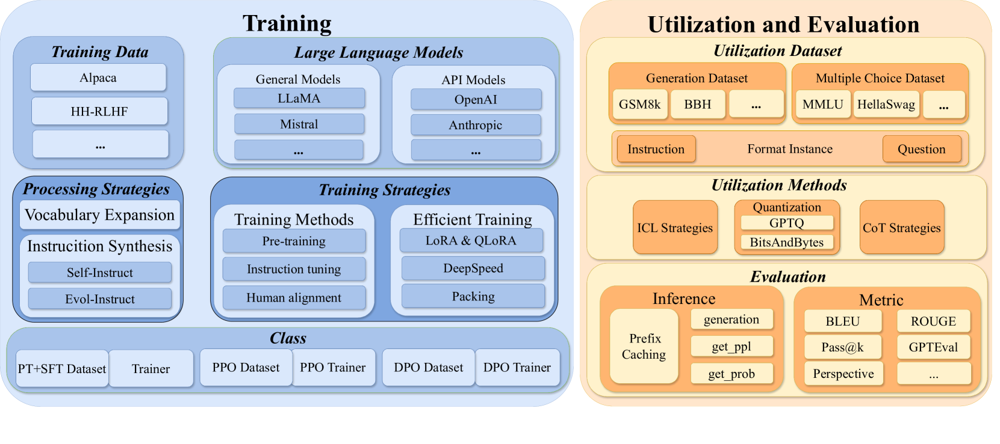
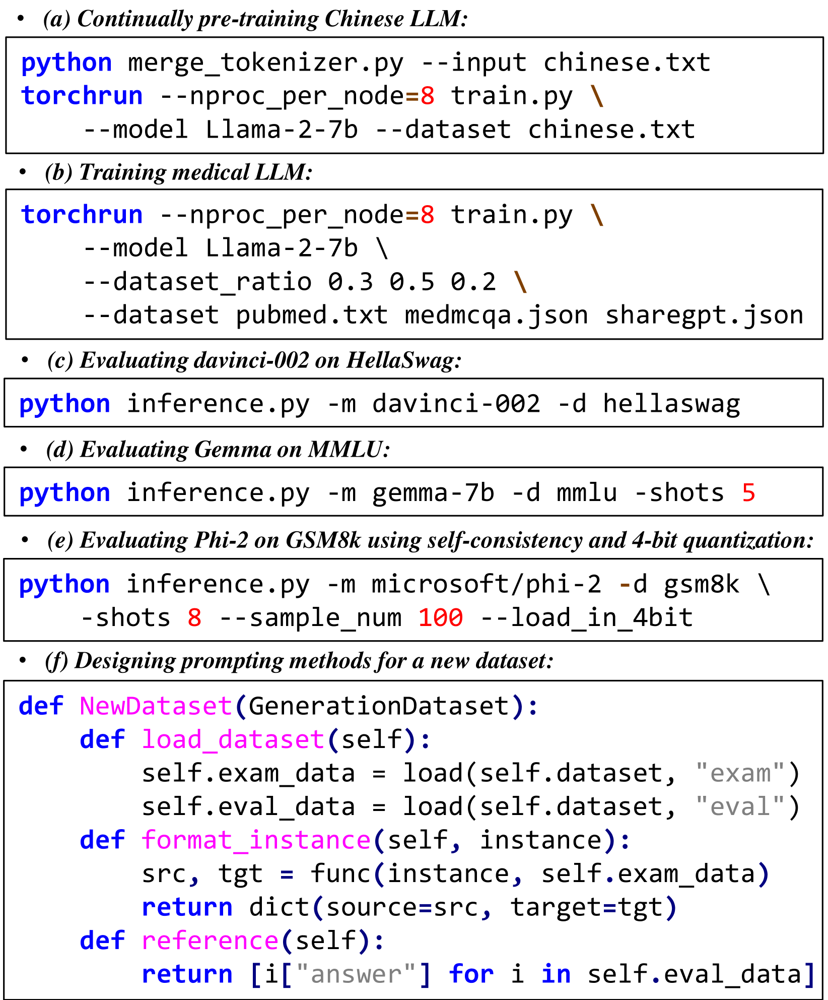

# LLMBox：大型语言模型的综合库

发布时间：2024年07月07日

`LLM应用` `软件开发` `人工智能`

> LLMBox: A Comprehensive Library for Large Language Models

# 摘要

> 本文推出 LLMBox，一个全面且统一的库，旨在简化大型语言模型 (LLM) 的开发、使用和评估。该库三大亮点：(1) 灵活的统一数据接口，(2) 广泛任务、数据集和模型的全面评估，(3) 强调用户友好与效率。借助 LLMBox，用户能轻松复现、训练并比较模型性能。我们通过多样化实验验证了其有效性与效率。详情及指南请访问 https://github.com/RUCAIBox/LLMBox。

> To facilitate the research on large language models (LLMs), this paper presents a comprehensive and unified library, LLMBox, to ease the development, use, and evaluation of LLMs. This library is featured with three main merits: (1) a unified data interface that supports the flexible implementation of various training strategies, (2) a comprehensive evaluation that covers extensive tasks, datasets, and models, and (3) more practical consideration, especially on user-friendliness and efficiency. With our library, users can easily reproduce existing methods, train new models, and conduct comprehensive performance comparisons. To rigorously test LLMBox, we conduct extensive experiments in a diverse coverage of evaluation settings, and experimental results demonstrate the effectiveness and efficiency of our library in supporting various implementations related to LLMs. The detailed introduction and usage guidance can be found at https://github.com/RUCAIBox/LLMBox.

[Arxiv](https://arxiv.org/abs/2407.05563)