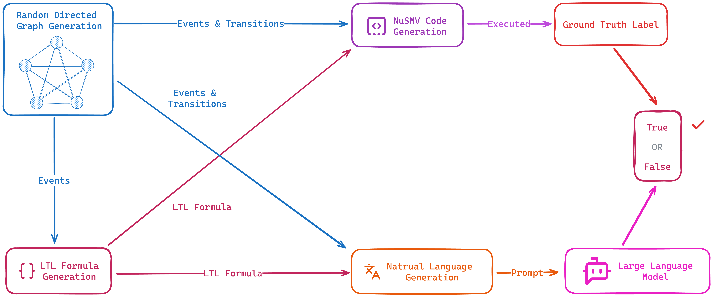

# LTLBench：专为评估大型语言模型中的时间逻辑推理而设计的基准测试

发布时间：2024年07月07日

`LLM应用` `人工智能` `时间推理`

> LTLBench: Towards Benchmarks for Evaluating Temporal Logic Reasoning in Large Language Models

# 摘要

> 时间推理（TR）是AI的核心，涉及时间信息与事件关系的理解与处理。为探索LLMs的TR能力，我们创新性地结合随机有向图、LTL公式和NuSMV模型检查器，设计了一套数据集构建流程。据此，我们打造了包含2,000个挑战的LTLBench基准，并测试了六款LLMs。实验揭示，尽管LLMs在TR任务上有所进步，但复杂问题仍令其困扰。此研究不仅深化了对LLMs TR能力的理解，更为未来评估提供了有力工具。

> Temporal reasoning (TR) is a critical component of artificial intelligence, encompassing understanding and processing temporal information and relationships between events. To discover and study the TR ability in Large Language Models (LLMs), various datasets have been constructed in different ways for evaluating various aspects of TR ability. Our work proposes a novel approach to design and develop a pipeline for constructing datasets to evaluate the TR ability of LLMs by leveraging random directed graph generation, LTL formula, and the NuSMV model checker. Based on the pipeline, we have also constructed a dataset as a benchmark, namely LTLBench, consisting of 2,000 TR challenges and evaluated six LLMs with it. Furthermore, we have conducted additional experiments to discover the impact of increasing the number of events and formula operators on the complexity of TR problems and the performance of LLMs. We have demonstrated that although LLMs exhibit some promise in handling TR challenges, they still struggle with complex TR. We expect this work can offer insights into TR ability in LLMs while also providing a valuable tool for future TR evaluations.

[Arxiv](https://arxiv.org/abs/2407.05434)