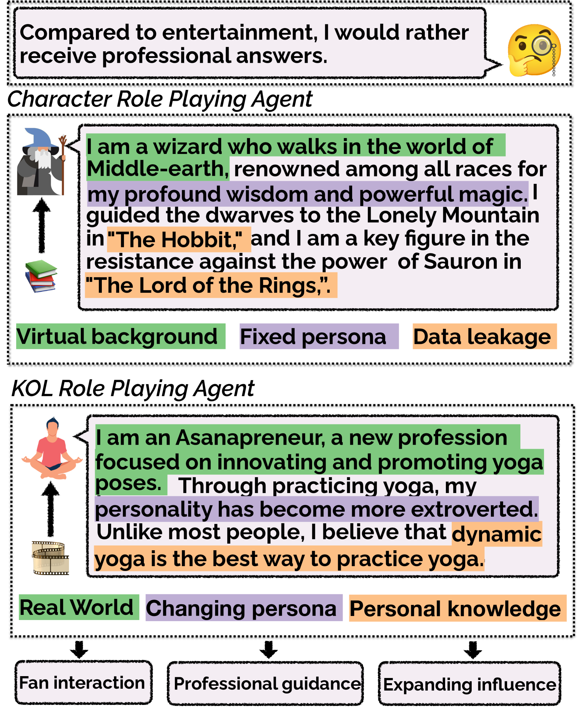
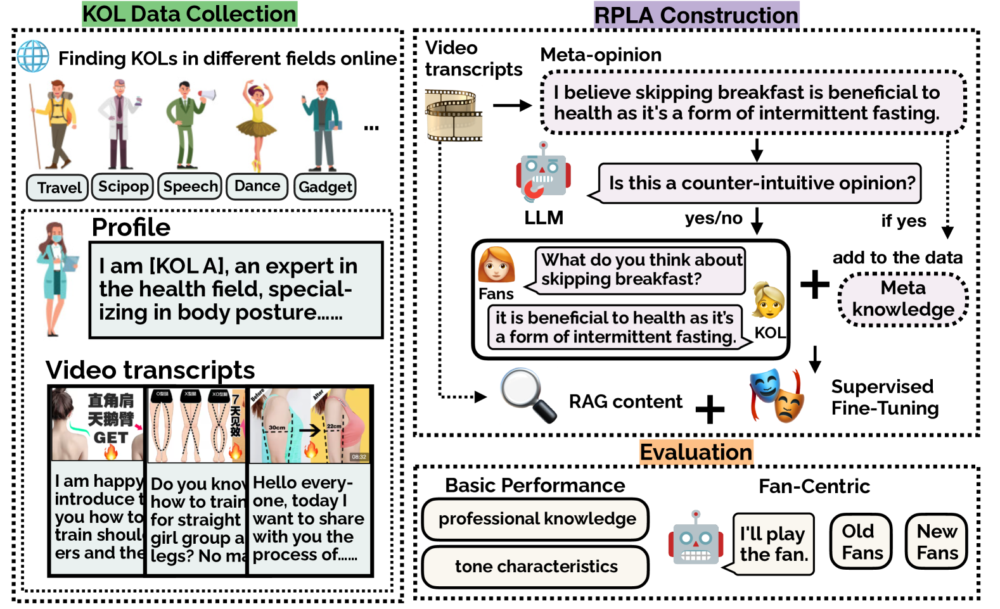

# MINDECHO：专为关键意见领袖打造的角色扮演语言代理

发布时间：2024年07月07日

`Agent` `社交媒体` `网络红人`

> MINDECHO: Role-Playing Language Agents for Key Opinion Leaders

# 摘要

> 大型语言模型在众多应用中表现卓越，尤其是角色扮演语言代理，深受用户喜爱。如今，代表关键意见领袖（即网络红人，他们主导着各自领域的潮流和观点）的 RPLAs 需求日益增长。然而，相关研究尚显不足。为此，我们提出了 MINDECHO 框架，旨在全面支持 KOL RPLAs 的开发与评估。MINDECHO 从多领域网络视频中采集 KOL 数据，并借助 GPT-4 模拟其对话。随后，这些对话与转录文本分别用于定制化模型训练与实时推理。我们的评估体系兼顾通用标准（如知识深度与语调）与粉丝视角。实验结果充分证明了 MINDECHO 在 KOL RPLAs 开发与评估中的高效性。

> Large language models~(LLMs) have demonstrated impressive performance in various applications, among which role-playing language agents (RPLAs) have engaged a broad user base. Now, there is a growing demand for RPLAs that represent Key Opinion Leaders (KOLs), \ie, Internet celebrities who shape the trends and opinions in their domains. However, research in this line remains underexplored. In this paper, we hence introduce MINDECHO, a comprehensive framework for the development and evaluation of KOL RPLAs. MINDECHO collects KOL data from Internet video transcripts in various professional fields, and synthesizes their conversations leveraging GPT-4. Then, the conversations and the transcripts are used for individualized model training and inference-time retrieval, respectively. Our evaluation covers both general dimensions (\ie, knowledge and tones) and fan-centric dimensions for KOLs. Extensive experiments validate the effectiveness of MINDECHO in developing and evaluating KOL RPLAs.

[Arxiv](https://arxiv.org/abs/2407.05305)