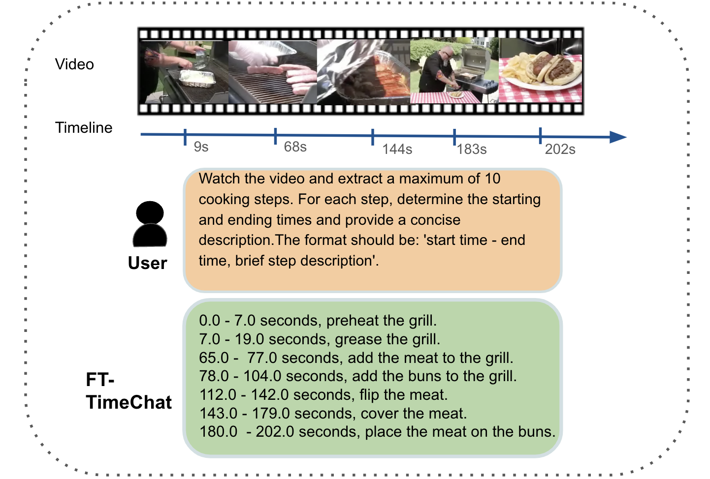
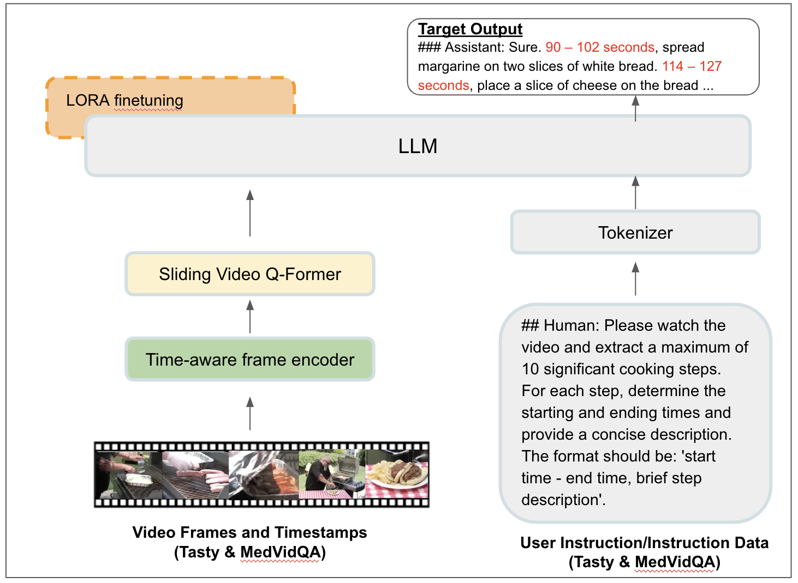
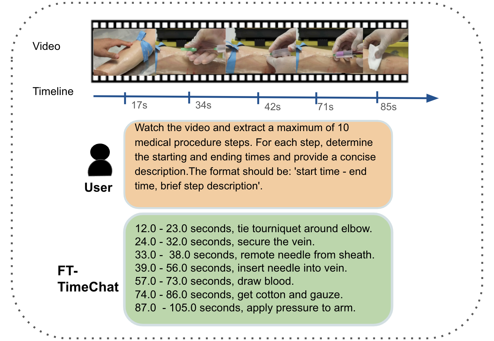

# 特定领域程序视频摘要的多模态语言模型

发布时间：2024年07月07日

`LLM应用`

> Multimodal Language Models for Domain-Specific Procedural Video Summarization

# 摘要

> 视频不仅是传达思想和故事的强大工具，还能通过长教程提供详尽指导。然而，这些教程因其长度和密集内容可能令人望而生畏。观众往往需要特定信息，如精确测量或详细步骤，因此高效提取和总结关键片段至关重要。一个能够总结和检测长视频亮点的智能助手备受追捧。多模态大型语言模型的最新进展为此类助手开发提供了希望。我们研究如何利用这些模型增强视频总结和特定领域内逐步指导生成。这些模型需理解视频帧间的时间事件和动作关系。我们专注于微调TimeChat，以提升其在烹饪和医疗程序等领域的性能。通过在特定领域数据集上训练模型，我们旨在增强其生成简洁、准确教程视频总结的能力。我们精心挑选和重组数据集，创建高质量视频指导数据。研究表明，在特定领域程序数据上微调后，TimeChat能显著提升长视频中关键步骤的提取和总结。这项研究展示了专门多模态模型通过提供个性化、逐步指导来协助实际任务的潜力。

> Videos serve as a powerful medium to convey ideas, tell stories, and provide detailed instructions, especially through long-format tutorials. Such tutorials are valuable for learning new skills at one's own pace, yet they can be overwhelming due to their length and dense content. Viewers often seek specific information, like precise measurements or step-by-step execution details, making it essential to extract and summarize key segments efficiently. An intelligent, time-sensitive video assistant capable of summarizing and detecting highlights in long videos is highly sought after. Recent advancements in Multimodal Large Language Models offer promising solutions to develop such an assistant. Our research explores the use of multimodal models to enhance video summarization and step-by-step instruction generation within specific domains. These models need to understand temporal events and relationships among actions across video frames. Our approach focuses on fine-tuning TimeChat to improve its performance in specific domains: cooking and medical procedures. By training the model on domain-specific datasets like Tasty for cooking and MedVidQA for medical procedures, we aim to enhance its ability to generate concise, accurate summaries of instructional videos. We curate and restructure these datasets to create high-quality video-centric instruction data. Our findings indicate that when finetuned on domain-specific procedural data, TimeChat can significantly improve the extraction and summarization of key instructional steps in long-format videos. This research demonstrates the potential of specialized multimodal models to assist with practical tasks by providing personalized, step-by-step guidance tailored to the unique aspects of each domain.

[Arxiv](https://arxiv.org/abs/2407.05419)