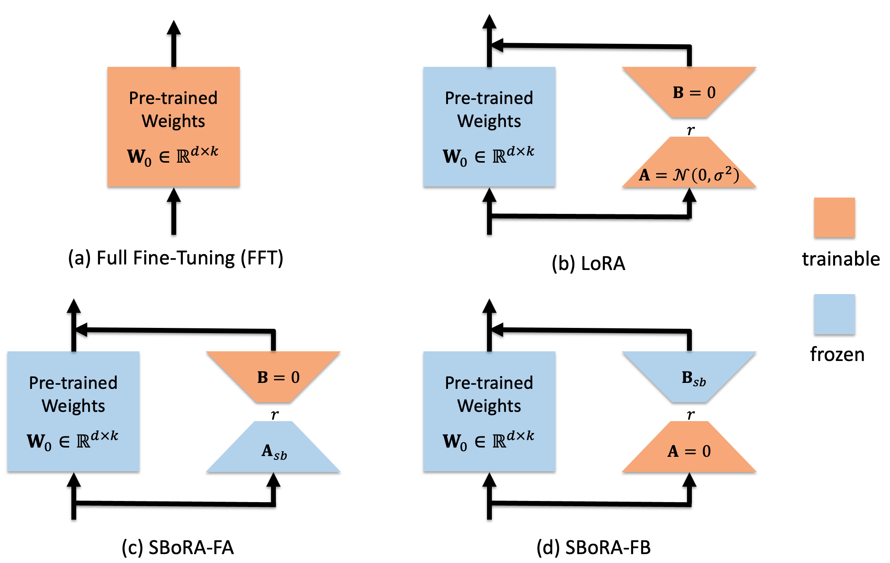
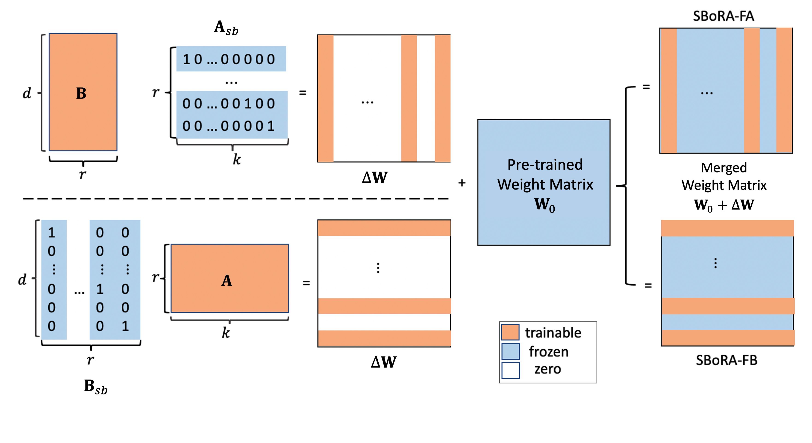

# SBoRA：通过区域权重更新实现低秩适应

发布时间：2024年07月07日

`LLM理论` `人工智能` `计算机科学`

> SBoRA: Low-Rank Adaptation with Regional Weight Updates

# 摘要

> 本文引入了 Standard Basis LoRA (SBoRA)，这是一种创新的参数高效微调技术，适用于大型语言模型，基于 Low-Rank Adaptation (LoRA) 和 Orthogonal Adaptation 的先驱研究。SBoRA 不仅减少了 LoRA 的计算和内存负担，还提升了学习效率。通过使用正交标准基向量初始化低秩矩阵（A 或 B），SBoRA 实现了针对性的权重更新和内存高效微调。这一方法衍生出两种变体，SBoRA-FA 和 SBoRA-FB，它们分别更新一个矩阵，形成稀疏的更新矩阵，大部分为零行或零列。因此，微调后的模型权重大多保持与预训练状态一致。SBoRA 的这种区域权重更新特性，类似于人脑的模块化适应机制，能够高效应对新任务。实证研究显示，在常识推理和算术推理等微调任务中，SBoRA-FA 表现优于 LoRA。此外，我们还评估了 QSBoRA 在不同规模量化 LLaMA 模型上的适应性，凸显了其在新任务上的高效适应潜力。相关代码已公开在 https://github.com/CityUHK-AI/SBoRA。

> This paper introduces Standard Basis LoRA (SBoRA), a novel parameter-efficient fine-tuning approach for Large Language Models that builds upon the pioneering works of Low-Rank Adaptation (LoRA) and Orthogonal Adaptation. SBoRA further reduces the computational and memory requirements of LoRA while enhancing learning performance. By leveraging orthogonal standard basis vectors to initialize one of the low-rank matrices, either A or B, SBoRA enables regional weight updates and memory-efficient fine-tuning. This approach gives rise to two variants, SBoRA-FA and SBoRA-FB, where only one of the matrices is updated, resulting in a sparse update matrix with a majority of zero rows or columns. Consequently, the majority of the fine-tuned model's weights remain unchanged from the pre-trained weights. This characteristic of SBoRA, wherein regional weight updates occur, is reminiscent of the modular organization of the human brain, which efficiently adapts to new tasks. Our empirical results demonstrate the superiority of SBoRA-FA over LoRA in various fine-tuning tasks, including commonsense reasoning and arithmetic reasoning. Furthermore, we evaluate the effectiveness of QSBoRA on quantized LLaMA models of varying scales, highlighting its potential for efficient adaptation to new tasks. Code is available at https://github.com/CityUHK-AI/SBoRA

[Arxiv](https://arxiv.org/abs/2407.05413)