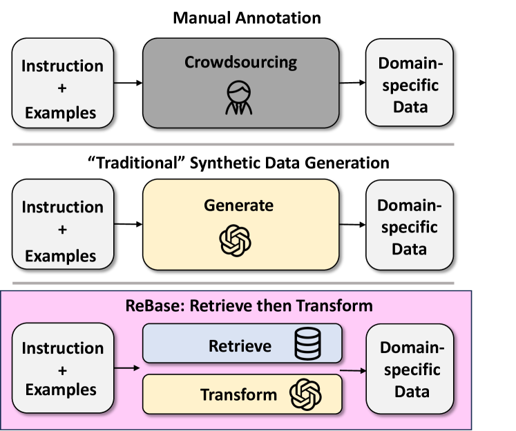
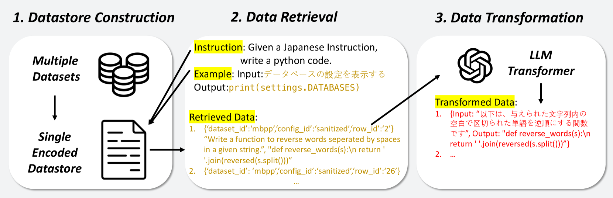
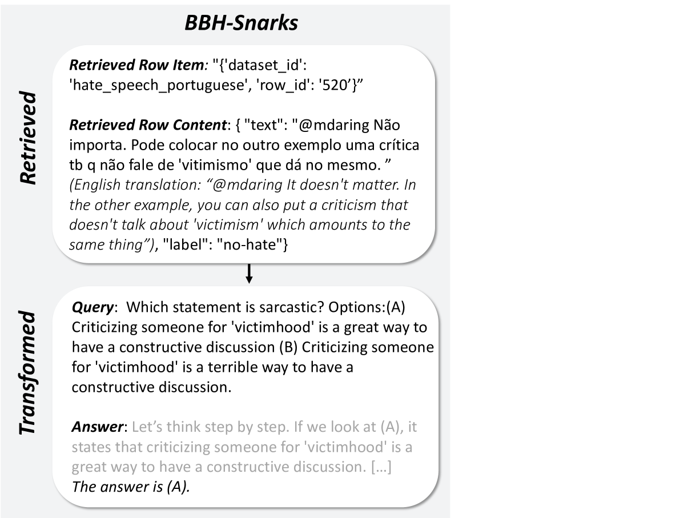
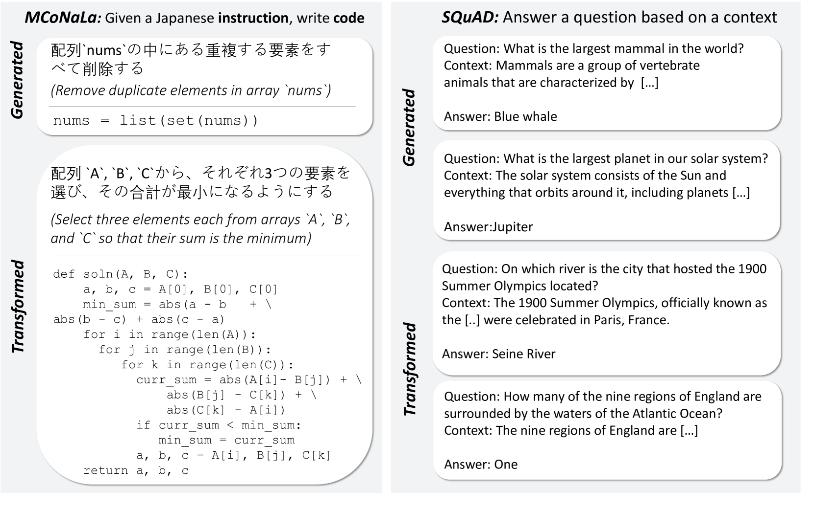
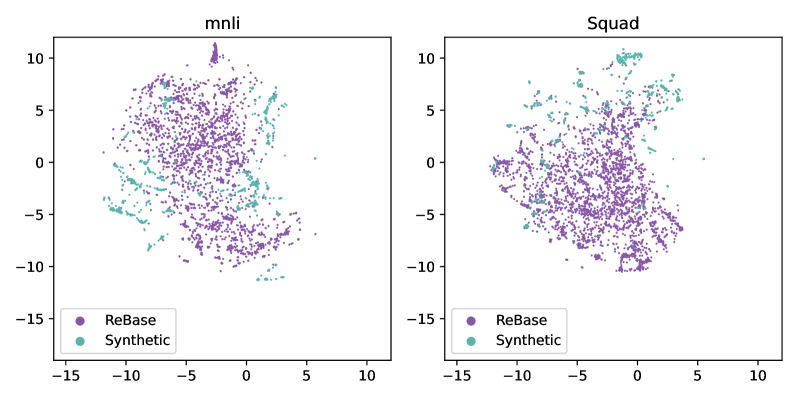
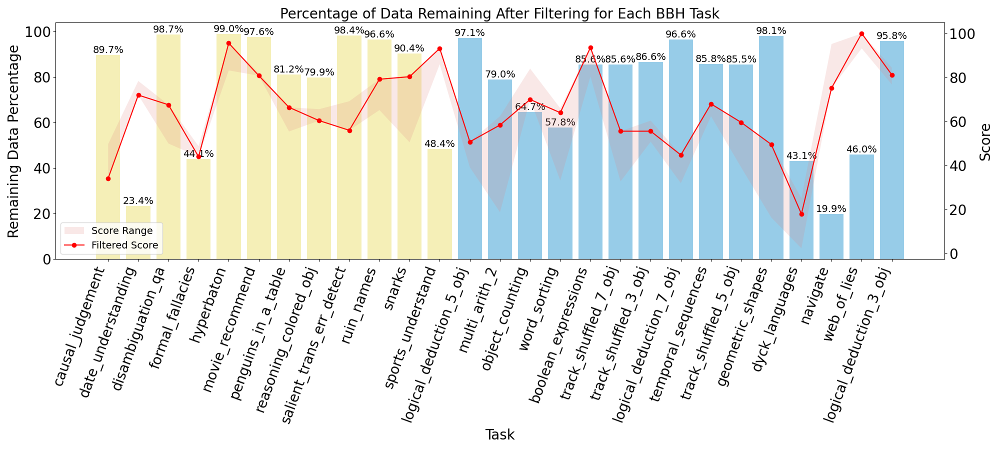
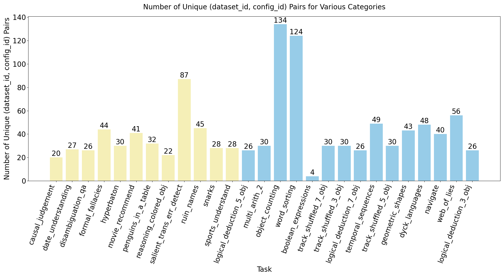
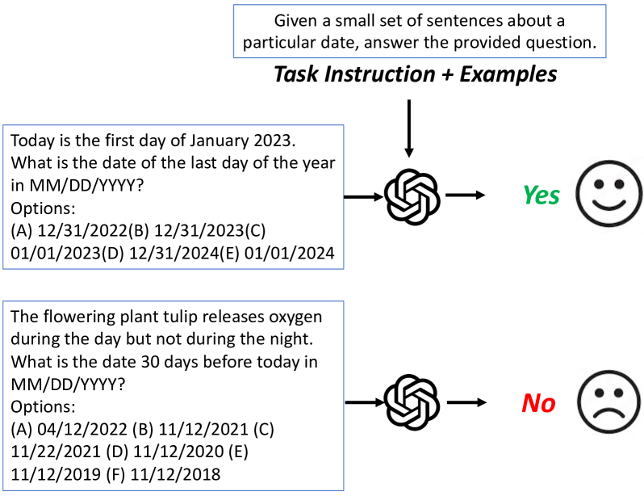
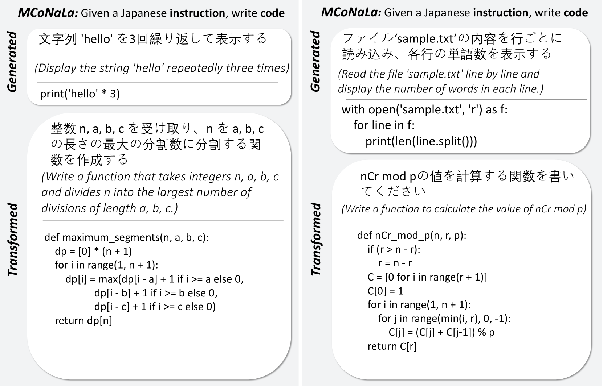

# 利用基于检索的蒸馏技术培养任务专家

发布时间：2024年07月07日

`LLM应用` `人工智能` `数据科学`

> Training Task Experts through Retrieval Based Distillation

# 摘要

> 构建专用任务的可部署模型，最可靠途径之一是获取大量高质量的特定任务数据。然而，这类数据集往往稀缺。现有技术通过从大型语言模型（LLM）中生成数据并提炼至小型模型来应对，但受限于LLM输出质量，常产生重复或错误数据。我们提出的基于检索的提炼（ReBase）方法，首先从丰富在线资源中检索数据，再转化为领域特定数据，极大提升数据多样性。ReBase还能生成思维链推理，提炼LLM的推理能力。在四个基准测试中，我们的方法在SQuAD上性能提升高达7.8%，MNLI上提升1.37%，BigBench-Hard上提升1.94%。

> One of the most reliable ways to create deployable models for specialized tasks is to obtain an adequate amount of high-quality task-specific data. However, for specialized tasks, often such datasets do not exist. Existing methods address this by creating such data from large language models (LLMs) and then distilling such knowledge into smaller models. However, these methods are limited by the quality of the LLMs output, and tend to generate repetitive or incorrect data. In this work, we present Retrieval Based Distillation (ReBase), a method that first retrieves data from rich online sources and then transforms them into domain-specific data. This method greatly enhances data diversity. Moreover, ReBase generates Chain-of-Thought reasoning and distills the reasoning capacity of LLMs. We test our method on 4 benchmarks and results show that our method significantly improves performance by up to 7.8% on SQuAD, 1.37% on MNLI, and 1.94% on BigBench-Hard.

[Arxiv](https://arxiv.org/abs/2407.05463)