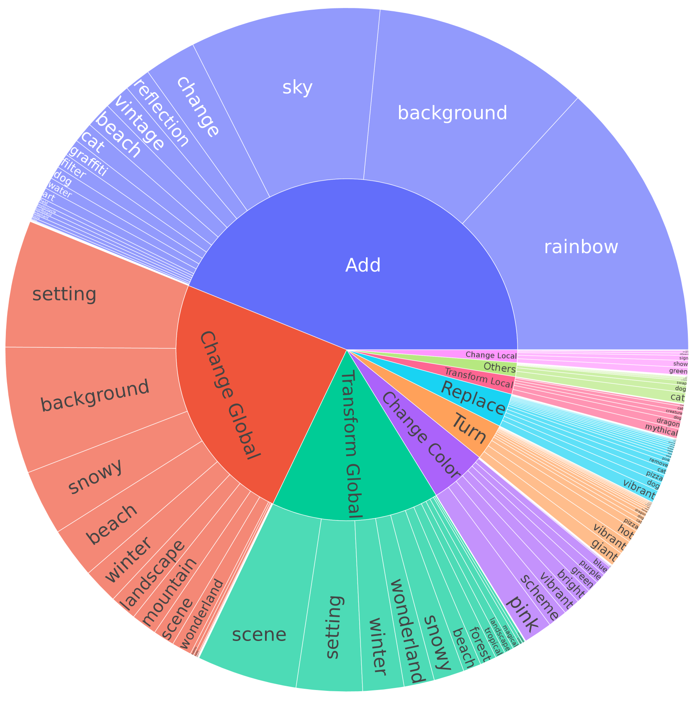

# UltraEdit：大规模基于指令的精细图像编辑

发布时间：2024年07月07日

`LLM应用` `图像处理` `人工智能`

> UltraEdit: Instruction-based Fine-Grained Image Editing at Scale

# 摘要

> 本文推出 UltraEdit，一个自动生成的大规模图像编辑数据集，约含 400 万样本。旨在克服现有数据集的不足，系统化生成高质量编辑样本。UltraEdit 的优势包括：1）结合 LLM 创造力和人类示例，扩展编辑指令；2）基于真实图像，提升多样性，减少偏见；3）支持区域编辑，借助自动高质量区域注释。实验显示，基于 UltraEdit 训练的扩散编辑模型在 MagicBrush 和 Emu-Edit 测试中刷新纪录。分析强调了真实图像和区域编辑数据的重要性。相关资源可访问 https://ultra-editing.github.io。

> This paper presents UltraEdit, a large-scale (approximately 4 million editing samples), automatically generated dataset for instruction-based image editing. Our key idea is to address the drawbacks in existing image editing datasets like InstructPix2Pix and MagicBrush, and provide a systematic approach to producing massive and high-quality image editing samples. UltraEdit offers several distinct advantages: 1) It features a broader range of editing instructions by leveraging the creativity of large language models (LLMs) alongside in-context editing examples from human raters; 2) Its data sources are based on real images, including photographs and artworks, which provide greater diversity and reduced bias compared to datasets solely generated by text-to-image models; 3) It also supports region-based editing, enhanced by high-quality, automatically produced region annotations. Our experiments show that canonical diffusion-based editing baselines trained on UltraEdit set new records on MagicBrush and Emu-Edit benchmarks. Our analysis further confirms the crucial role of real image anchors and region-based editing data. The dataset, code, and models can be found in https://ultra-editing.github.io.

[Arxiv](https://arxiv.org/abs/2407.05282)