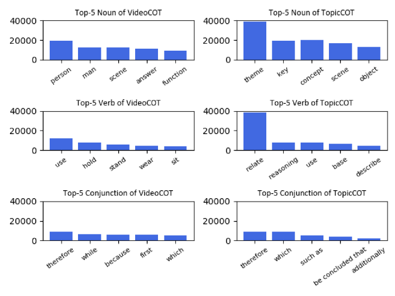

# VideoCoT：一款集成了主动注释工具的视频思维链数据集

发布时间：2024年07月07日

`LLM应用` `视频处理` `人工智能`

> VideoCoT: A Video Chain-of-Thought Dataset with Active Annotation Tool

# 摘要

> 多模态大型语言模型 (MLLMs) 正蓬勃发展，但对视频的关注不如图像，尤其是在提示工程、视频链-of-思维 (CoT) 和视频指令调整等领域。为此，我们探索视频中的 CoT 数据集，旨在推动视频 OpenQA 并增强 MLLMs 的推理能力。然而，构建视频 CoT 数据集颇具挑战。考虑到人工标注成本高且繁琐，机器生成又因幻觉问题不可靠，我们开发了结合机器与人类专家的自动标注工具，采用主动学习策略。该策略通过模型与专家的互动，既减轻了人工负担，又确保了数据质量。借助此工具，我们贡献了 VideoCoT、TopicQA 和 TopicCoT 三个数据集。此外，我们基于这些数据集提出了一个简单高效的基准，旨在通过 CoT 最大化 MLLMs 的复杂推理能力。实验结果充分验证了我们方法的有效性。

> Multimodal large language models (MLLMs) are flourishing, but mainly focus on images with less attention than videos, especially in sub-fields such as prompt engineering, video chain-of-thought (CoT), and instruction tuning on videos. Therefore, we try to explore the collection of CoT datasets in videos to lead to video OpenQA and improve the reasoning ability of MLLMs. Unfortunately, making such video CoT datasets is not an easy task. Given that human annotation is too cumbersome and expensive, while machine-generated is not reliable due to the hallucination issue, we develop an automatic annotation tool that combines machine and human experts, under the active learning paradigm. Active learning is an interactive strategy between the model and human experts, in this way, the workload of human labeling can be reduced and the quality of the dataset can be guaranteed. With the help of the automatic annotation tool, we strive to contribute three datasets, namely VideoCoT, TopicQA, TopicCoT. Furthermore, we propose a simple but effective benchmark based on the collected datasets, which exploits CoT to maximize the complex reasoning capabilities of MLLMs. Extensive experiments demonstrate the effectiveness our solution.

[Arxiv](https://arxiv.org/abs/2407.05355)