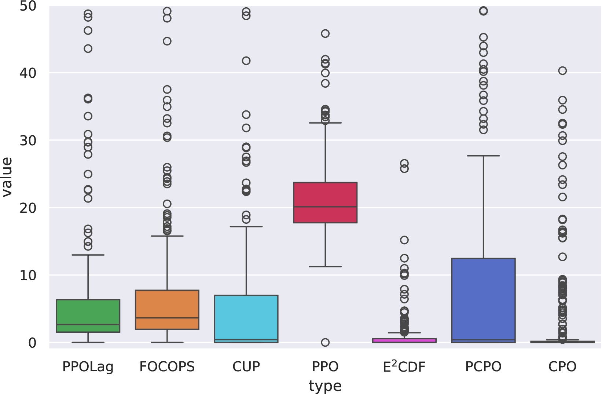

# 利用大型语言模型，我们致力于设计既安全又高效的强化学习成本函数。

发布时间：2024年07月07日

`LLM应用` `人工智能`

> : Towards Effective and Efficient Cost Function Design for Safe Reinforcement Learning via Large Language Model

# 摘要

> 在满足不同安全需求的场景中，各类安全强化学习算法表现出色，但它们通常只能应对特定场景，无法通用。此外，这些算法的优化目标往往与实际任务需求脱节。为此，我们设计了 $\mathrm{E^{2}CFD}$ 框架，它借助大型语言模型的理解力，针对不同安全场景生成定制的代价函数，并通过快速性能评估方法实现快速迭代优化。实验结果显示，该框架训练出的策略性能超越了传统方法和人工设计的代价函数。

> Different classes of safe reinforcement learning algorithms have shown satisfactory performance in various types of safety requirement scenarios. However, the existing methods mainly address one or several classes of specific safety requirement scenario problems and cannot be applied to arbitrary safety requirement scenarios. In addition, the optimization objectives of existing reinforcement learning algorithms are misaligned with the task requirements. Based on the need to address these issues, we propose $\mathrm{E^{2}CFD}$, an effective and efficient cost function design framework. $\mathrm{E^{2}CFD}$ leverages the capabilities of a large language model (LLM) to comprehend various safety scenarios and generate corresponding cost functions. It incorporates the \textit{fast performance evaluation (FPE)} method to facilitate rapid and iterative updates to the generated cost function. Through this iterative process, $\mathrm{E^{2}CFD}$ aims to obtain the most suitable cost function for policy training, tailored to the specific tasks within the safety scenario. Experiments have proven that the performance of policies trained using this framework is superior to traditional safe reinforcement learning algorithms and policies trained with carefully designed cost functions.

[Arxiv](https://arxiv.org/abs/2407.05580)