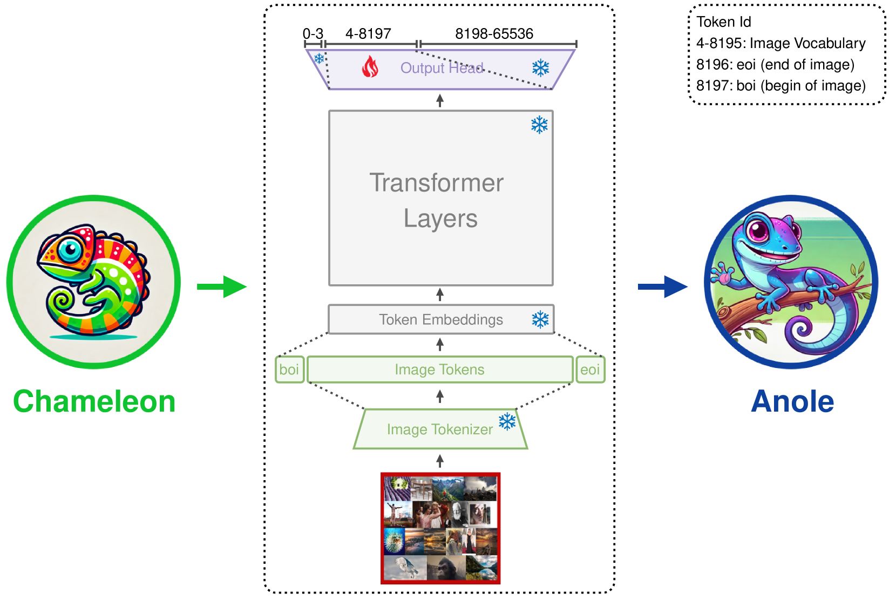

# ANOLE 是一个开放且自回归的原生大型多模态模型，专为交错图像与文本生成而设计。

发布时间：2024年07月08日

`LLM应用` `人工智能` `开源软件`

> ANOLE: An Open, Autoregressive, Native Large Multimodal Models for Interleaved Image-Text Generation

# 摘要

> 先前的开源大型多模态模型存在一些问题，如缺乏原生集成、仅支持单模态生成，以及依赖独立扩散模型进行视觉处理。为此，我们推出了 Anole，这是一个开放、自回归的原生多模态模型，专为图像与文本交错生成设计。基于 Meta AI 的 Chameleon，我们采用了一种创新的微调方法，既高效利用数据又节省参数。Anole 能够生成高质量且连贯的多模态内容。我们已将模型、训练框架及调优数据全部开源。

> Previous open-source large multimodal models (LMMs) have faced several limitations: (1) they often lack native integration, requiring adapters to align visual representations with pre-trained large language models (LLMs); (2) many are restricted to single-modal generation; (3) while some support multimodal generation, they rely on separate diffusion models for visual modeling and generation. To mitigate these limitations, we present Anole, an open, autoregressive, native large multimodal model for interleaved image-text generation. We build Anole from Meta AI's Chameleon, adopting an innovative fine-tuning strategy that is both data-efficient and parameter-efficient. Anole demonstrates high-quality, coherent multimodal generation capabilities. We have open-sourced our model, training framework, and instruction tuning data.

[Arxiv](https://arxiv.org/abs/2407.06135)