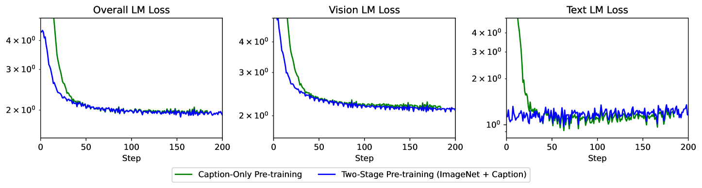

# 单一 Transformer 实现视觉与语言模型的可扩展性

发布时间：2024年07月08日

`LLM应用` `计算机视觉` `人工智能`

> A Single Transformer for Scalable Vision-Language Modeling

# 摘要

> 我们推出了 SOLO，一种单一 Transformer 架构，专为可扩展的视觉语言模型设计。当前的 LVLMs 如 LLaVA 多采用异构架构，结合预训练视觉编码器与 LLMs，虽性能卓越，但存在四大可扩展性挑战：视觉能力受限、架构复杂、缩放分析困难、图像处理受限。SOLO 通过统一架构有效应对这些挑战，但普及受限于缺乏平衡视觉与语言、确保大型模型稳定训练的可靠方法。本文首次公开 SOLO 训练方法，利用适中资源打造 7B LVLM，通过 LLMs 初始化、多阶段预训练及高质量数据集微调，实现与 LLaVA-v1.5-7B 媲美的性能，尤其在视觉数学推理上表现卓越。

> We present SOLO, a single transformer for Scalable visiOn-Language mOdeling. Current large vision-language models (LVLMs) such as LLaVA mostly employ heterogeneous architectures that connect pre-trained visual encoders with large language models (LLMs) to facilitate visual recognition and complex reasoning. Although achieving remarkable performance with relatively lightweight training, we identify four primary scalability limitations: (1) The visual capacity is constrained by pre-trained visual encoders, which are typically an order of magnitude smaller than LLMs. (2) The heterogeneous architecture complicates the use of established hardware and software infrastructure. (3) Study of scaling laws on such architecture must consider three separate components - visual encoder, connector, and LLMs, which complicates the analysis. (4) The use of existing visual encoders typically requires following a pre-defined specification of image inputs pre-processing, for example, by reshaping inputs to fixed-resolution square images, which presents difficulties in processing and training on high-resolution images or those with unusual aspect ratio. A unified single Transformer architecture, like SOLO, effectively addresses these scalability concerns in LVLMs; however, its limited adoption in the modern context likely stems from the absence of reliable training recipes that balance both modalities and ensure stable training for billion-scale models. In this paper, we introduce the first open-source training recipe for developing SOLO, an open-source 7B LVLM using moderate academic resources. The training recipe involves initializing from LLMs, sequential pre-training on ImageNet and web-scale data, and instruction fine-tuning on our curated high-quality datasets. On extensive evaluation, SOLO demonstrates performance comparable to LLaVA-v1.5-7B, particularly excelling in visual mathematical reasoning.

[Arxiv](https://arxiv.org/abs/2407.06438)