# 语言模型中词汇扩展与初始化方法的实证对比研究

发布时间：2024年07月08日

`LLM理论` `机器学习`

> An Empirical Comparison of Vocabulary Expansion and Initialization Approaches for Language Models

# 摘要

> 尽管语言模型在英语处理中表现卓越，但在其他多数语言中性能却有所下降。通常，这一难题通过持续的预训练和微调来解决。然而，原始模型分词器的词汇覆盖不足，导致新语言的表达力受限，进而需要扩展分词器。此外，新词汇的嵌入初始化也是一个挑战。当前方法依赖于跨语言嵌入，且缺乏坚实的理论支撑和强有力的比较基准。本文中，我们首先从理论上论证了在现有嵌入的凸包内进行初始化是有效的，随后提出了一种新颖且简便的方法——约束 Word2Vec (CW2V)，无需跨语言嵌入。我们的研究在四种语言和五项任务中评估了不同的初始化方法，结果表明 CW2V 的表现与高级技术不相上下，甚至更优。同时，简单的多元初始化方法也显示出与这些高级技术相当的性能，这表明即使采用简单的初始化方法，也能实现高效的大规模多语言持续预训练。

> Language Models (LMs) excel in natural language processing tasks for English but show reduced performance in most other languages. This problem is commonly tackled by continually pre-training and fine-tuning these models for said languages. A significant issue in this process is the limited vocabulary coverage in the original model's tokenizer, leading to inadequate representation of new languages and necessitating an expansion of the tokenizer. The initialization of the embeddings corresponding to new vocabulary items presents a further challenge. Current strategies require cross-lingual embeddings and lack a solid theoretical foundation as well as comparisons with strong baselines. In this paper, we first establish theoretically that initializing within the convex hull of existing embeddings is a good initialization, followed by a novel but simple approach, Constrained Word2Vec (CW2V), which does not require cross-lingual embeddings. Our study evaluates different initialization methods for expanding RoBERTa and LLaMA 2 across four languages and five tasks. The results show that CW2V performs equally well or even better than more advanced techniques. Additionally, simpler approaches like multivariate initialization perform on par with these advanced methods indicating that efficient large-scale multilingual continued pretraining can be achieved even with simpler initialization methods.

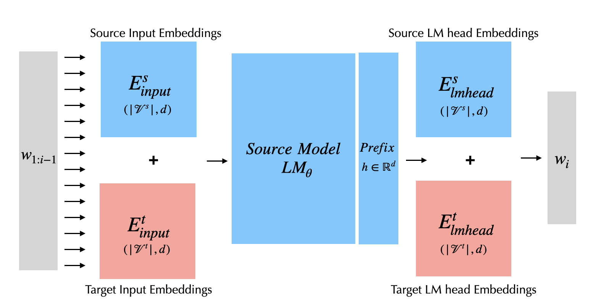

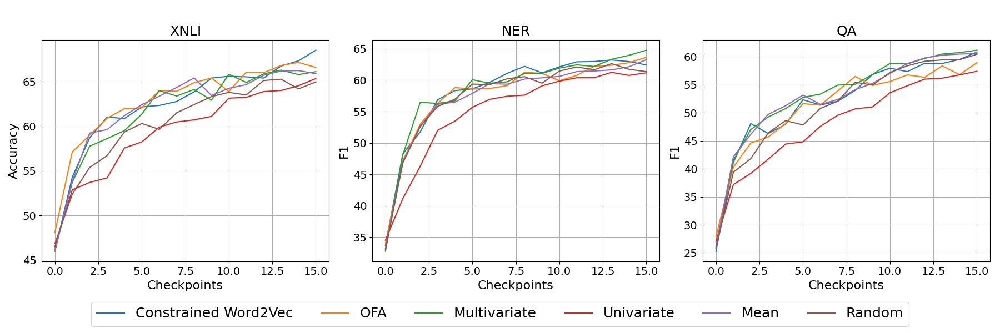

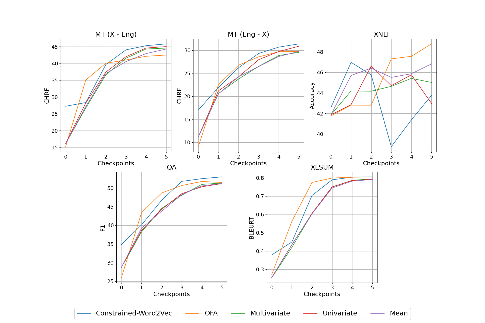

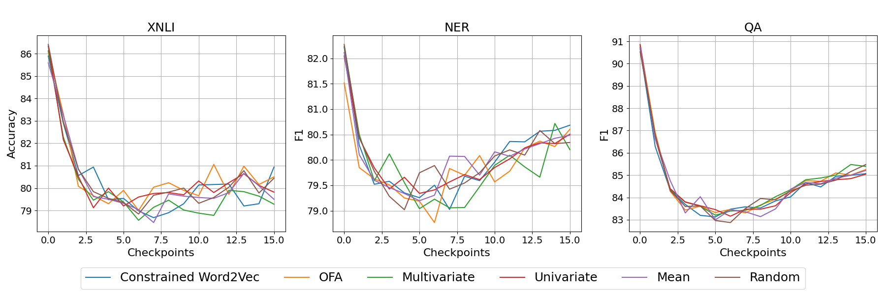

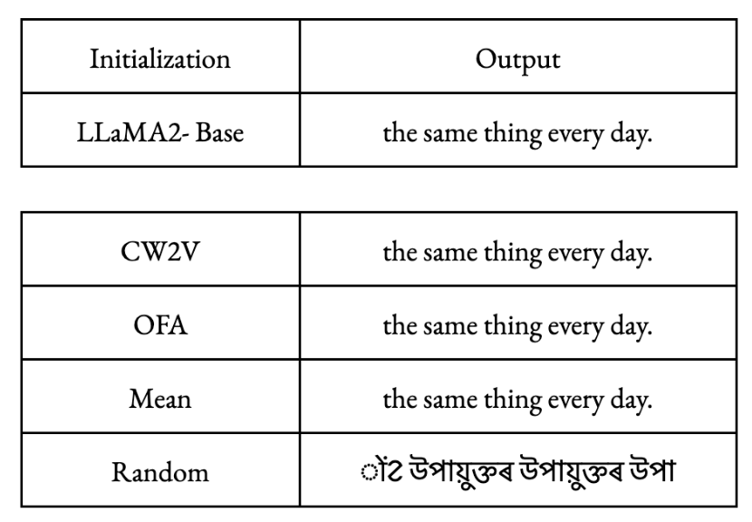

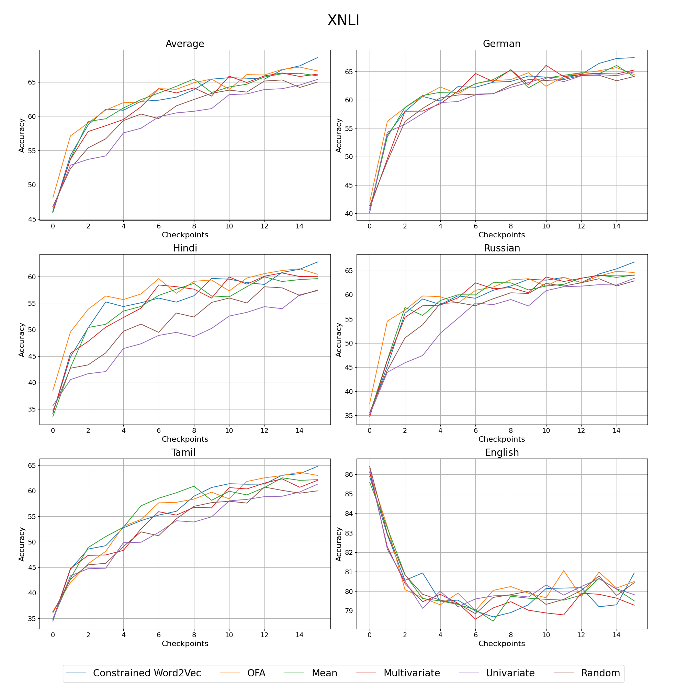

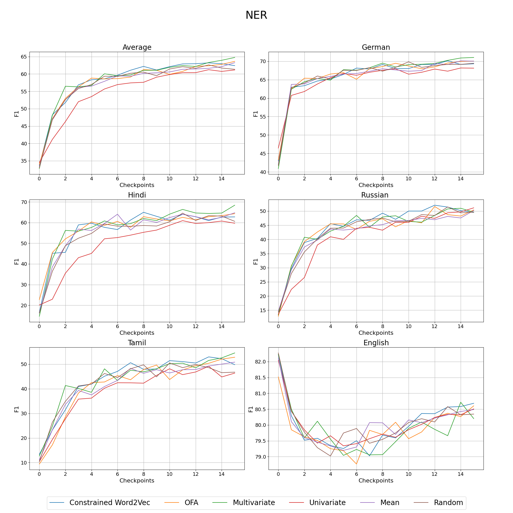

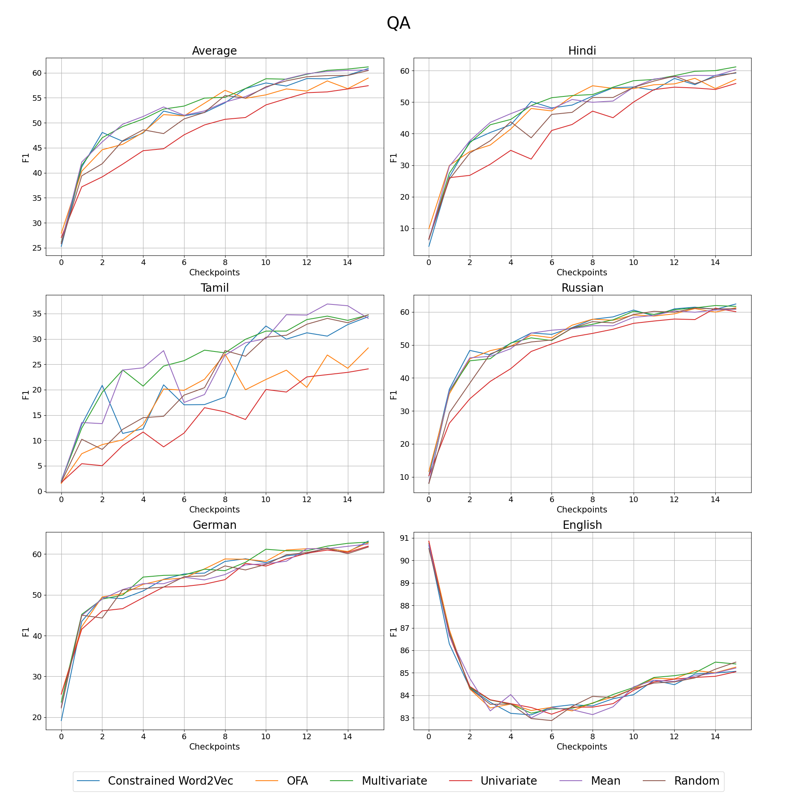

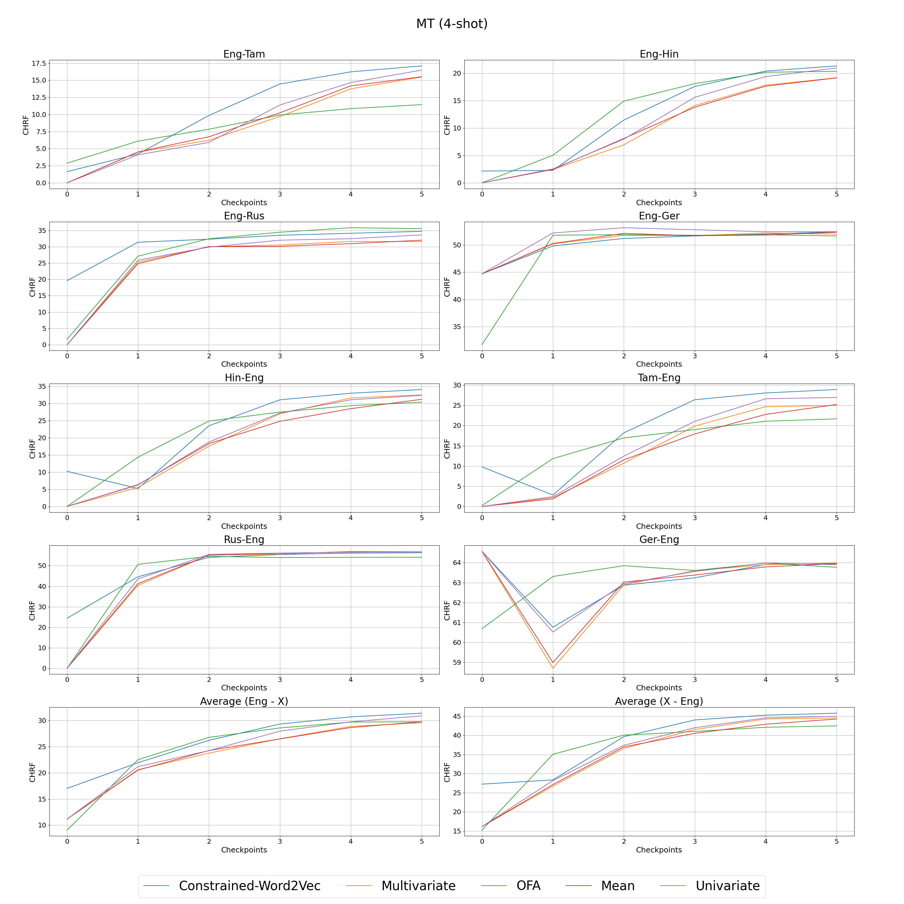

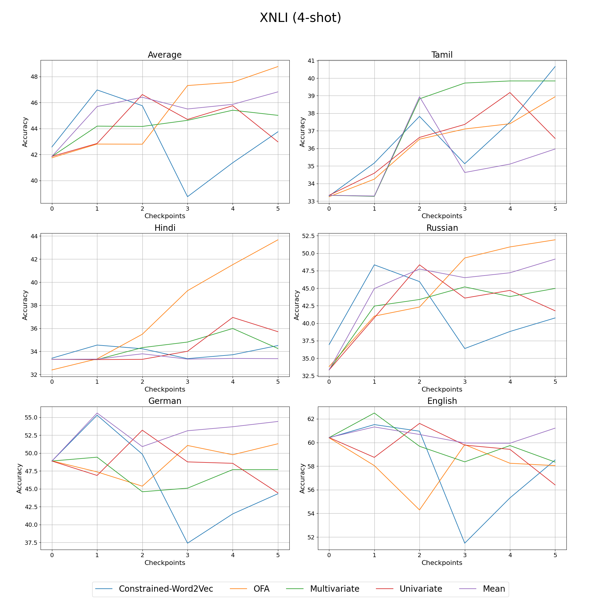

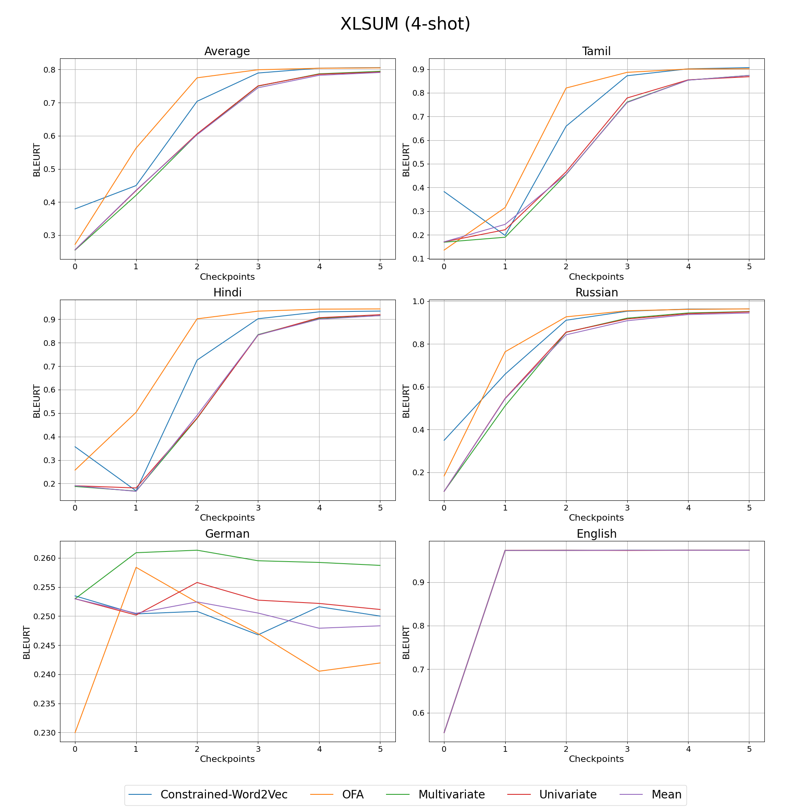

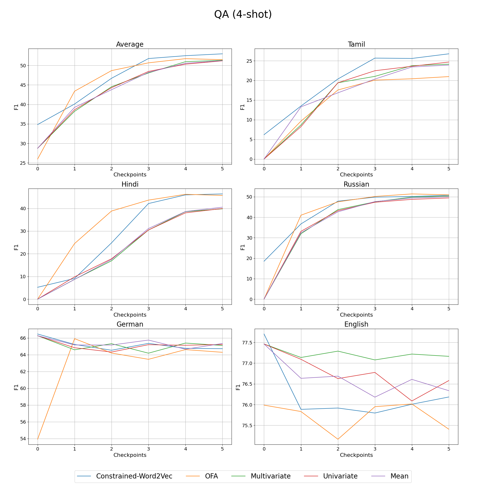

[Arxiv](https://arxiv.org/abs/2407.05841)