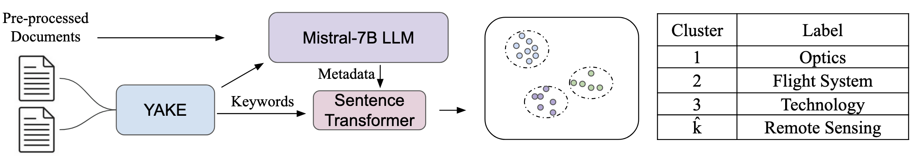

# 人工直觉：科学摘要的高效分类

发布时间：2024年07月08日

`LLM应用` `科学研究` `信息管理`

> Artificial Intuition: Efficient Classification of Scientific Abstracts

# 摘要

> 为了战略洞察或研究组合管理，对短科学文本进行粗略分类是理想的。这些文本高效地向专家传递密集信息，但因其简短和缺乏上下文，自动化难度大。为此，我们创新了一种方法，生成并分配领域特定标签。通过LLM，我们模拟了人类直觉的补充知识增强过程，并设计了工作流程。试点研究中，我们采用NASA的资助摘要语料库，并结合传统性能指标，开发了新的评估工具。

> It is desirable to coarsely classify short scientific texts, such as grant or publication abstracts, for strategic insight or research portfolio management. These texts efficiently transmit dense information to experts possessing a rich body of knowledge to aid interpretation. Yet this task is remarkably difficult to automate because of brevity and the absence of context. To address this gap, we have developed a novel approach to generate and appropriately assign coarse domain-specific labels. We show that a Large Language Model (LLM) can provide metadata essential to the task, in a process akin to the augmentation of supplemental knowledge representing human intuition, and propose a workflow. As a pilot study, we use a corpus of award abstracts from the National Aeronautics and Space Administration (NASA). We develop new assessment tools in concert with established performance metrics.

[Arxiv](https://arxiv.org/abs/2407.06093)