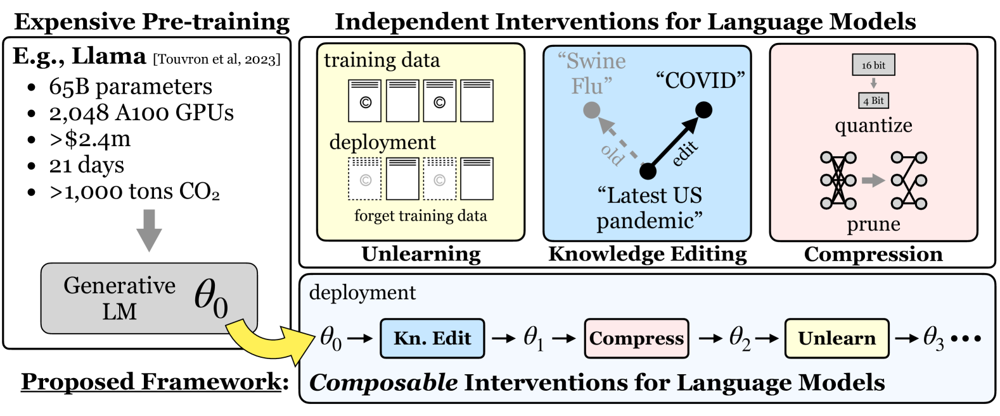
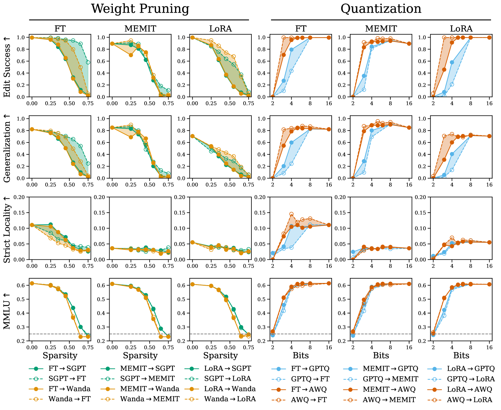
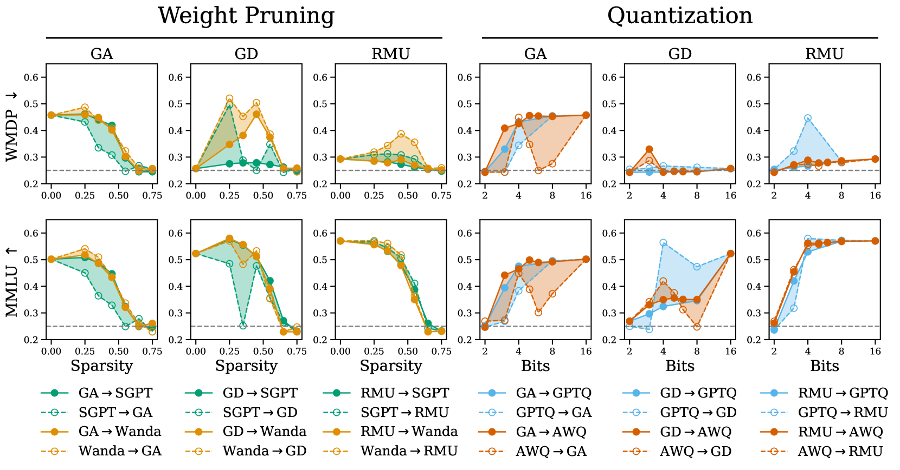

# 语言模型的可组合干预策略

发布时间：2024年07月08日

`LLM理论` `人工智能` `软件工程`

> Composable Interventions for Language Models

# 摘要

> 语言模型在测试时的干预不仅能提升事实准确性，还能减少有害输出并增强模型效率，且无需重新训练。然而，尽管新方法层出不穷，各类干预措施却大多各自为政。实践中，我们需对同一模型依次施加多种干预，却缺乏研究其相互作用的标准化途径。为此，我们引入了“可组合干预”框架，旨在探索多重干预在同一模型上的效果，并配备了新指标和统一代码库。借助此框架，我们广泛实验，将知识编辑、模型压缩和机器遗忘这三类新兴干预方法进行组合。结果显示，压缩会妨碍编辑与遗忘，干预顺序至关重要，而现有通用指标在评估可组合性上尚显不足。这些发现揭示了可组合性领域的明显短板，呼吁新的多目标干预策略。所有相关代码已公开于：https://github.com/hartvigsen-group/composable-interventions。

> Test-time interventions for language models can enhance factual accuracy, mitigate harmful outputs, and improve model efficiency without costly retraining. But despite a flood of new methods, different types of interventions are largely developing independently. In practice, multiple interventions must be applied sequentially to the same model, yet we lack standardized ways to study how interventions interact. We fill this gap by introducing composable interventions, a framework to study the effects of using multiple interventions on the same language models, featuring new metrics and a unified codebase. Using our framework, we conduct extensive experiments and compose popular methods from three emerging intervention categories -- Knowledge Editing, Model Compression, and Machine Unlearning. Our results from 310 different compositions uncover meaningful interactions: compression hinders editing and unlearning, composing interventions hinges on their order of application, and popular general-purpose metrics are inadequate for assessing composability. Taken together, our findings showcase clear gaps in composability, suggesting a need for new multi-objective interventions. All of our code is public: https://github.com/hartvigsen-group/composable-interventions.

[Arxiv](https://arxiv.org/abs/2407.06483)