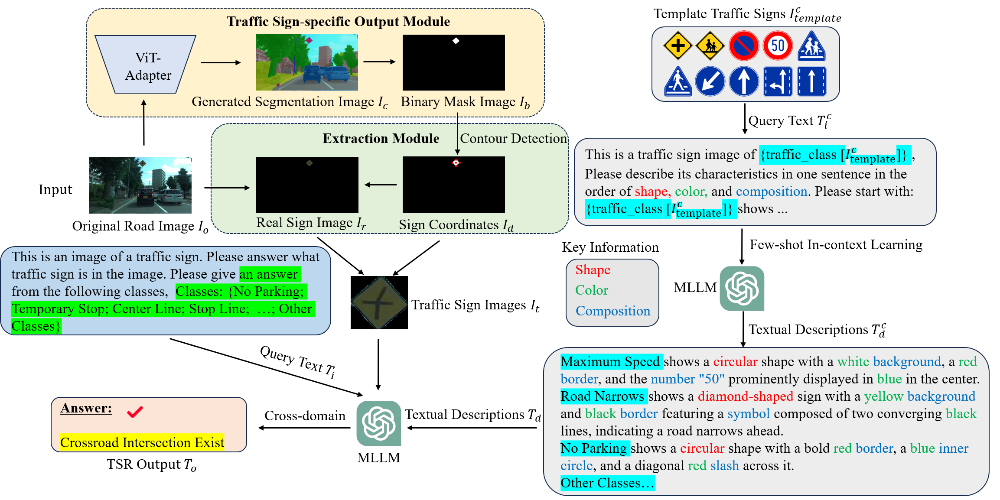

# 通过跨域少样本上下文学习提升交通标志识别能力

发布时间：2024年07月08日

`LLM应用` `自动驾驶`

> Cross-domain Few-shot In-context Learning for Enhancing Traffic Sign Recognition

# 摘要

> 近期，多模态大型语言模型如GPT-4o和GPT-4v在自动驾驶领域展现出显著潜力。本文提出了一种基于MLLM的跨领域少样本上下文学习策略，旨在提升交通标志识别（TSR）能力。我们首先构建了一个基于Vision Transformer Adapter的交通标志检测网络，并设计了一个提取模块，从原始道路图像中精准提取交通标志。为减少对大量训练数据的依赖，并增强跨领域TSR的稳定性，我们创新性地引入了基于MLLM的跨领域少样本上下文学习技术。此外，为进一步提升MLLM对交通标志的细粒度识别能力，我们利用模板交通标志生成富含形状、颜色及构成等关键信息的描述文本，有效激发MLLM对细粒度交通标志类别的感知力。通过这些描述文本，我们成功缩小了模板与实际交通标志间的跨领域差异。值得一提的是，我们的方法仅需简单统一的文本指示，无需庞大的交通标志图像库和标签集。我们在德国、比利时的标准数据集以及日本的真实世界数据集上进行了详尽评估，实验结果表明，我们的方法在TSR性能上取得了显著提升。

> Recent multimodal large language models (MLLM) such as GPT-4o and GPT-4v have shown great potential in autonomous driving. In this paper, we propose a cross-domain few-shot in-context learning method based on the MLLM for enhancing traffic sign recognition (TSR). We first construct a traffic sign detection network based on Vision Transformer Adapter and an extraction module to extract traffic signs from the original road images. To reduce the dependence on training data and improve the performance stability of cross-country TSR, we introduce a cross-domain few-shot in-context learning method based on the MLLM. To enhance MLLM's fine-grained recognition ability of traffic signs, the proposed method generates corresponding description texts using template traffic signs. These description texts contain key information about the shape, color, and composition of traffic signs, which can stimulate the ability of MLLM to perceive fine-grained traffic sign categories. By using the description texts, our method reduces the cross-domain differences between template and real traffic signs. Our approach requires only simple and uniform textual indications, without the need for large-scale traffic sign images and labels. We perform comprehensive evaluations on the German traffic sign recognition benchmark dataset, the Belgium traffic sign dataset, and two real-world datasets taken from Japan. The experimental results show that our method significantly enhances the TSR performance.

[Arxiv](https://arxiv.org/abs/2407.05814)