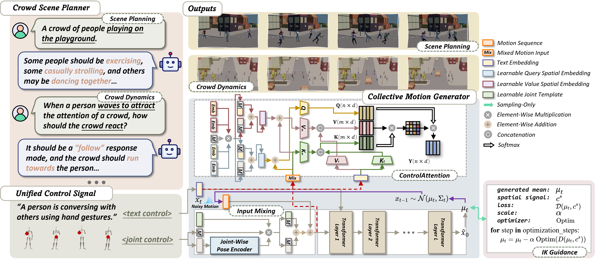
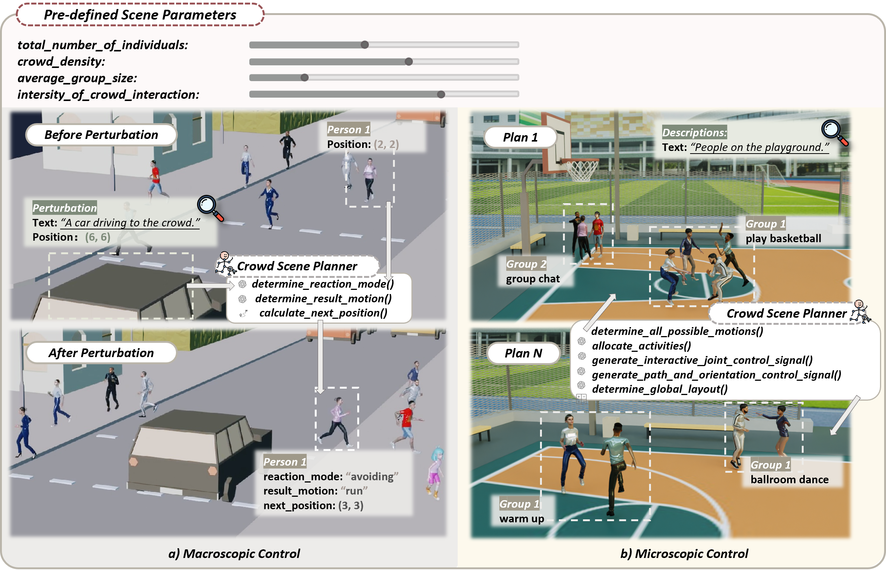
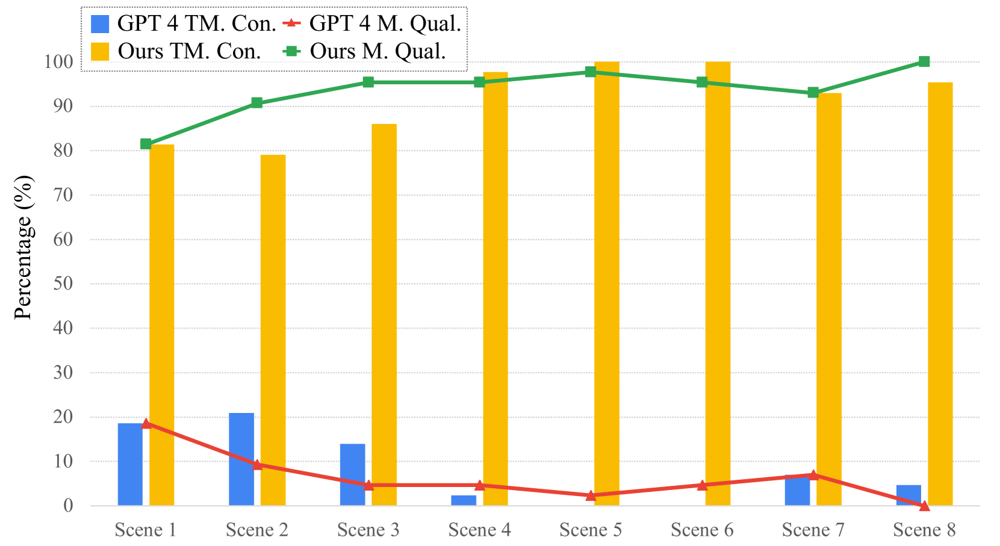

# CrowdMoGen：引领零-Shot 文本驱动的集体运动创新

发布时间：2024年07月08日

`LLM应用` `城市规划`

> CrowdMoGen: Zero-Shot Text-Driven Collective Motion Generation

# 摘要

> 人群运动生成在娱乐和战略领域至关重要，如动画、游戏、城市模拟和规划。这一新任务要求在特定约束下精细整合控制与生成，以真实合成人群动态，其挑战尚待深入探索。现有模型多关注个体行为，忽视集体复杂性；而多人运动生成方法则依赖预设场景，局限于固定少数互动，实用性受限。为此，我们推出CrowdMoGen框架，借助大型语言模型（LLM），将集体智慧融入生成过程，实现无需配对数据的泛化人群运动规划与生成。框架包含两大核心组件：人群场景规划器，根据场景或扰动协调运动；集体运动生成器，高效合成集体运动。实验证明，该框架不仅填补了关键技术空白，提供可扩展、可泛化解决方案，更实现了高度真实与灵活性。

> Crowd Motion Generation is essential in entertainment industries such as animation and games as well as in strategic fields like urban simulation and planning. This new task requires an intricate integration of control and generation to realistically synthesize crowd dynamics under specific spatial and semantic constraints, whose challenges are yet to be fully explored. On the one hand, existing human motion generation models typically focus on individual behaviors, neglecting the complexities of collective behaviors. On the other hand, recent methods for multi-person motion generation depend heavily on pre-defined scenarios and are limited to a fixed, small number of inter-person interactions, thus hampering their practicality. To overcome these challenges, we introduce CrowdMoGen, a zero-shot text-driven framework that harnesses the power of Large Language Model (LLM) to incorporate the collective intelligence into the motion generation framework as guidance, thereby enabling generalizable planning and generation of crowd motions without paired training data. Our framework consists of two key components: 1) Crowd Scene Planner that learns to coordinate motions and dynamics according to specific scene contexts or introduced perturbations, and 2) Collective Motion Generator that efficiently synthesizes the required collective motions based on the holistic plans. Extensive quantitative and qualitative experiments have validated the effectiveness of our framework, which not only fills a critical gap by providing scalable and generalizable solutions for Crowd Motion Generation task but also achieves high levels of realism and flexibility.

[Arxiv](https://arxiv.org/abs/2407.06188)