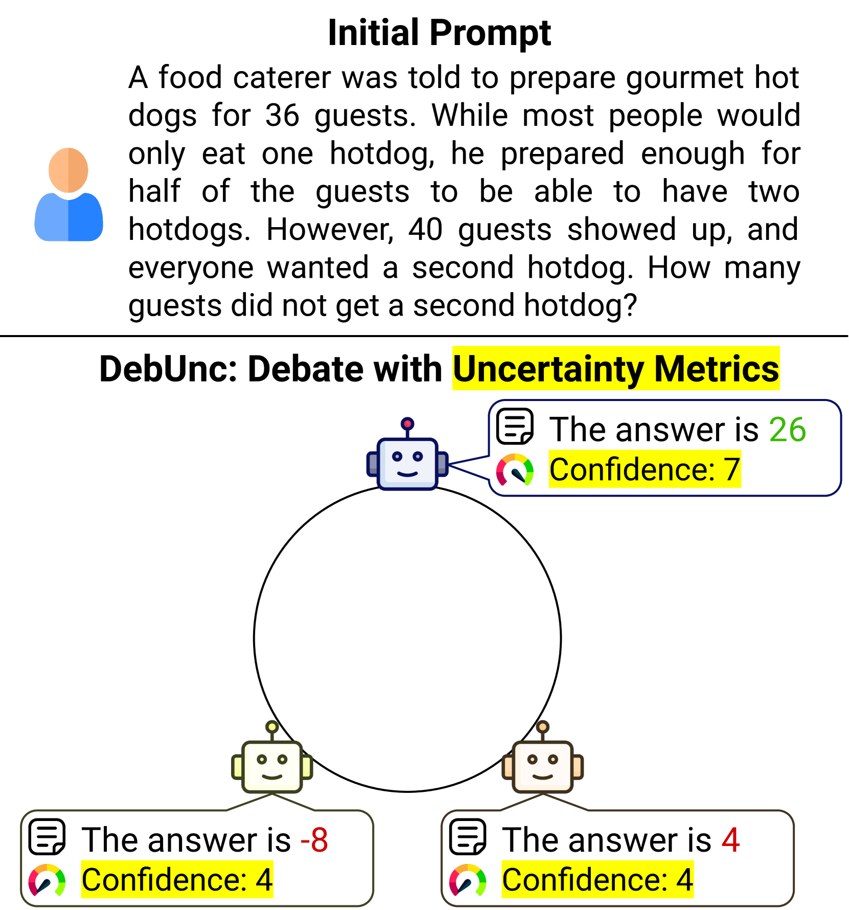

# DebUnc：利用不确定性估计，有效减少大型语言模型代理通信中的幻觉现象。

发布时间：2024年07月08日

`LLM应用` `人工智能` `软件开发`

> DebUnc: Mitigating Hallucinations in Large Language Model Agent Communication with Uncertainty Estimations

# 摘要

> 为了提升 LLM 的性能，我们引入了多智能体辩论机制，让多个 LLM 通过多轮辩论共同探讨解决方案。但 LLM 常给出看似自信的错误答案，可能误导其他智能体。为此，我们开发了 DebUnc 框架，通过不确定性度量来评估智能体的信心水平。我们改进了 LLM 的注意力机制，根据信心调整令牌权重，并尝试用文本提示传达信心。评估结果表明，基于注意力的方法效果显著，且随着不确定性度量的改进，性能将持续提升。代码已公开在 https://github.com/lukeyoffe/debunc。

> To enhance Large Language Model (LLM) capabilities, multi-agent debates have been introduced, where multiple LLMs discuss solutions to a problem over several rounds of debate. However, LLMs often produce incorrect responses that appear deceptively confident, which can mislead other agents. This is partly because agents do not express their confidence levels during standard debates. To address this, we introduce DebUnc, a multi-agent debate framework that uses uncertainty metrics to assess agent confidence levels. We adapted the LLM attention mechanism to adjust token weights based on confidence levels and also explored using textual prompts to convey confidence. Our evaluations across various benchmarks show that attention-based methods are particularly effective, and that as uncertainty metrics evolve, performance will continue to increase. The code is available at https://github.com/lukeyoffe/debunc

[Arxiv](https://arxiv.org/abs/2407.06426)