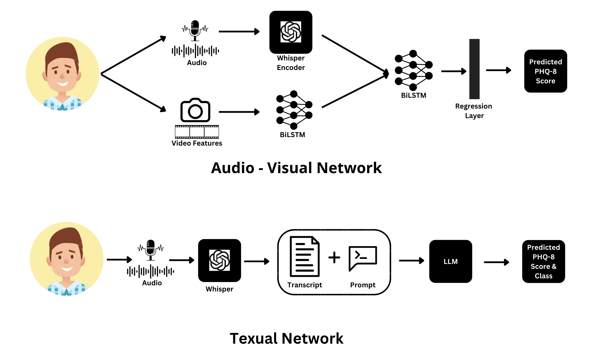
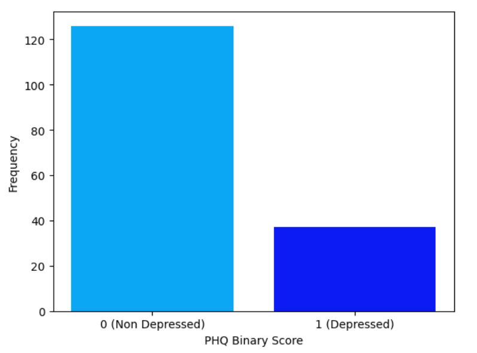
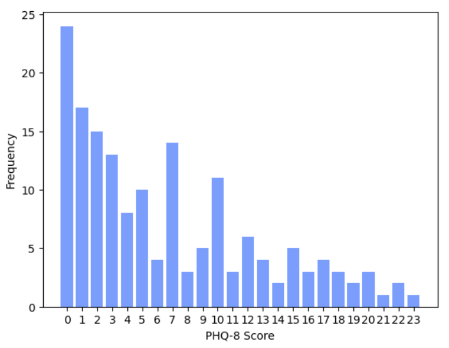
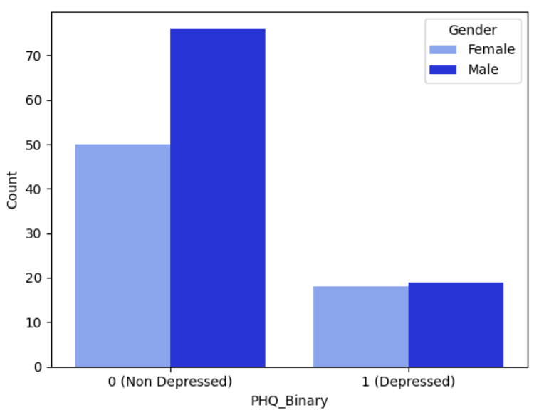
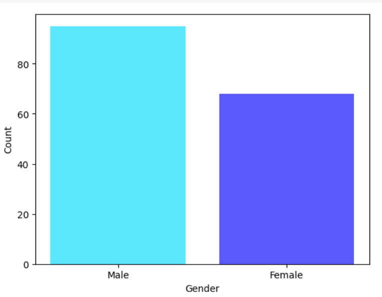
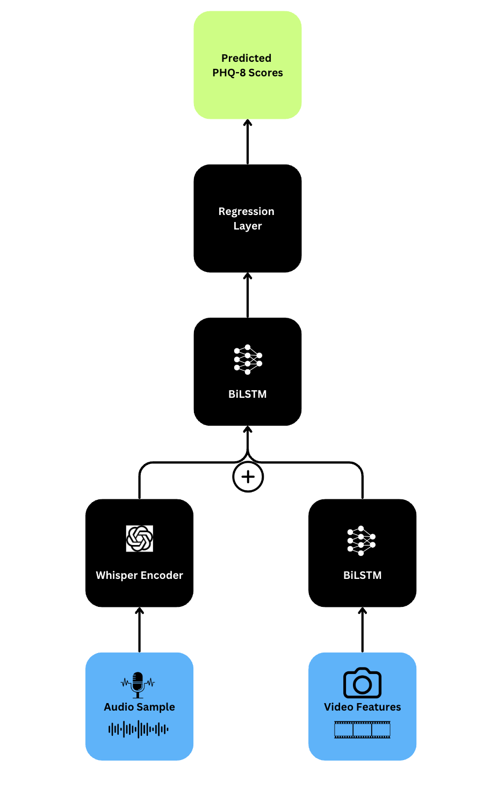
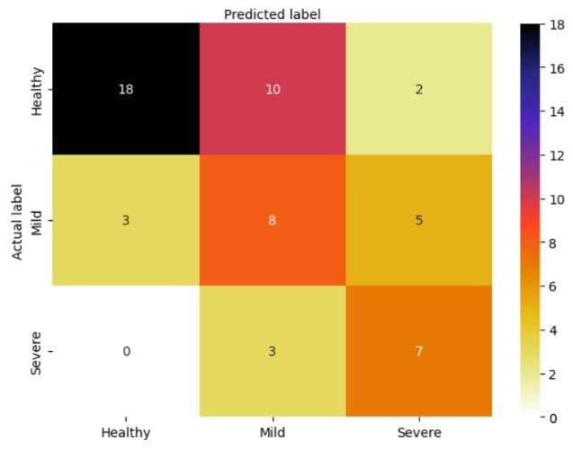
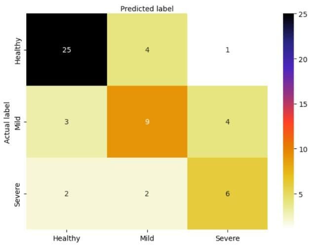
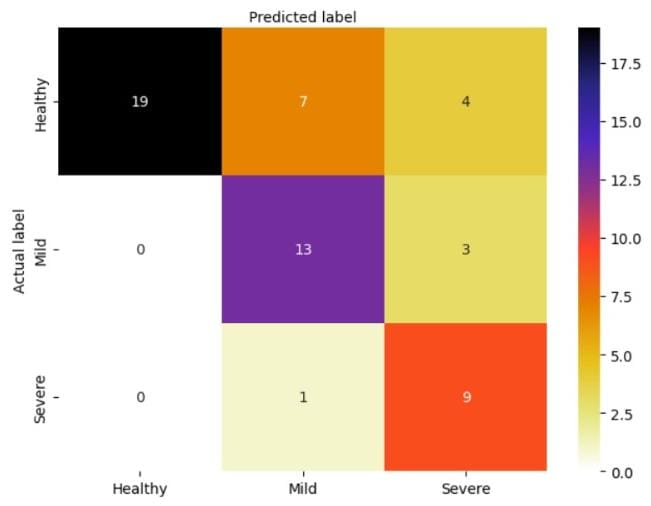

# 利用大型语言模型，结合文本与视听信息，精准检测与分析抑郁症

发布时间：2024年07月08日

`LLM应用` `人工智能`

> Depression Detection and Analysis using Large Language Models on Textual and Audio-Visual Modalities

# 摘要

> 抑郁症已成为影响深远的公共卫生难题，对个体心理健康造成严重冲击。未被识别的抑郁症可能引发一系列严重健康问题，甚至导致自杀。传统上，抑郁症的诊断依赖于半结构化访谈和补充问卷，如患者健康问卷（PHQ），这些方法高度依赖医生的专业判断，易受个人偏见影响。由于抑郁症的内在机制尚在探索中，医生在早期诊断和治疗时面临诸多挑战。近年来，人工神经计算在处理文本、图像和语音等多领域问题方面取得显著进展。我们利用这些尖端模型进行实验，旨在通过多模态分析实现更优结果。实验基于2019年音频/视觉情感挑战（AVEC）中的扩展困境分析访谈语料库（E-DAIC）。我们的解决方案通过专有和开源大型语言模型（LLMs）在文本模态上实现了3.98的RMSE，超越了AVEC 2019的基线和现有SOTA回归架构。此外，分类任务的准确率达到了71.43%。论文还介绍了一种创新的音频-视觉多模态网络，能够以6.51的RMSE预测PHQ-8分数。

> Depression has proven to be a significant public health issue, profoundly affecting the psychological well-being of individuals. If it remains undiagnosed, depression can lead to severe health issues, which can manifest physically and even lead to suicide. Generally, Diagnosing depression or any other mental disorder involves conducting semi-structured interviews alongside supplementary questionnaires, including variants of the Patient Health Questionnaire (PHQ) by Clinicians and mental health professionals. This approach places significant reliance on the experience and judgment of trained physicians, making the diagnosis susceptible to personal biases. Given that the underlying mechanisms causing depression are still being actively researched, physicians often face challenges in diagnosing and treating the condition, particularly in its early stages of clinical presentation. Recently, significant strides have been made in Artificial neural computing to solve problems involving text, image, and speech in various domains. Our analysis has aimed to leverage these state-of-the-art (SOTA) models in our experiments to achieve optimal outcomes leveraging multiple modalities. The experiments were performed on the Extended Distress Analysis Interview Corpus Wizard of Oz dataset (E-DAIC) corpus presented in the Audio/Visual Emotion Challenge (AVEC) 2019 Challenge. The proposed solutions demonstrate better results achieved by Proprietary and Open-source Large Language Models (LLMs), which achieved a Root Mean Square Error (RMSE) score of 3.98 on Textual Modality, beating the AVEC 2019 challenge baseline results and current SOTA regression analysis architectures. Additionally, the proposed solution achieved an accuracy of 71.43% in the classification task. The paper also includes a novel audio-visual multi-modal network that predicts PHQ-8 scores with an RMSE of 6.51.

[Arxiv](https://arxiv.org/abs/2407.06125)