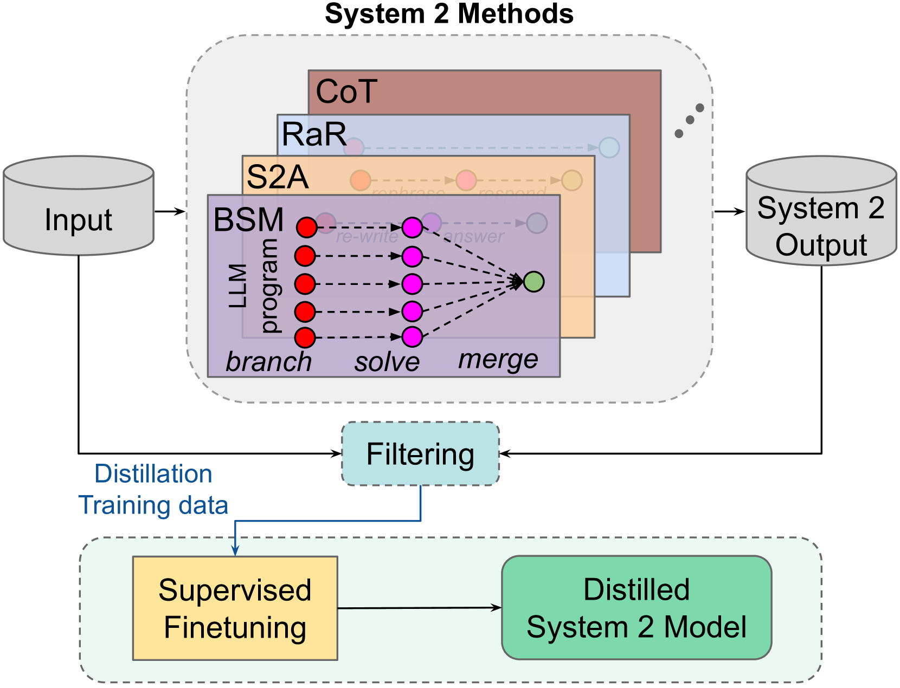
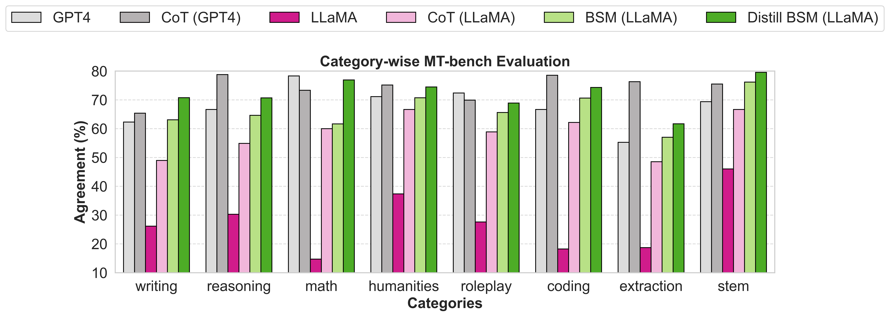
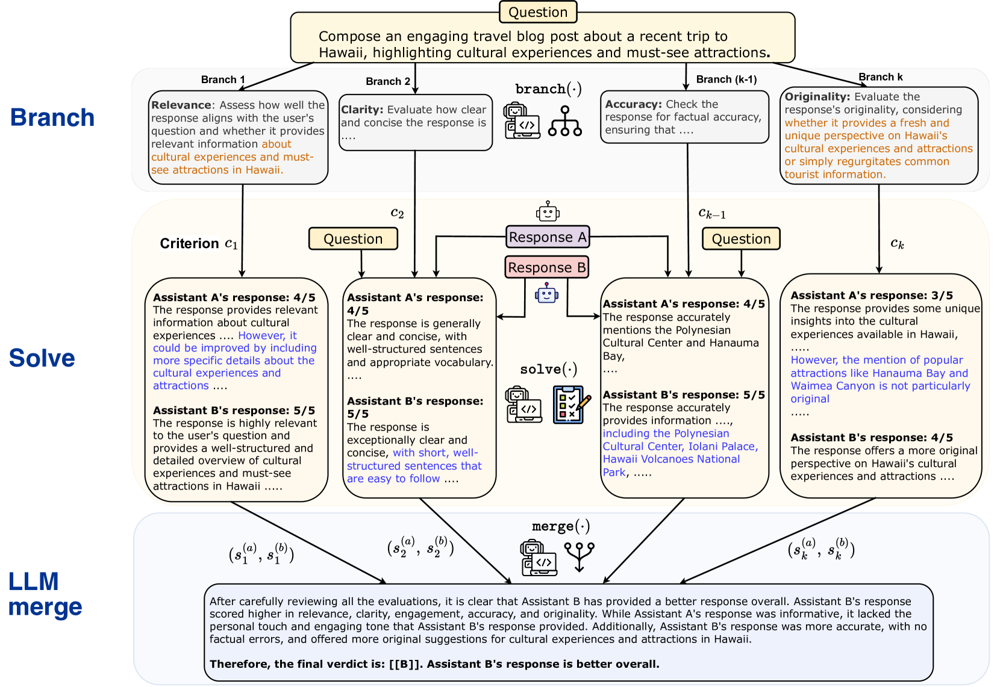

# 系统2向系统1的精炼转化

发布时间：2024年07月08日

`LLM理论` `人工智能` `机器学习`

> Distilling System 2 into System 1

# 摘要

> 大型语言模型在推理时通过额外计算生成中间思维，从而提升最终响应质量。自 Chain-of-Thought 提出后，多种 System 2 技术如 Rephrase and Respond、System 2 Attention 和 Branch-Solve-Merge 相继涌现。本研究探索自监督方法，将这些 System 2 技术的高质量输出提炼回 LLM，无需中间推理步骤，因为推理已融入 System 1。实验表明，这些技术提炼后不仅性能提升，且推理成本降低。我们预见，这种 System 2 提炼将成为未来 AI 系统持续学习的关键，使其能更高效地运用 System 2 能力于尚需改进的推理任务。

> Large language models (LLMs) can spend extra compute during inference to generate intermediate thoughts, which helps to produce better final responses. Since Chain-of-Thought (Wei et al., 2022), many such System 2 techniques have been proposed such as Rephrase and Respond (Deng et al., 2023a), System 2 Attention (Weston and Sukhbaatar, 2023) and Branch-Solve-Merge (Saha et al., 2023). In this work we investigate self-supervised methods to ``compile'' (distill) higher quality outputs from System 2 techniques back into LLM generations without intermediate reasoning token sequences, as this reasoning has been distilled into System 1. We show that several such techniques can be successfully distilled, resulting in improved results compared to the original System 1 performance, and with less inference cost than System 2. We posit that such System 2 distillation will be an important feature of future continually learning AI systems, enabling them to focus System 2 capabilities on the reasoning tasks that they cannot yet do well.

[Arxiv](https://arxiv.org/abs/2407.06023)