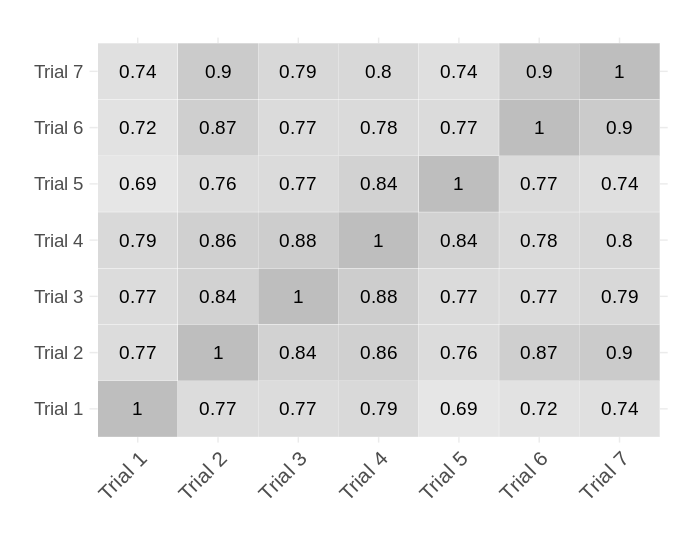

# 探究对话型聊天机器人中的对称推理实证研究

发布时间：2024年07月08日

`LLM应用` `人工智能` `语言处理`

> Empirical Study of Symmetrical Reasoning in Conversational Chatbots

# 摘要

> 本研究探索了大型语言模型 (LLM) 驱动的对话聊天机器人在理解谓词对称性方面的能力，这是一种传统上被视为人类独有的认知语言功能。通过利用上下文学习 (ICL) 这一创新方法，我们评估了 ChatGPT 4、Huggingface 聊天 AI、微软 Copilot AI、Perplexity 的 LLaMA 和 Gemini Advanced 这五款聊天机器人的对称推理能力。我们采用 Tanchip 等人 (2020) 的 Symmetry Inference Sentence (SIS) 数据集，对比聊天机器人的响应与人类评估，以检验它们对谓词对称性的理解。实验结果显示，各聊天机器人的表现参差不齐，部分已接近人类推理水平。例如，Gemini 与人类评分相关性高达 0.85，且每次评估均提供合理解释。此研究凸显了 LLM 在模拟对称推理等复杂认知过程中的潜力与局限。

> This work explores the capability of conversational chatbots powered by large language models (LLMs), to understand and characterize predicate symmetry, a cognitive linguistic function traditionally believed to be an inherent human trait. Leveraging in-context learning (ICL), a paradigm shift enabling chatbots to learn new tasks from prompts without re-training, we assess the symmetrical reasoning of five chatbots: ChatGPT 4, Huggingface chat AI, Microsoft's Copilot AI, LLaMA through Perplexity, and Gemini Advanced. Using the Symmetry Inference Sentence (SIS) dataset by Tanchip et al. (2020), we compare chatbot responses against human evaluations to gauge their understanding of predicate symmetry. Experiment results reveal varied performance among chatbots, with some approaching human-like reasoning capabilities. Gemini, for example, reaches a correlation of 0.85 with human scores, while providing a sounding justification for each symmetry evaluation. This study underscores the potential and limitations of LLMs in mirroring complex cognitive processes as symmetrical reasoning.

[Arxiv](https://arxiv.org/abs/2407.05734)