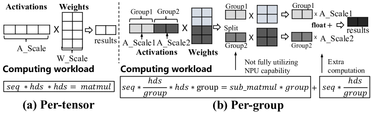
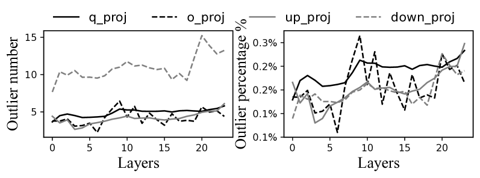
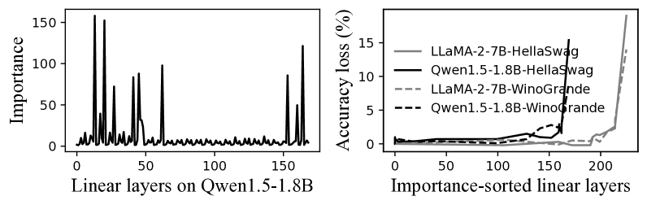
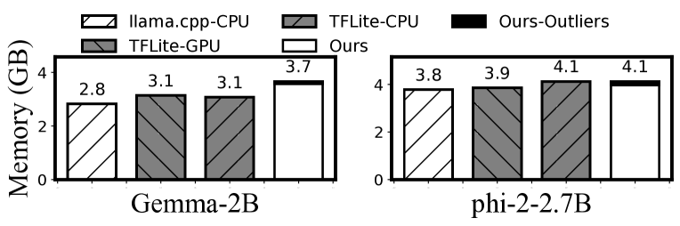

# 借助mllm-NPU，实现设备上LLM每秒高效预填充1000个令牌。

发布时间：2024年07月08日

`LLM应用` `移动应用` `人工智能`

> Empowering 1000 tokens/second on-device LLM prefilling with mllm-NPU

# 摘要

> 设备上的大型语言模型（LLM）正推动着创新的移动应用，如界面任务自动化和个性化邮件自动回复，同时保护用户隐私。然而，这些模型仍受困于过长的推理延迟，尤其是在首次生成令牌时。为了解决这一难题，我们推出了mllm-NPU，这一开创性的LLM推理系统巧妙地利用了设备上的神经处理单元（NPU）。mllm-NPU通过算法与系统的深度融合，有效弥合了LLM架构与现代NPU设计间的语义鸿沟。它通过三个层面的创新重构提示与模型：首先，在提示层面，将可变长度提示分割为固定大小块，保持数据依赖；其次，在张量层面，识别并并行处理关键异常值，降低开销；最后，在块层面，根据硬件特性与准确性需求，灵活调度Transformer块。相较于现有技术，mllm-NPU在预填充速度上提升了22.4倍，能耗节省达30.7倍，实际应用中加速高达32.8倍。这一突破首次实现了十亿级模型每秒预填充超过1,000个令牌，为设备上LLM的实用化开辟了新纪元。

> On-device large language models (LLMs) are catalyzing novel mobile applications such as UI task automation and personalized email auto-reply, without giving away users' private data. However, on-device LLMs still suffer from unacceptably long inference latency, especially the time to first token (prefill stage) due to the need of long context for accurate, personalized content generation, as well as the lack of parallel computing capacity of mobile CPU/GPU.
  To enable practical on-device LLM, we present mllm-NPU, the first-of-its-kind LLM inference system that efficiently leverages on-device Neural Processing Unit (NPU) offloading. Essentially, mllm-NPU is an algorithm-system co-design that tackles a few semantic gaps between the LLM architecture and contemporary NPU design. Specifically, it re-constructs the prompt and model in three levels: (1) At prompt level, it divides variable-length prompts into multiple fixed-sized chunks while maintaining data dependencies; (2) At tensor level, it identifies and extracts significant outliers to run on the CPU/GPU in parallel with minimal overhead; (3) At block level, it schedules Transformer blocks in an out-of-order manner to the CPU/GPU and NPU based on their hardware affinity and sensitivity to accuracy. Compared to competitive baselines, mllm-NPU achieves 22.4x faster prefill speed and 30.7x energy savings on average, and up to 32.8x speedup in an end-to-end real-world application. For the first time, mllm-NPU achieves more than 1,000 tokens/sec prefilling for a billion-sized model (Qwen1.5-1.8B), paving the way towards practical on-device LLM.

[Arxiv](https://arxiv.org/abs/2407.05858)