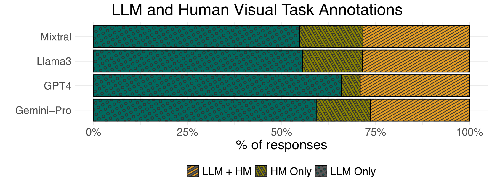
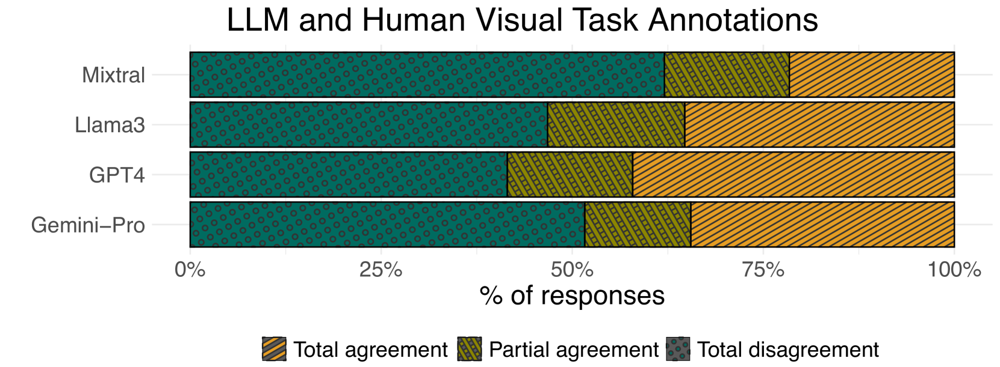
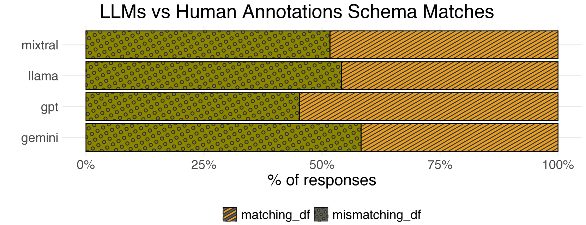

# 探究 LLM 在数据可视化领域对自然语言表达的语义解析能力

发布时间：2024年07月08日

`LLM应用` `数据可视化` `人工智能`

> Evaluating the Semantic Profiling Abilities of LLMs for Natural Language Utterances in Data Visualization

# 摘要

> 自动生成数据可视化以响应人类对数据集的表述，需要深入理解数据表述的语义，包括对数据属性的隐含和显式引用、可视化任务及数据准备步骤。尽管数据可视化的自然语言接口（NLIs）已探索推断此类信息的方法，但人类语言的不确定性仍带来挑战。大型语言模型（LLMs）的最新进展为解决这些挑战提供了可能，但其提取相关语义信息的能力尚未明确。本研究评估了四个公开可用的LLMs（GPT-4、Gemini-Pro、Llama3和Mixtral），探讨它们在不确定性存在时理解表述的能力，并识别相关数据上下文和可视化任务。研究发现，LLMs对表述中的不确定性敏感，但仍能提取相关数据上下文，而在推断可视化任务方面则面临挑战。基于此，我们提出了利用LLMs进行可视化生成的未来研究方向。

> Automatically generating data visualizations in response to human utterances on datasets necessitates a deep semantic understanding of the data utterance, including implicit and explicit references to data attributes, visualization tasks, and necessary data preparation steps. Natural Language Interfaces (NLIs) for data visualization have explored ways to infer such information, yet challenges persist due to inherent uncertainty in human speech. Recent advances in Large Language Models (LLMs) provide an avenue to address these challenges, but their ability to extract the relevant semantic information remains unexplored. In this study, we evaluate four publicly available LLMs (GPT-4, Gemini-Pro, Llama3, and Mixtral), investigating their ability to comprehend utterances even in the presence of uncertainty and identify the relevant data context and visual tasks. Our findings reveal that LLMs are sensitive to uncertainties in utterances. Despite this sensitivity, they are able to extract the relevant data context. However, LLMs struggle with inferring visualization tasks. Based on these results, we highlight future research directions on using LLMs for visualization generation.

[Arxiv](https://arxiv.org/abs/2407.06129)