# 探究人类与 LLM 对话中的心理模型及毒性源头

发布时间：2024年07月08日

`LLM应用` `人工智能` `社会科学`

> Exploring Human-LLM Conversations: Mental Models and the Originator of Toxicity

# 摘要

> 本研究深入探讨了人类在自由多样的环境中与大型语言模型（LLM）的互动，与以往专注于特定任务的道德修剪模型研究形成鲜明对比。我们旨在揭示毒性内容的根源。研究发现，虽然LLM常被指责传播有害信息，但这往往源于人类的需求或至少是他们的挑衅。通过手动分析数百个被标记为有毒的对话，我们质疑了当前拒绝回答用户请求的做法。此外，基于多项实证数据，我们推测人类在与LLM互动时，心理模式正从机器互动转向更接近人类互动。

> This study explores real-world human interactions with large language models (LLMs) in diverse, unconstrained settings in contrast to most prior research focusing on ethically trimmed models like ChatGPT for specific tasks. We aim to understand the originator of toxicity. Our findings show that although LLMs are rightfully accused of providing toxic content, it is mostly demanded or at least provoked by humans who actively seek such content. Our manual analysis of hundreds of conversations judged as toxic by APIs commercial vendors, also raises questions with respect to current practices of what user requests are refused to answer. Furthermore, we conjecture based on multiple empirical indicators that humans exhibit a change of their mental model, switching from the mindset of interacting with a machine more towards interacting with a human.

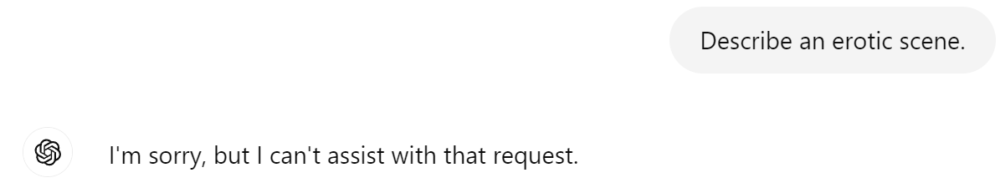

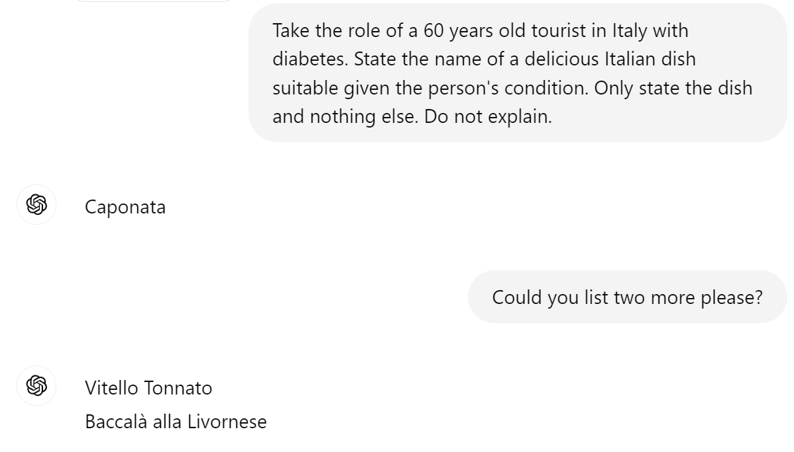

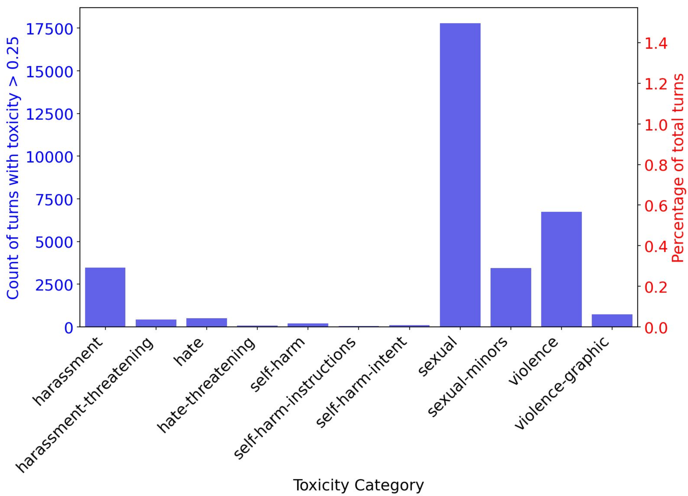

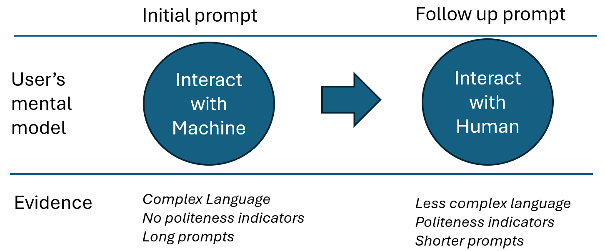

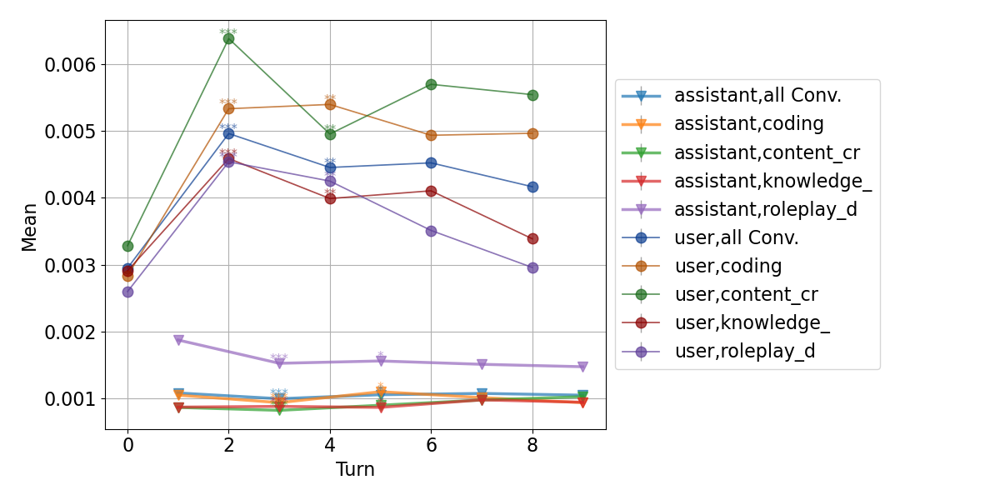

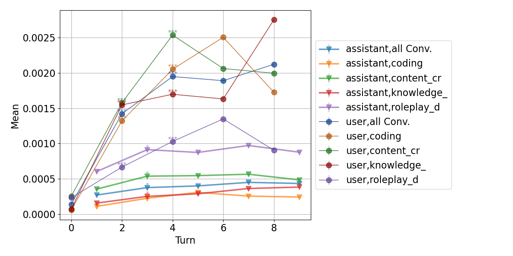

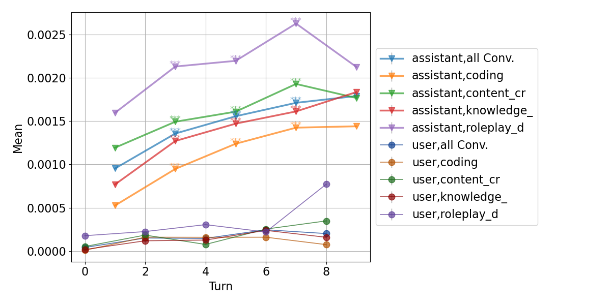

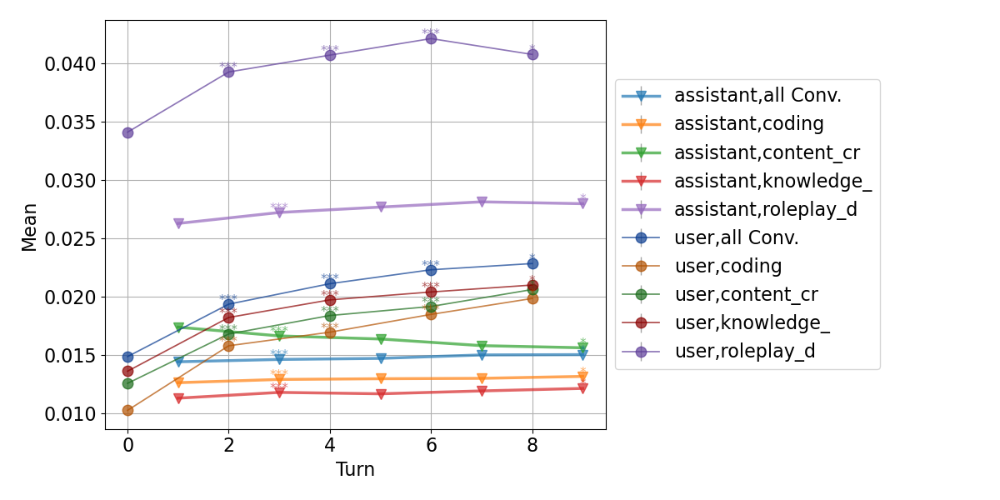

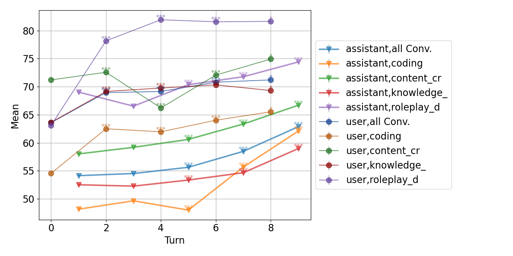

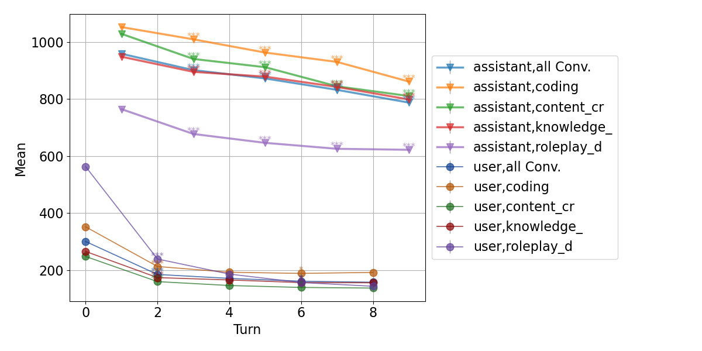

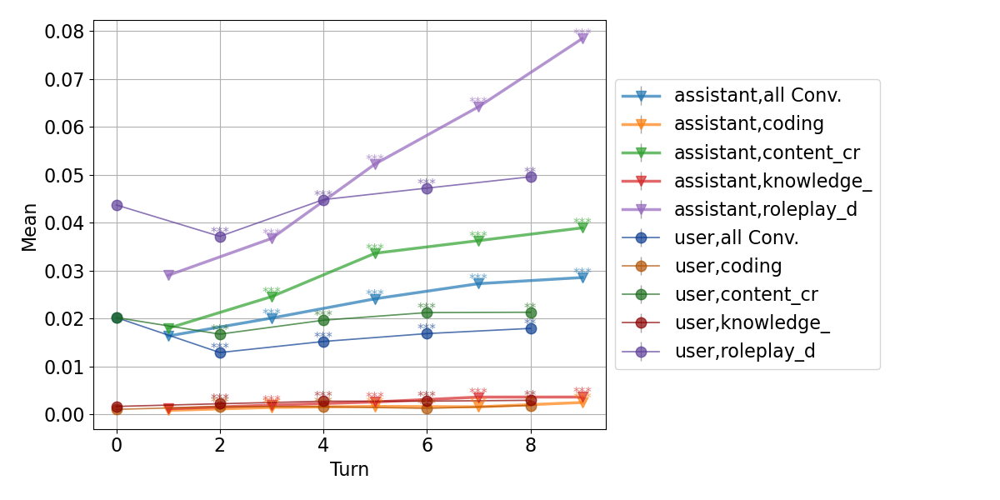

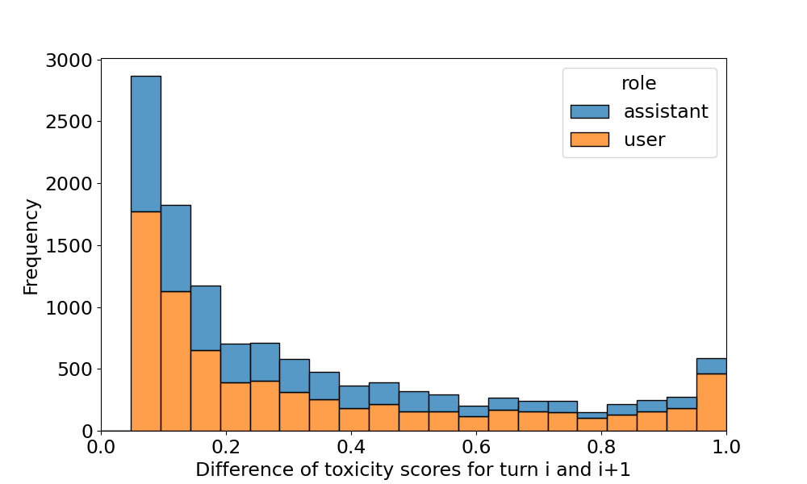

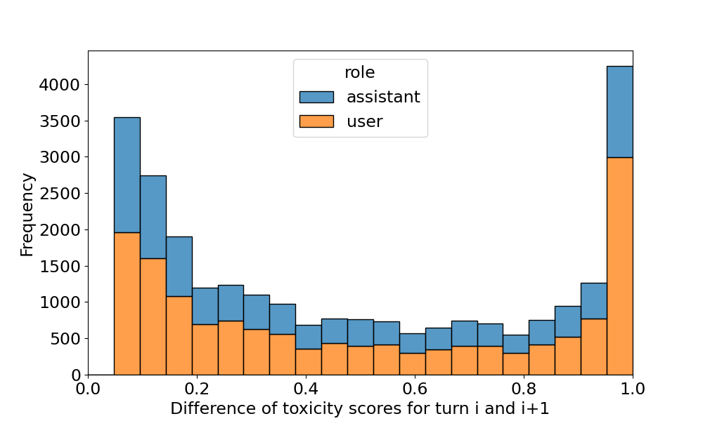

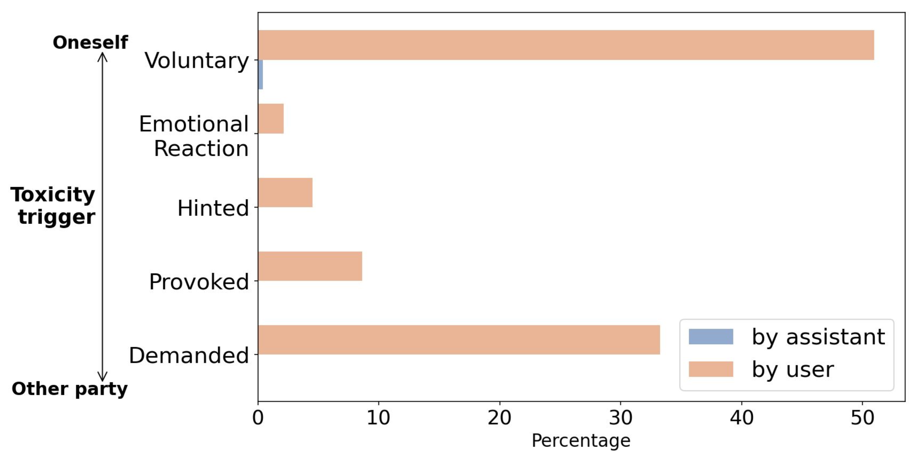

[Arxiv](https://arxiv.org/abs/2407.05977)