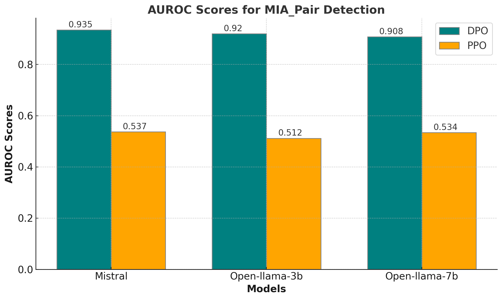
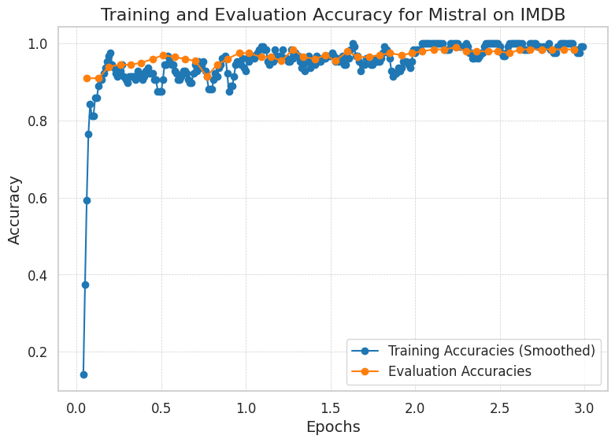
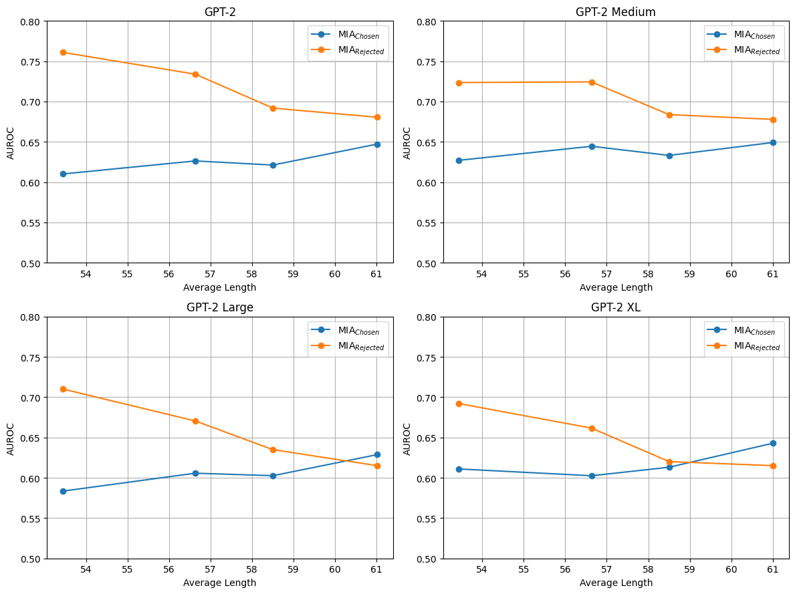

# 揭秘隐私漏洞：针对 LLM 对齐过程中的偏好数据进行的成员推理攻击

发布时间：2024年07月08日

`LLM应用` `人工智能` `隐私保护`

> Exposing Privacy Gaps: Membership Inference Attack on Preference Data for LLM Alignment

# 摘要

> 大型语言模型（LLM）因其出色的自然语言处理能力而广受欢迎。但在实际应用中，确保其生成的文本符合人类标准至关重要。近端策略优化（PPO）和直接偏好优化（DPO）等方法利用人类偏好数据对 LLM 进行了显著改进，但这些数据带来的隐私问题尚未得到充分探讨。本文探讨了基于人类偏好数据集对齐的 LLM 对成员推理攻击（MIA）的脆弱性，并指出了现有 MIA 方法在处理偏好数据方面的缺陷。我们的研究主要贡献有两点：一是引入了针对偏好数据的新型参考攻击框架 PREMIA；二是实证表明 DPO 模型比 PPO 模型更易受 MIA 影响。这些发现揭示了当前 LLM 对齐过程中隐私保护措施的不足。

> Large Language Models (LLMs) have seen widespread adoption due to their remarkable natural language capabilities. However, when deploying them in real-world settings, it is important to align LLMs to generate texts according to acceptable human standards. Methods such as Proximal Policy Optimization (PPO) and Direct Preference Optimization (DPO) have made significant progress in refining LLMs using human preference data. However, the privacy concerns inherent in utilizing such preference data have yet to be adequately studied. In this paper, we investigate the vulnerability of LLMs aligned using human preference datasets to membership inference attacks (MIAs), highlighting the shortcomings of previous MIA approaches with respect to preference data. Our study has two main contributions: first, we introduce a novel reference-based attack framework specifically for analyzing preference data called PREMIA (\uline{Pre}ference data \uline{MIA}); second, we provide empirical evidence that DPO models are more vulnerable to MIA compared to PPO models. Our findings highlight gaps in current privacy-preserving practices for LLM alignment.

[Arxiv](https://arxiv.org/abs/2407.06443)