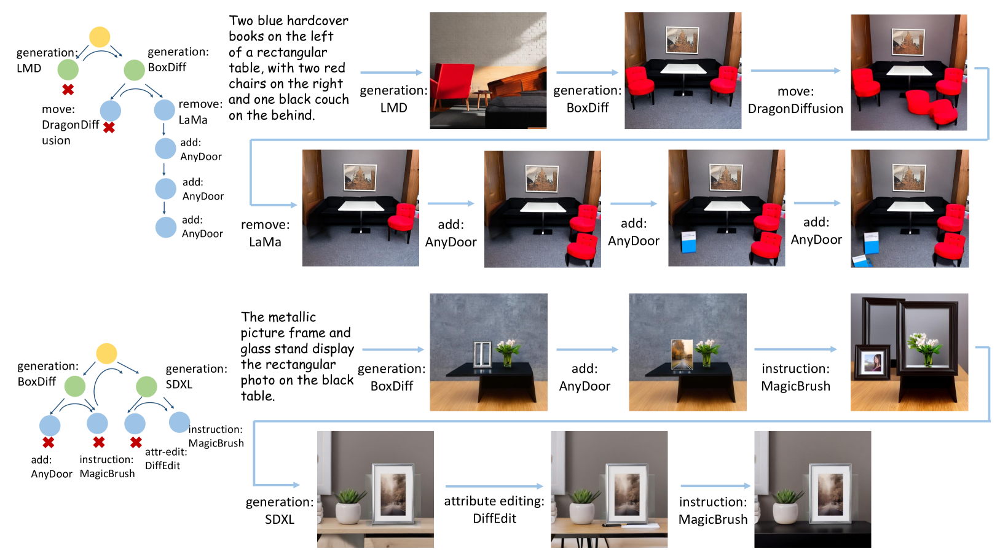

# GenArtist：一款多模态 LLM，作为统一图像生成与编辑的智能代理

发布时间：2024年07月08日

`Agent` `图像处理` `人工智能`

> GenArtist: Multimodal LLM as an Agent for Unified Image Generation and Editing

# 摘要

> 尽管现有图像生成和编辑技术已取得一定成就，但面对复杂文本提示等难题，以及缺乏验证和自校正机制，现有模型仍显不足。此外，单一模型往往局限于特定任务，难以全面满足用户需求。为此，我们推出了GenArtist系统，该系统由多模态大型语言模型（MLLM）代理统一调度，集成了广泛的现有模型工具库。面对复杂任务，MLLM代理能将其拆解为简单子问题，并构建树状结构，系统化地规划生成、编辑及自校正流程，每一步都经过严格验证。通过自动补全位置相关输入并融入位置信息，系统能精准选用工具，高效解决各子问题。实验结果显示，GenArtist在多种生成和编辑任务中表现卓越，性能超越了SDXL和DALL-E 3等现有模型，详情可见图1。项目详情页：https://zhenyuw16.github.io/GenArtist_page。

> Despite the success achieved by existing image generation and editing methods, current models still struggle with complex problems including intricate text prompts, and the absence of verification and self-correction mechanisms makes the generated images unreliable. Meanwhile, a single model tends to specialize in particular tasks and possess the corresponding capabilities, making it inadequate for fulfilling all user requirements. We propose GenArtist, a unified image generation and editing system, coordinated by a multimodal large language model (MLLM) agent. We integrate a comprehensive range of existing models into the tool library and utilize the agent for tool selection and execution. For a complex problem, the MLLM agent decomposes it into simpler sub-problems and constructs a tree structure to systematically plan the procedure of generation, editing, and self-correction with step-by-step verification. By automatically generating missing position-related inputs and incorporating position information, the appropriate tool can be effectively employed to address each sub-problem. Experiments demonstrate that GenArtist can perform various generation and editing tasks, achieving state-of-the-art performance and surpassing existing models such as SDXL and DALL-E 3, as can be seen in Fig. 1. Project page is https://zhenyuw16.github.io/GenArtist_page.

[Arxiv](https://arxiv.org/abs/2407.05600)