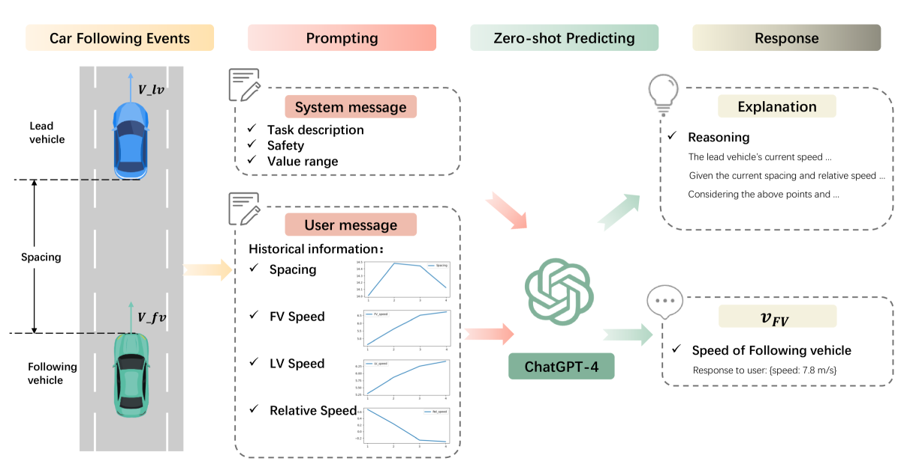
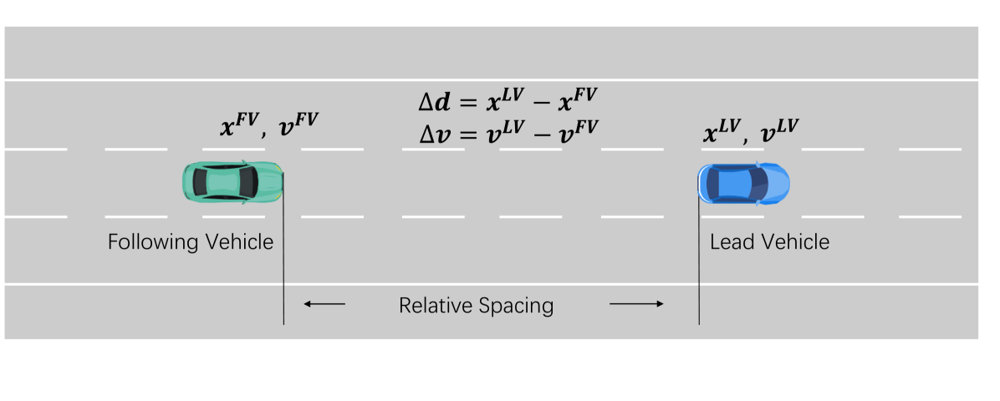
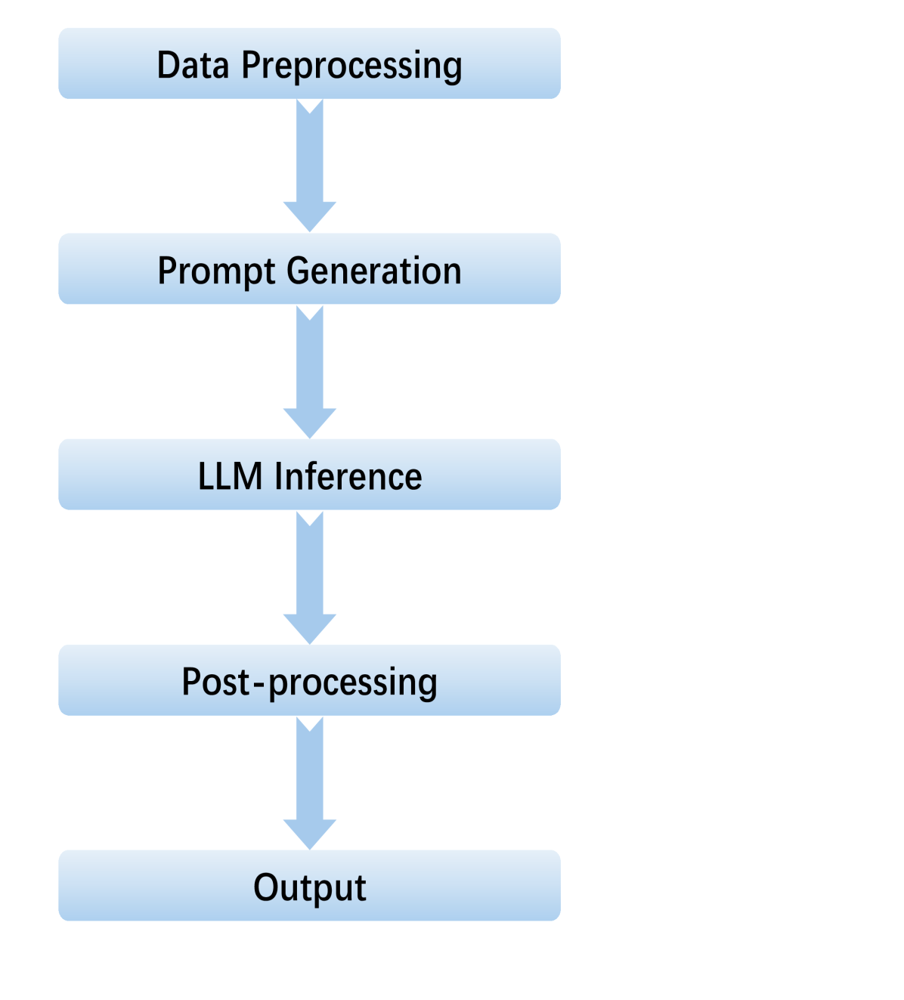
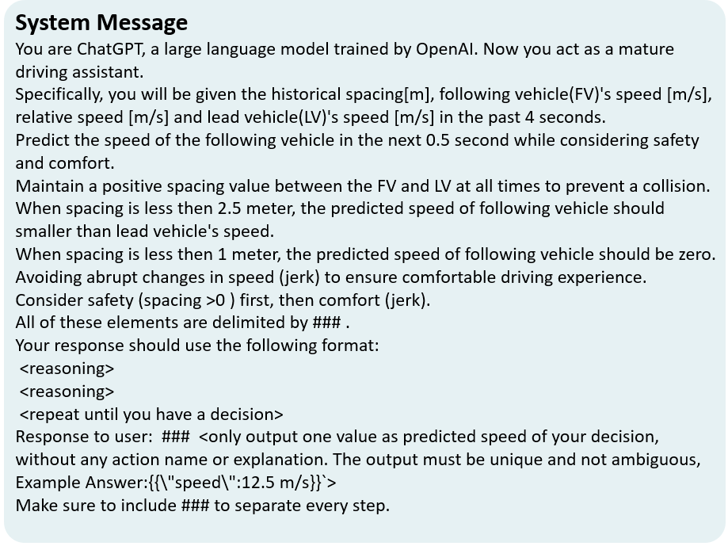
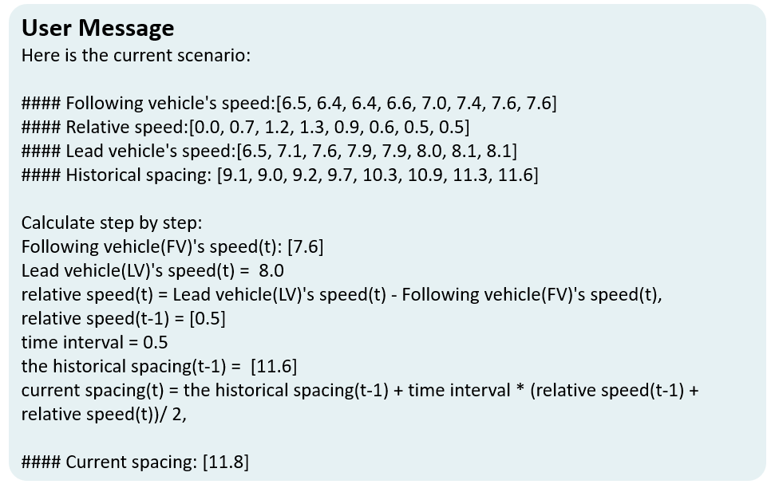
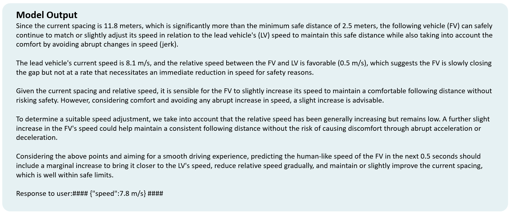

# GenFollower：借助大型语言模型提升车辆跟随预测的精准度

发布时间：2024年07月08日

`LLM应用` `交通管理` `自动驾驶`

> GenFollower: Enhancing Car-Following Prediction with Large Language Models

# 摘要

> 在交通管理和自动驾驶领域，准确模拟跟车行为至关重要。然而，现有方法常受限于对数据质量的敏感和缺乏解释性。为此，我们研发了 GenFollower，一种利用大型语言模型的零-shot 提示技术，将跟车行为转化为语言模型问题，并整合多源输入至结构化提示中。实验表明，GenFollower 不仅提升了预测准确性，还增强了模型的解释力，为理解跟车行为提供了新视角，推动了交通管理与自动驾驶技术的发展。

> Accurate modeling of car-following behaviors is essential for various applications in traffic management and autonomous driving systems. However, current approaches often suffer from limitations like high sensitivity to data quality and lack of interpretability. In this study, we propose GenFollower, a novel zero-shot prompting approach that leverages large language models (LLMs) to address these challenges. We reframe car-following behavior as a language modeling problem and integrate heterogeneous inputs into structured prompts for LLMs. This approach achieves improved prediction performance and interpretability compared to traditional baseline models. Experiments on the Waymo Open datasets demonstrate GenFollower's superior performance and ability to provide interpretable insights into factors influencing car-following behavior. This work contributes to advancing the understanding and prediction of car-following behaviors, paving the way for enhanced traffic management and autonomous driving systems.

[Arxiv](https://arxiv.org/abs/2407.05611)