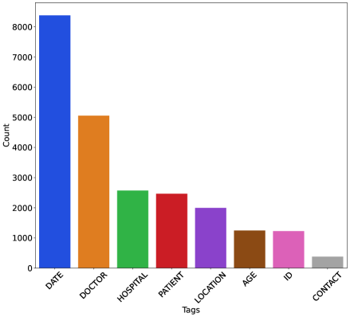
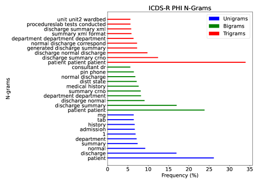

# 利用大型语言模型生成并去识别化印度临床出院总结

发布时间：2024年07月08日

`LLM应用` `数据安全`

> Generation and De-Identification of Indian Clinical Discharge Summaries using LLMs

# 摘要

> 医疗数据泄露的后果对患者、提供者和支付者都可能是毁灭性的，平均财务影响近1000万美元。在印度，快速数字化与数据治理程序的建立并行，这对医疗机构尤为关键。去标识化系统易受数据漂移影响，跨机构应用时常无效。因此，对现有去标识化系统进行严格评估，以支持印度数字健康举措的安全采用至关重要。本研究利用印度医疗机构提供的去标识化患者出院总结，揭示了基于非印度数据集训练的去标识化算法在跨机构泛化上的不足。同时，现成的去标识化系统也存在潜在风险。为解决数据稀缺问题，我们通过在大语言模型上进行上下文学习，生成合成临床报告，实验证明这是一种有效策略，可创建具有良好泛化能力的高性能去标识化系统。

> The consequences of a healthcare data breach can be devastating for the patients, providers, and payers. The average financial impact of a data breach in recent months has been estimated to be close to USD 10 million. This is especially significant for healthcare organizations in India that are managing rapid digitization while still establishing data governance procedures that align with the letter and spirit of the law. Computer-based systems for de-identification of personal information are vulnerable to data drift, often rendering them ineffective in cross-institution settings. Therefore, a rigorous assessment of existing de-identification against local health datasets is imperative to support the safe adoption of digital health initiatives in India. Using a small set of de-identified patient discharge summaries provided by an Indian healthcare institution, in this paper, we report the nominal performance of de-identification algorithms (based on language models) trained on publicly available non-Indian datasets, pointing towards a lack of cross-institutional generalization. Similarly, experimentation with off-the-shelf de-identification systems reveals potential risks associated with the approach. To overcome data scarcity, we explore generating synthetic clinical reports (using publicly available and Indian summaries) by performing in-context learning over Large Language Models (LLMs). Our experiments demonstrate the use of generated reports as an effective strategy for creating high-performing de-identification systems with good generalization capabilities.

[Arxiv](https://arxiv.org/abs/2407.05887)