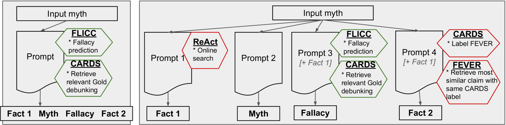

# 揭秘气候谣言的生成式方法

发布时间：2024年07月08日

`LLM应用` `气候变化` `信息安全`

> Generative Debunking of Climate Misinformation

# 摘要

> 气候变化错误信息带来的负面影响众多，亟需纠正。心理学研究虽提供了减少其影响的策略，如“事实-神话-谬误-事实”结构，但大规模实施纠正措施仍具挑战。本研究探索了通过自动检测与纠正错误信息来应对这一问题，开发了能接受气候神话输入并按“真相三明治”结构生成反驳的大型语言模型。我们融合了开放与专有LLM，并运用多样的提示策略进行实验，发现结合结构化提示的GPT-4和Mixtral性能显著。同时，我们揭示了反驳生成及评估的难题，并指明了未来研究方向。此外，我们公开了高质量反驳数据集、源码及系统演示，以供进一步探索与应用。

> Misinformation about climate change causes numerous negative impacts, necessitating corrective responses. Psychological research has offered various strategies for reducing the influence of climate misinformation, such as the fact-myth-fallacy-fact-structure. However, practically implementing corrective interventions at scale represents a challenge. Automatic detection and correction of misinformation offers a solution to the misinformation problem. This study documents the development of large language models that accept as input a climate myth and produce a debunking that adheres to the fact-myth-fallacy-fact (``truth sandwich'') structure, by incorporating contrarian claim classification and fallacy detection into an LLM prompting framework. We combine open (Mixtral, Palm2) and proprietary (GPT-4) LLMs with prompting strategies of varying complexity. Experiments reveal promising performance of GPT-4 and Mixtral if combined with structured prompts. We identify specific challenges of debunking generation and human evaluation, and map out avenues for future work. We release a dataset of high-quality truth-sandwich debunkings, source code and a demo of the debunking system.

[Arxiv](https://arxiv.org/abs/2407.05599)