# Hecaton：借助可扩展的小芯片系统，高效训练与微调大型语言模型。

发布时间：2024年07月08日

`LLM理论` `半导体` `人工智能`

> Hecaton: Training and Finetuning Large Language Models with Scalable Chiplet Systems

# 摘要

> 大型语言模型 (LLM) 在多领域取得显著成就，但其训练与微调对计算和内存需求巨大，导致并行化带来高额通信成本。随着封装技术的发展，chiplet 架构应运而生，它集成了计算能力，并通过优化封装内链接，提供更佳的信号完整性、高带宽和低能耗。然而，现有 chiplet 研究多聚焦于 DNN 推理，直接应用于 LLM 训练则引发大量 DRAM 访问和封装内网络 (NoP) 开销，使先进 chiplet 设计失效，揭示了研究缺口。  本研究提出 Hecaton，一个专为 LLM 训练与微调设计的可扩展、高性价比 chiplet 系统。我们首先构建了一个定制调度的 chiplet 架构，显著减少 DRAM 访问。接着，我们设计了一种高效的分布式训练策略，降低 NoP 通信复杂性，并放宽对 SRAM 容量和布局的限制。理论分析显示，该系统实现了弱扩展：工作负载与硬件资源同比例增长时，计算与通信比率几乎恒定。实验证明，Hecaton 在 Llama2-70B 上相较于 Megatron 的张量并行，实现了 $4.98\times$ 的性能提升和 $2.35\times$ 的能耗节省。据我们所知，这是首个专为 LLM 训练或微调设计的 chiplet 架构，确保了性能的稳定性，不受问题规模影响。

> Large Language Models (LLMs) have achieved remarkable success in various fields, but their training and finetuning require massive computation and memory, necessitating parallelism which introduces heavy communication overheads. Driven by advances in packaging, the chiplet architecture emerges as a potential solution, as it can integrate computing power, as well as utilize on-package links with better signal integrity, higher bandwidth, and lower energy consumption. However, most existing chiplet-related works focus on DNN inference. Directly porting them to LLM training introduces significantly large quantities of DRAM access and network-on-package (NoP) overheads which make state-of-the-art chiplet designs fail, highlighting a research gap.
  This work proposes Hecaton, a scalable and cost-effective chiplet system for LLM training and finetuning. We first provide a chiplet architecture with tailored scheduling that can largely reduce DRAM accesses. We further design an efficient distributed training method that reduces NoP communication complexity and relieves constraints on SRAM capacity and layout. Theoretical analysis shows that the entire system achieves weak scaling: as the workload and hardware resources grow proportionally, the computation-to-communication ratio remains nearly constant. Experiments with various workloads and hardware configurations verify the property, and Hecaton achieves $4.98\times$ performance improvement and $2.35\times$ energy reduction on Llama2-70B, compared to the tensor parallelism in Megatron. To the best of our knowledge, we propose the first chiplet architecture specifically used for LLM training or finetuning, with guaranteed performance regardless of the problem scale.

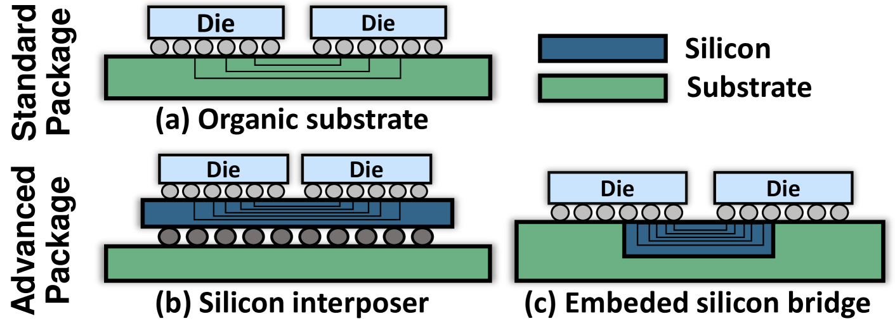

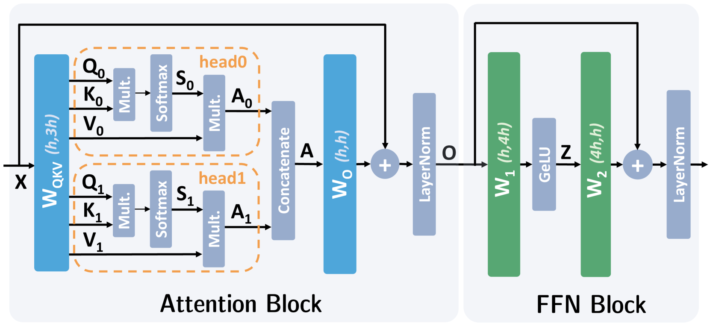

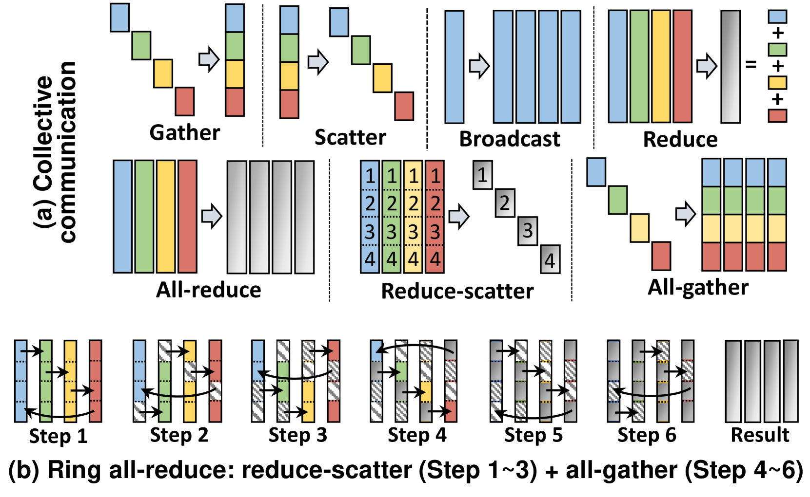

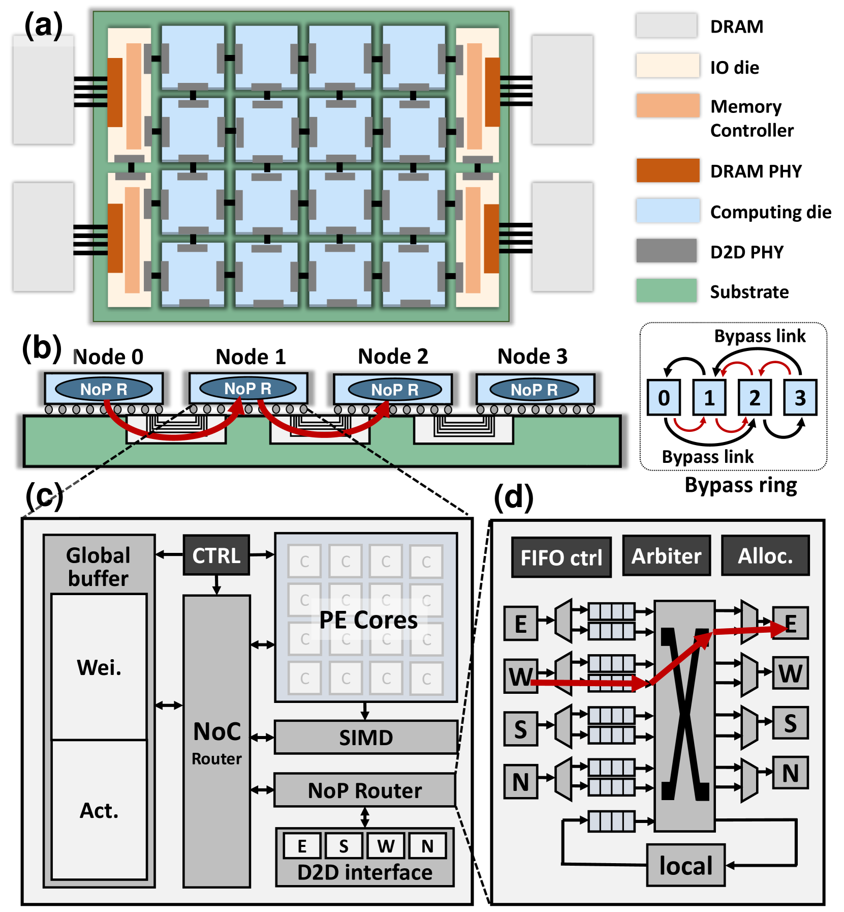

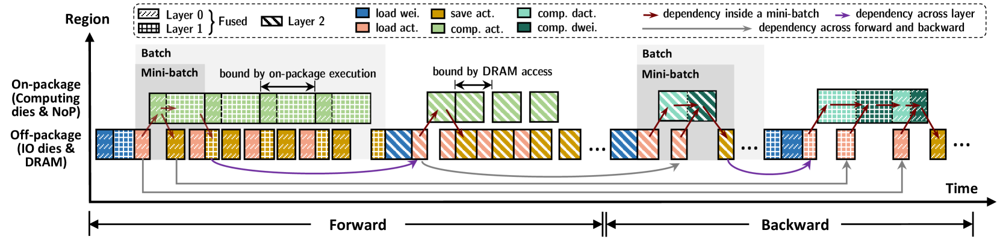

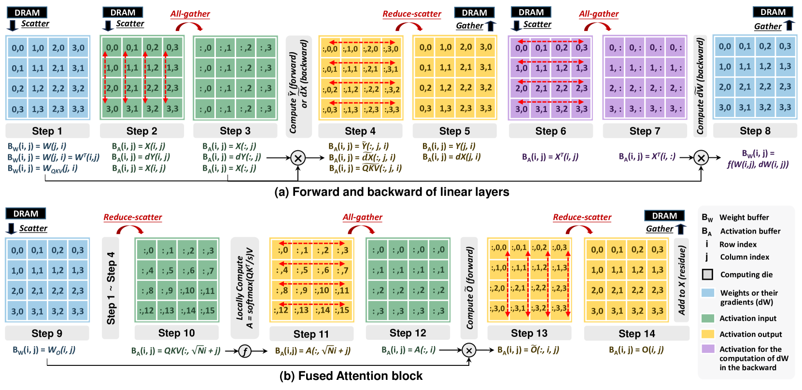

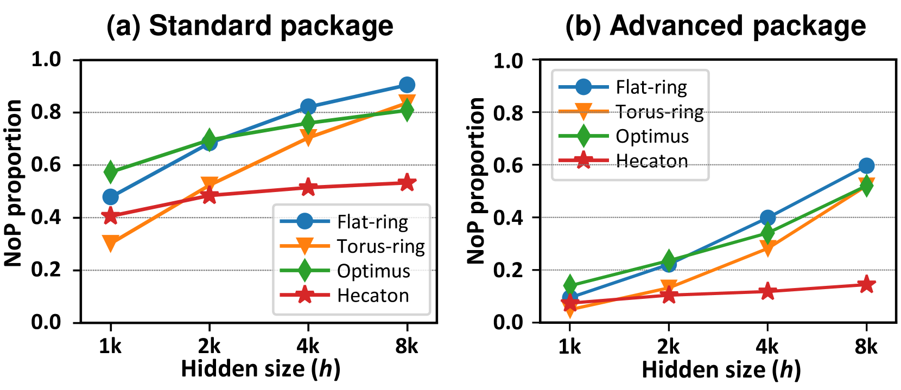

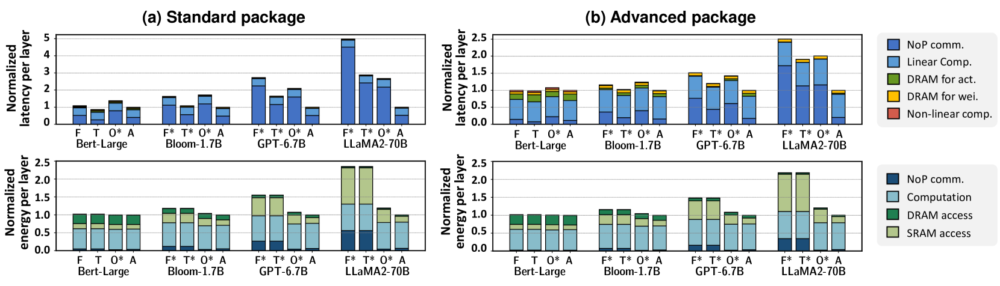

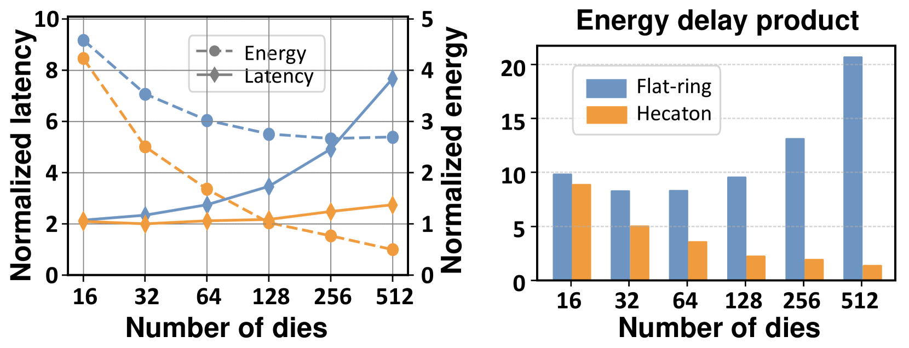

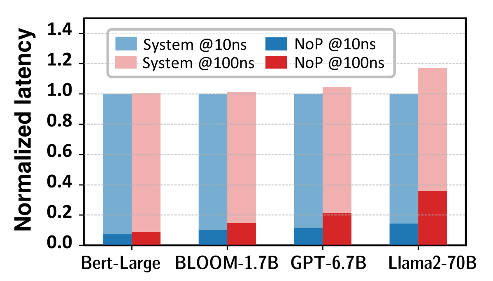

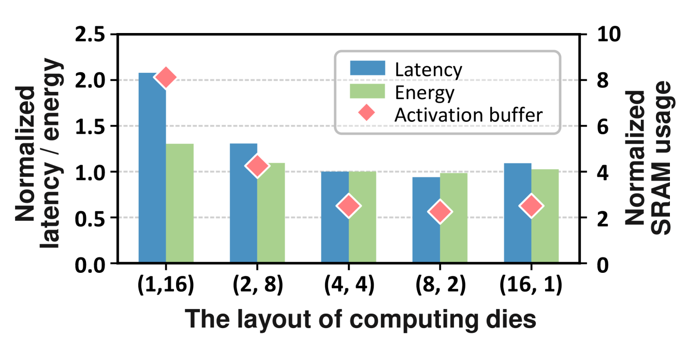

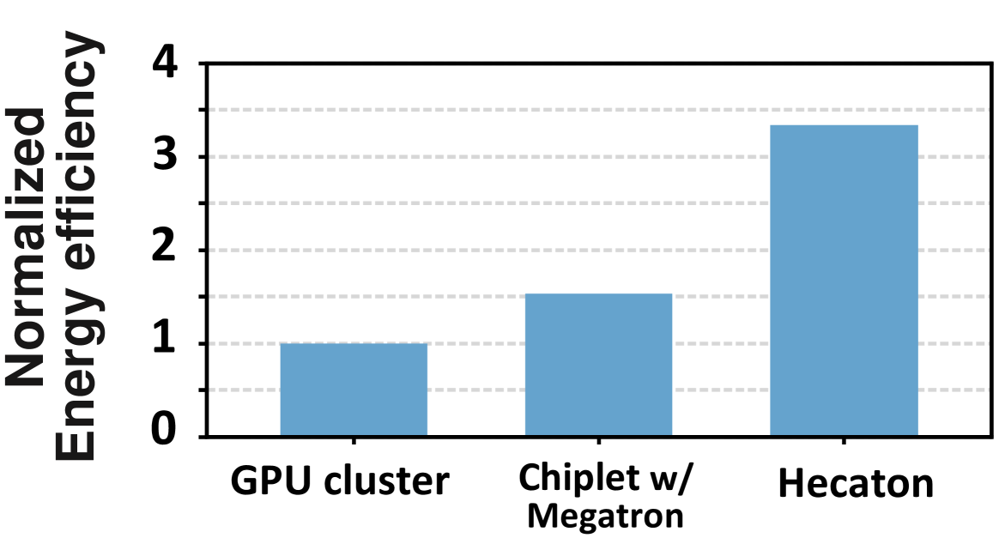

[Arxiv](https://arxiv.org/abs/2407.05784)