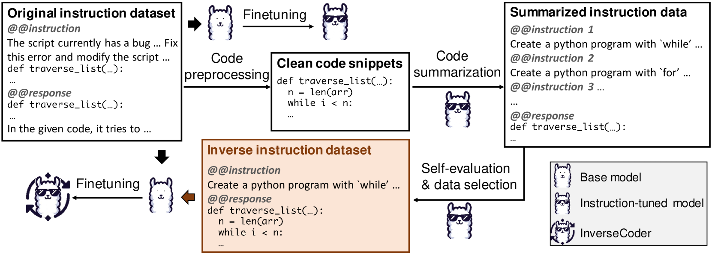
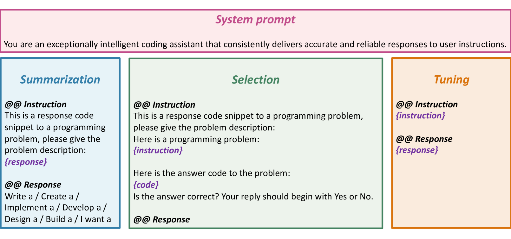
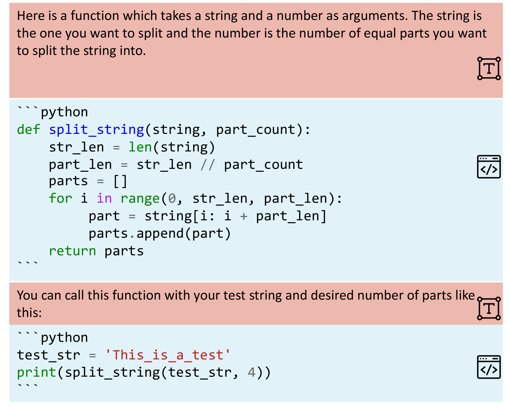
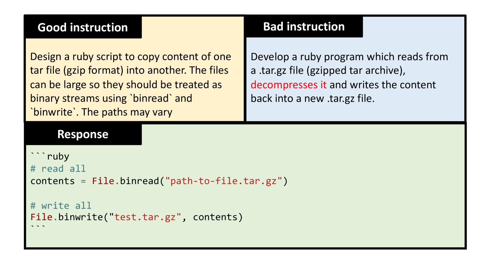
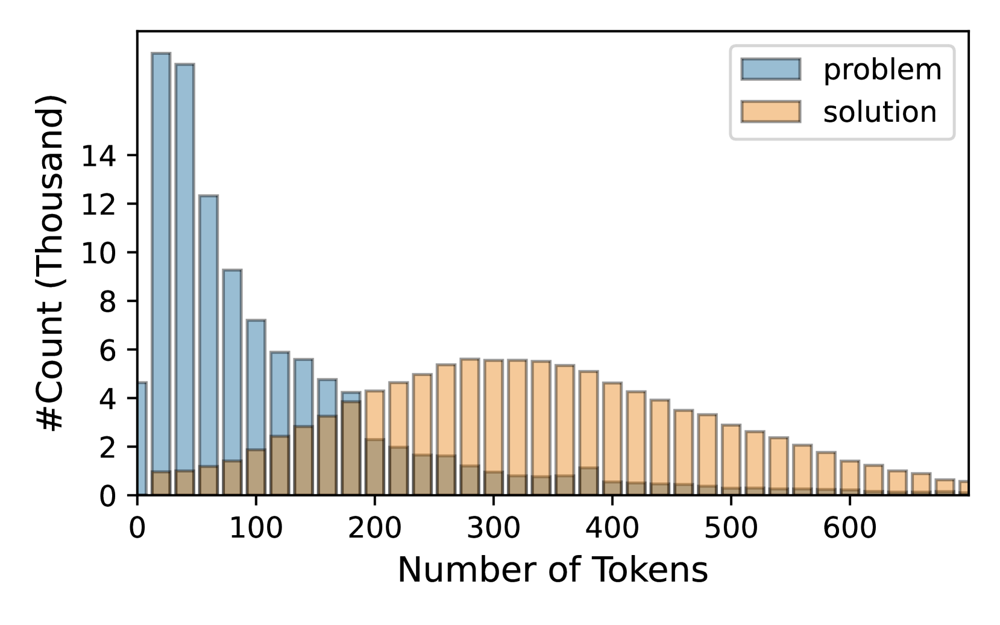
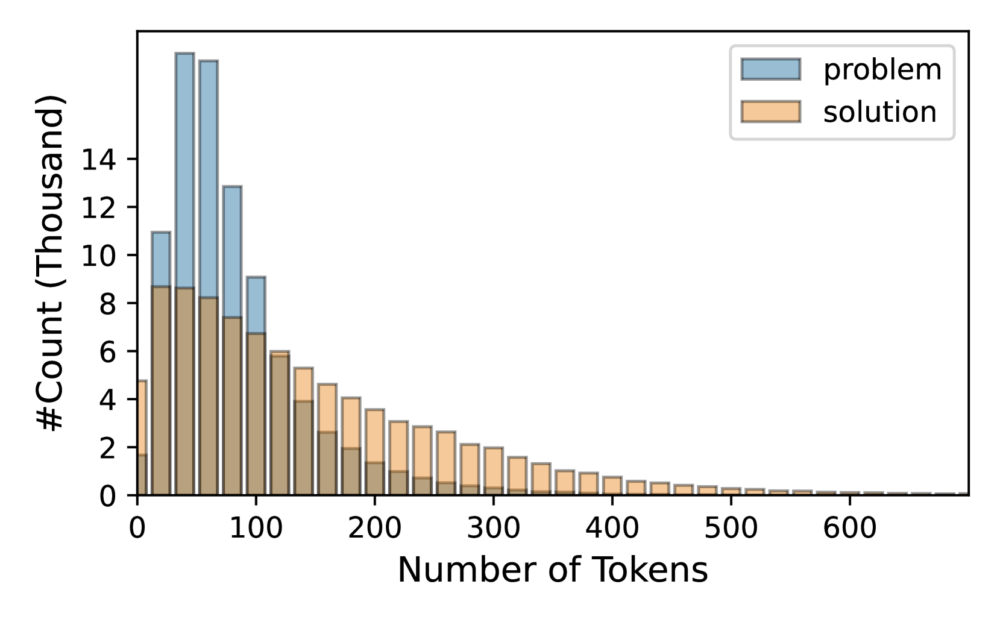
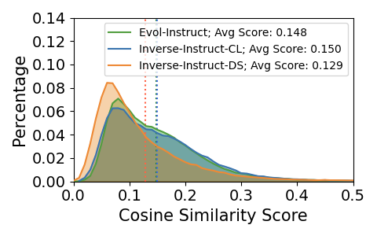
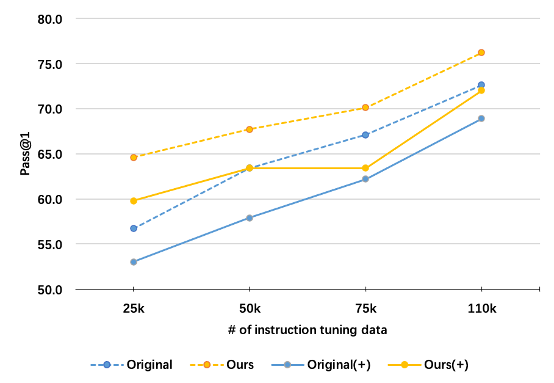

# InverseCoder：借助 Inverse-Instruct 技术，释放指令调优代码大型模型（LLM）的潜能。

发布时间：2024年07月08日

`LLM应用` `软件开发` `人工智能`

> InverseCoder: Unleashing the Power of Instruction-Tuned Code LLMs with Inverse-Instruct

# 摘要

> 近期，开源代码大型语言模型 (LLM) 通过在由 GPT-3.5 和 GPT-4 等闭源 LLM 生成的数据上进行指令调优，展现了卓越的编码能力。本文探讨了如何通过从自身生成数据而非依赖闭源 LLM 来进一步提升指令调优的代码 LLM。我们发现，将代码（正式语言）翻译为自然语言（非正式语言）比反向翻译更为直接。基于此，我们提出 INVERSE-INSTRUCT 方法，从代码片段中提取指令而非相反。具体而言，我们利用代码 LLM 对原始语料库进行代码摘要和自我评估，生成高质量指令，进而结合原始与新生成的语料库对基础 LLM 进行微调，得到更强大的指令调优 LLM。我们推出的 InverseCoder 系列模型，在 Python 文本到代码生成、多语言编码及数据科学代码生成等多项基准测试中，性能超越了原始代码 LLM。

> Recent advancements in open-source code large language models (LLMs) have demonstrated remarkable coding abilities by fine-tuning on the data generated from powerful closed-source LLMs such as GPT-3.5 and GPT-4 for instruction tuning. This paper explores how to further improve an instruction-tuned code LLM by generating data from itself rather than querying closed-source LLMs. Our key observation is the misalignment between the translation of formal and informal languages: translating formal language (i.e., code) to informal language (i.e., natural language) is more straightforward than the reverse. Based on this observation, we propose INVERSE-INSTRUCT, which summarizes instructions from code snippets instead of the reverse. Specifically, given an instruction tuning corpus for code and the resulting instruction-tuned code LLM, we ask the code LLM to generate additional high-quality instructions for the original corpus through code summarization and self-evaluation. Then, we fine-tune the base LLM on the combination of the original corpus and the self-generated one, which yields a stronger instruction-tuned LLM. We present a series of code LLMs named InverseCoder, which surpasses the performance of the original code LLMs on a wide range of benchmarks, including Python text-to-code generation, multilingual coding, and data-science code generation.

[Arxiv](https://arxiv.org/abs/2407.05700)