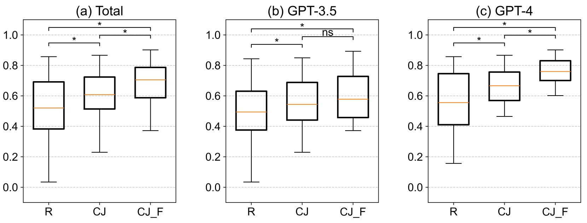
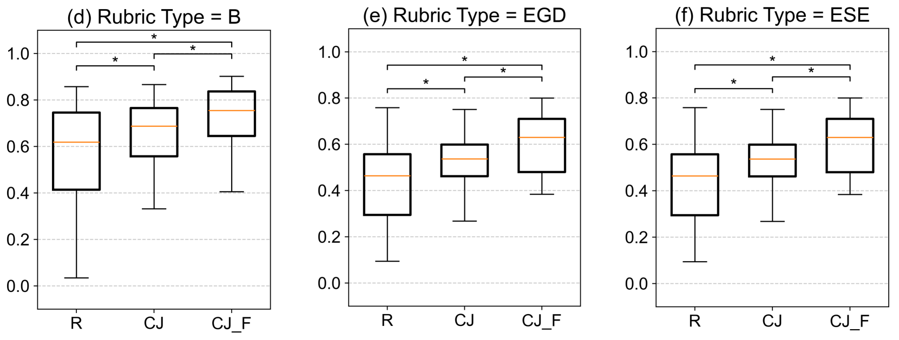

# GPT-4 能否独立胜任自动作文评分？本研究采用基于评分者认知的比较判断方法，探讨其可行性。

发布时间：2024年07月08日

`LLM应用` `人工智能`

> Is GPT-4 Alone Sufficient for Automated Essay Scoring?: A Comparative Judgment Approach Based on Rater Cognition

# 摘要

> 尽管大型语言模型在自动作文评分领域展现出潜力，但其零-shot 和少-shot 性能仍不及顶尖模型和人类评分者。鉴于实际教育场景中作文题目和评分标准的多样性，逐一微调模型并不现实。为此，本研究创新性地结合了 LLM 与比较判断技术，通过零-shot 提示在两篇作文间做出选择，结果显示，这种方法在 LLM 辅助的作文评分中，显著优于传统评分标准。

> Large Language Models (LLMs) have shown promise in Automated Essay Scoring (AES), but their zero-shot and few-shot performance often falls short compared to state-of-the-art models and human raters. However, fine-tuning LLMs for each specific task is impractical due to the variety of essay prompts and rubrics used in real-world educational contexts. This study proposes a novel approach combining LLMs and Comparative Judgment (CJ) for AES, using zero-shot prompting to choose between two essays. We demonstrate that a CJ method surpasses traditional rubric-based scoring in essay scoring using LLMs.

[Arxiv](https://arxiv.org/abs/2407.05733)