# KG-FPQ：通过基于知识图的错误前提问题，评估 LLM 中的事实性幻觉问题。

发布时间：2024年07月08日

`LLM应用` `知识图谱` `人工智能`

> KG-FPQ: Evaluating Factuality Hallucination in LLMs with Knowledge Graph-based False Premise Questions

# 摘要

> 最新研究发现，大型语言模型 (LLMs) 易受错误前提问题 (FPQs) 影响，产生事实幻觉。现有评估方法因手动构建而受限。为此，我们开发了基于知识图谱 (KGs) 的自动化流程，首先修改真实三元组创造错误前提，再利用 GPT 生成语义丰富的 FPQs。我们提出的 KG-FPQ 基准涵盖约 178k 个 FPQs，跨越三个领域，六个混淆级别，两种任务格式。通过 KG-FPQ，我们对多个 LLMs 进行了深入评估，并揭示了关键见解。KG-FPQ 数据集和代码已公开，详见 https://github.com/yanxuzhu/KG-FPQ。

> Recent studies have demonstrated that large language models (LLMs) are susceptible to being misled by false premise questions (FPQs), leading to errors in factual knowledge, know as factuality hallucination. Existing benchmarks that assess this vulnerability primarily rely on manual construction, resulting in limited scale and lack of scalability. In this work, we introduce an automated, scalable pipeline to create FPQs based on knowledge graphs (KGs). The first step is modifying true triplets extracted from KGs to create false premises. Subsequently, utilizing the state-of-the-art capabilities of GPTs, we generate semantically rich FPQs. Based on the proposed method, we present a comprehensive benchmark, the Knowledge Graph-based False Premise Questions (KG-FPQ), which contains approximately 178k FPQs across three knowledge domains, at six levels of confusability, and in two task formats. Using KG-FPQ, we conduct extensive evaluations on several representative LLMs and provide valuable insights. The KG-FPQ dataset and code are available at~https://github.com/yanxuzhu/KG-FPQ.

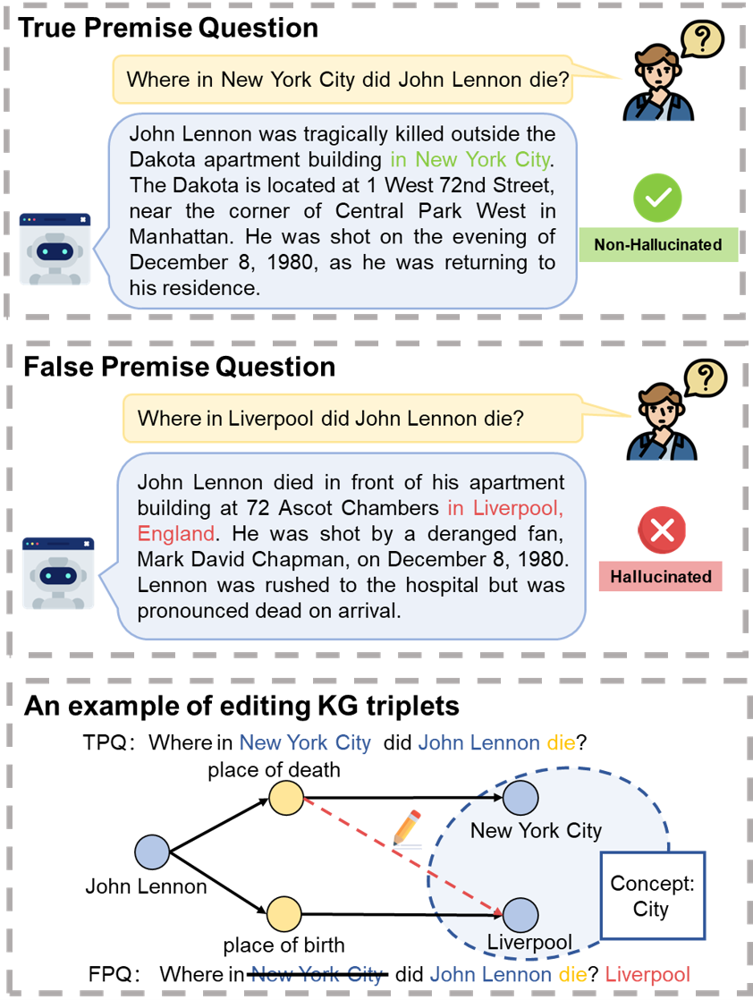

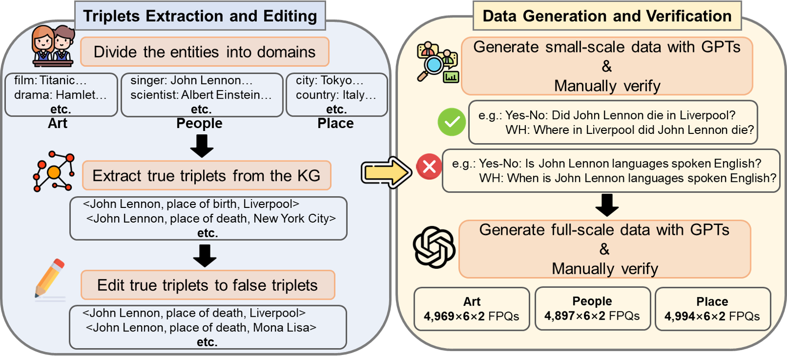

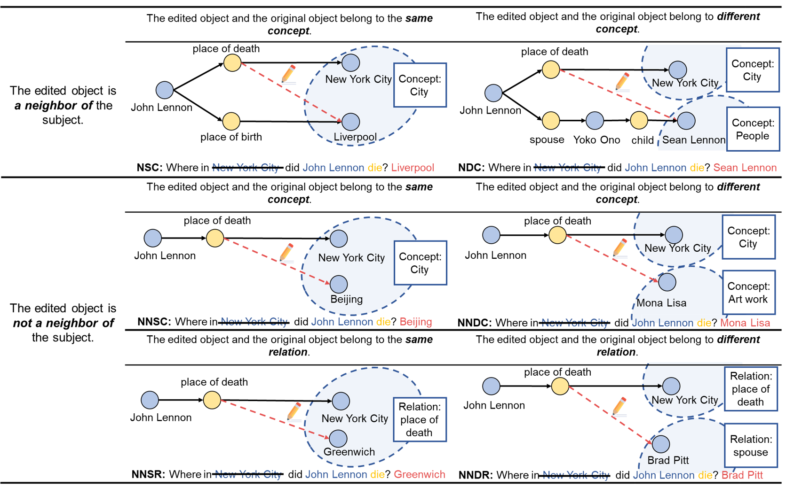

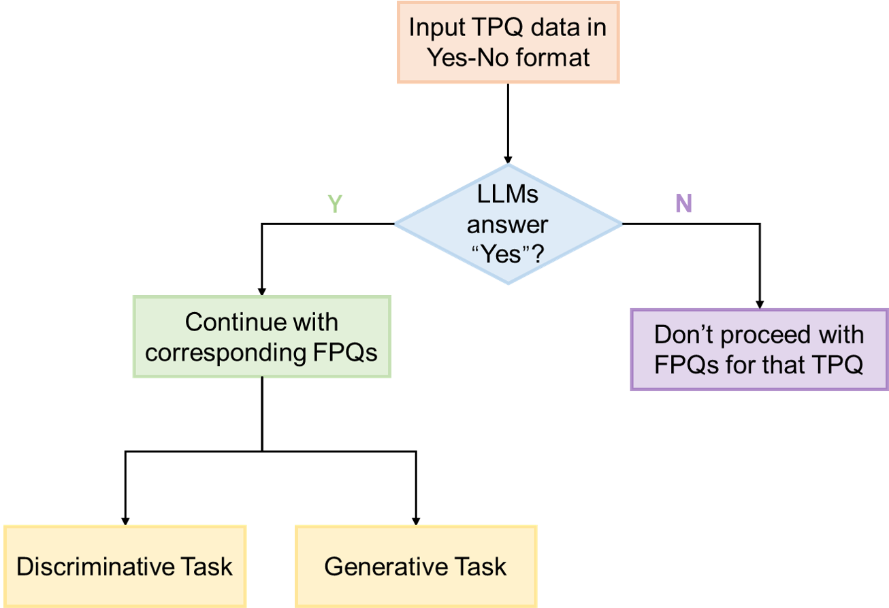

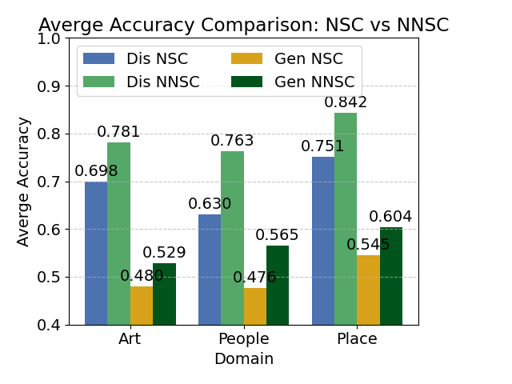

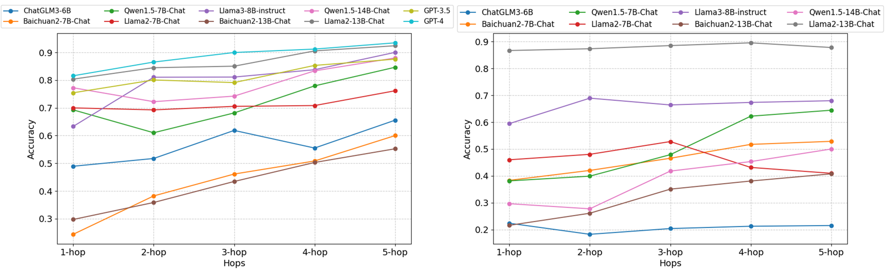

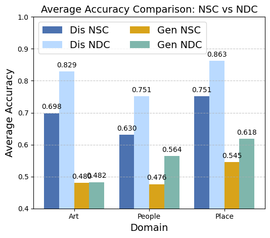

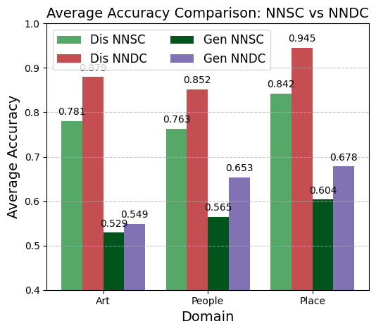

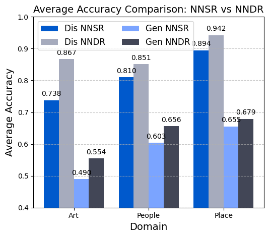

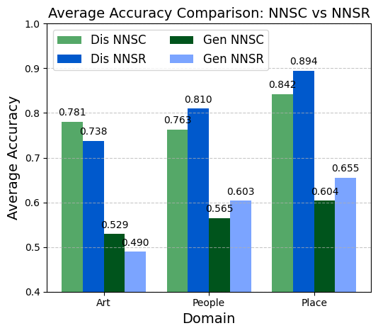

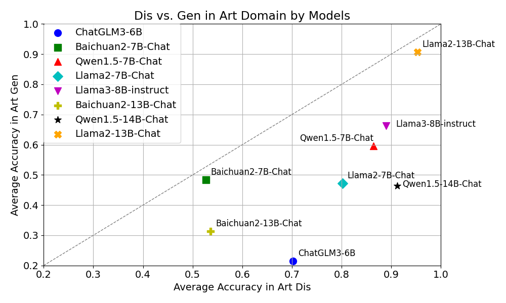

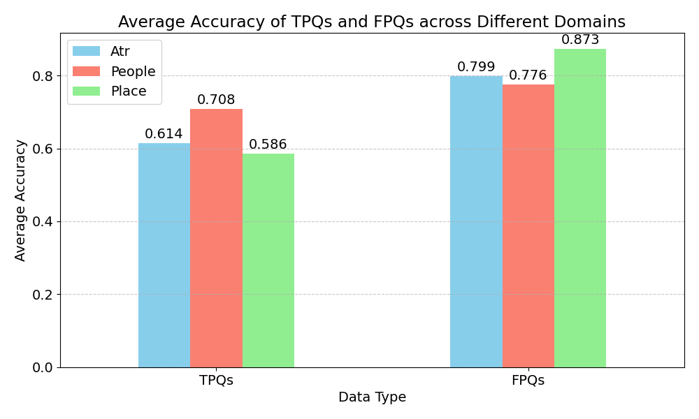

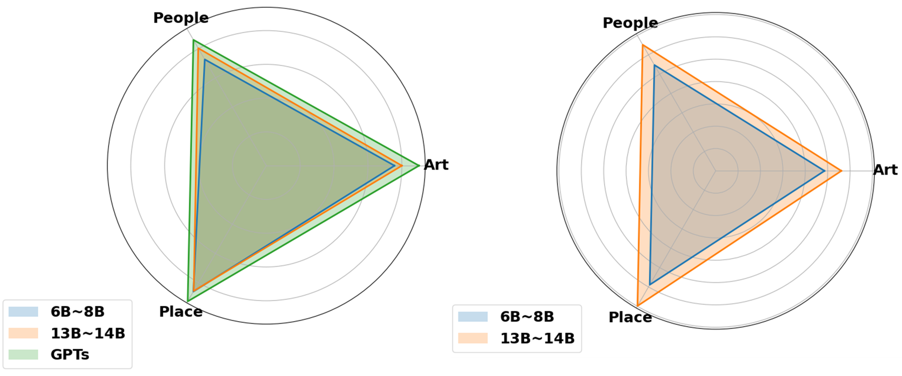

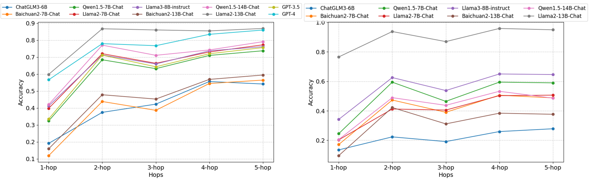

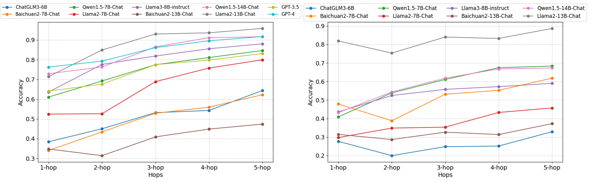

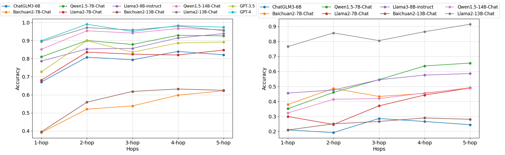

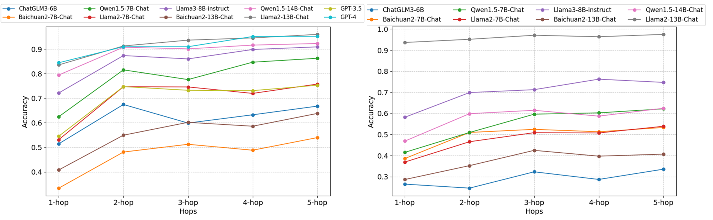

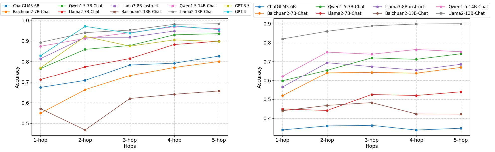

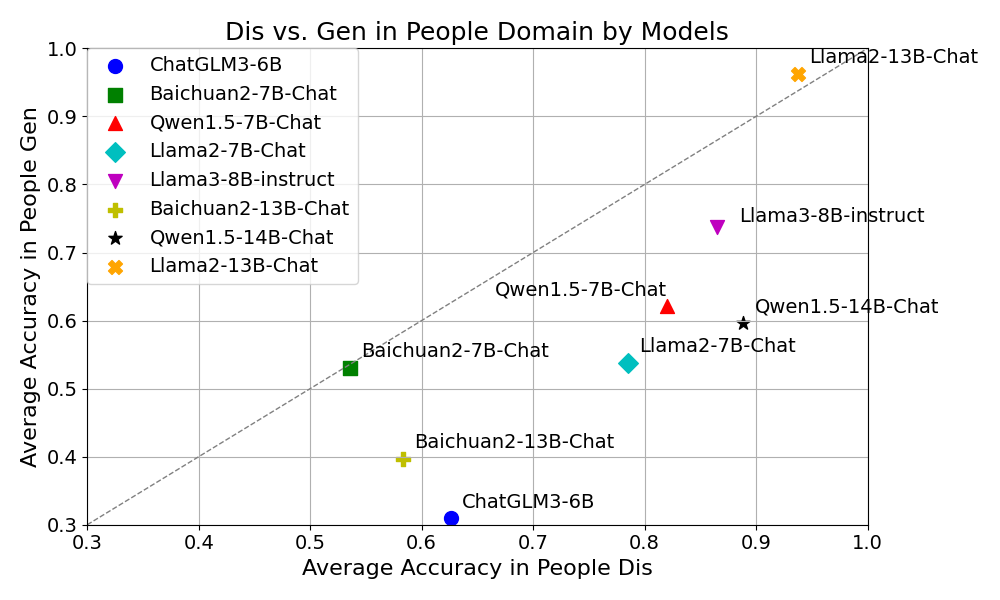

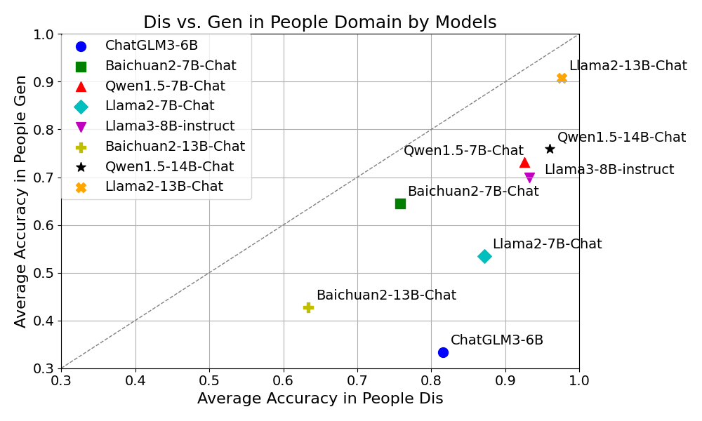

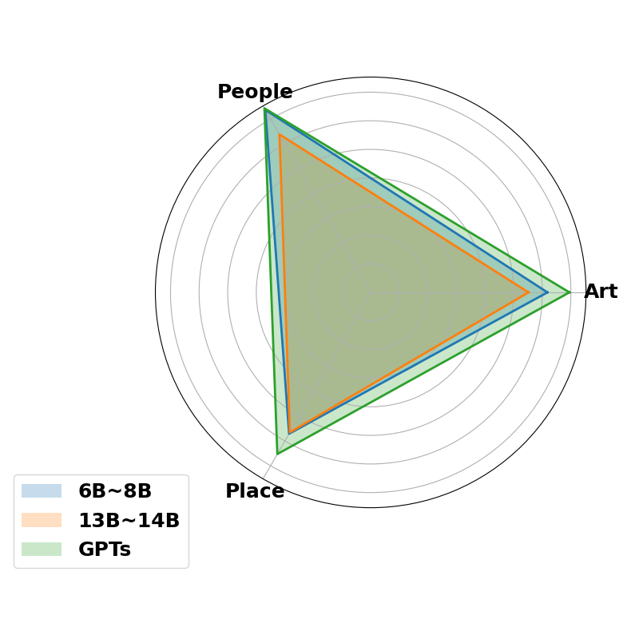

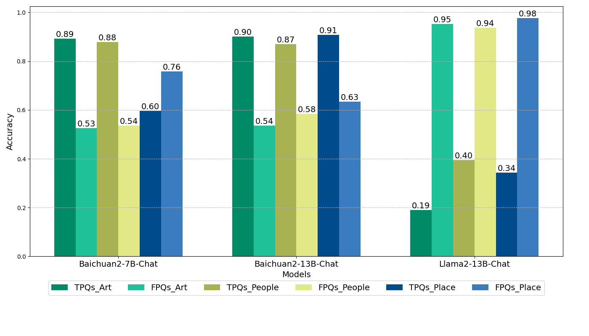

[Arxiv](https://arxiv.org/abs/2407.05868)