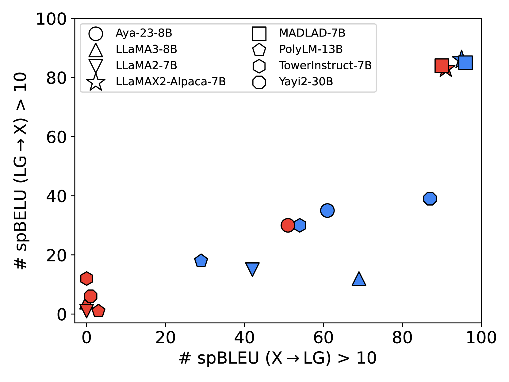
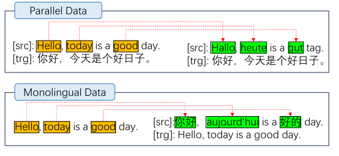
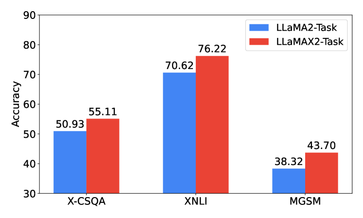
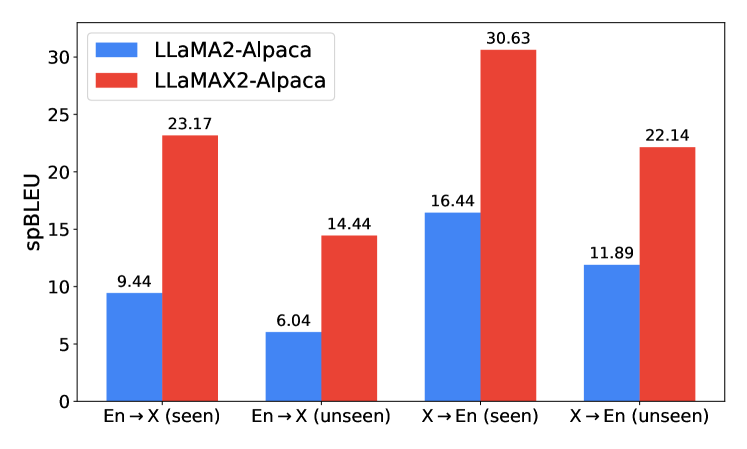
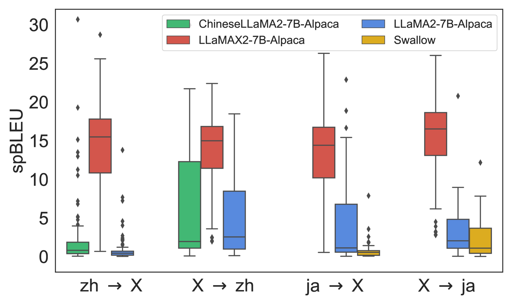
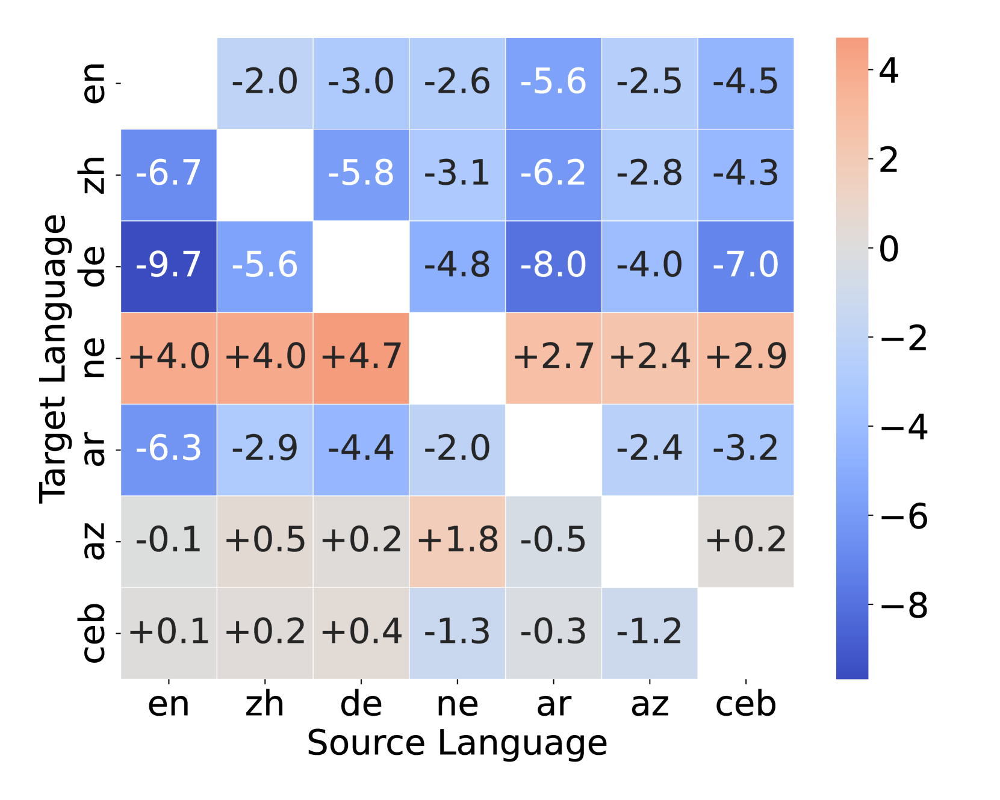

# LLaMAX：拓展LLM的语言边界，强化超百种语言的翻译实力

发布时间：2024年07月08日

`LLM应用` `多语言处理`

> LLaMAX: Scaling Linguistic Horizons of LLM by Enhancing Translation Capabilities Beyond 100 Languages

# 摘要

> 在高资源语言任务中，大型语言模型（LLMs）的翻译能力令人瞩目，但在低资源语言中，由于预训练数据不足，性能受限。为此，我们投入大量资源，对LLaMA系列模型进行多语言持续预训练，支持百余种语言的翻译。通过优化训练策略，如词汇扩展和数据增强，我们打造了LLaMAX。LLaMAX不仅保持了强大的泛化能力，还在翻译性能上大幅超越现有开源LLMs，与专业翻译模型在Flores-101基准上不相上下。实验证实，LLaMAX可作为稳健的多语言基础模型。相关代码和模型已公开，供公众使用。

> Large Language Models~(LLMs) demonstrate remarkable translation capabilities in high-resource language tasks, yet their performance in low-resource languages is hindered by insufficient multilingual data during pre-training. To address this, we dedicate 35,000 A100-SXM4-80GB GPU hours in conducting extensive multilingual continual pre-training on the LLaMA series models, enabling translation support across more than 100 languages. Through a comprehensive analysis of training strategies, such as vocabulary expansion and data augmentation, we develop LLaMAX. Remarkably, without sacrificing its generalization ability, LLaMAX achieves significantly higher translation performance compared to existing open-source LLMs~(by more than 10 spBLEU points) and performs on-par with specialized translation model~(M2M-100-12B) on the Flores-101 benchmark. Extensive experiments indicate that LLaMAX can serve as a robust multilingual foundation model. The code~\footnote{\url{https://github.com/CONE-MT/LLaMAX/.}} and models~\footnote{\url{https://huggingface.co/LLaMAX/.}} are publicly available.

[Arxiv](https://arxiv.org/abs/2407.05975)