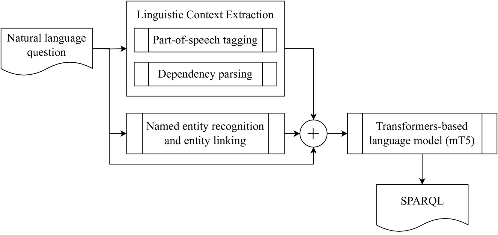
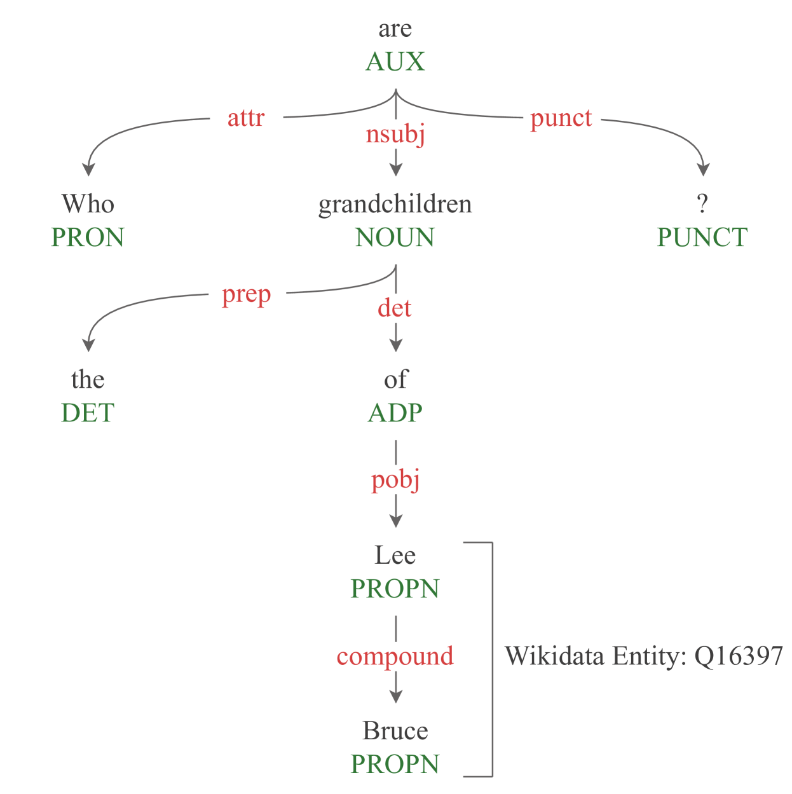

# MST5 —— 知识图谱上的多语言问答系统

发布时间：2024年07月08日

`LLM应用` `知识图谱`

> MST5 -- Multilingual Question Answering over Knowledge Graphs

# 摘要

> 知识图谱问答 (KGQA) 利用自然语言简化了海量知识的查询过程，但研究多聚焦于英语，对非英语使用者不利。现有多语言 KGQA 系统在性能上难以匹敌英语系统，凸显了多语言生成 SPARQL 查询的挑战。本研究提出一种简化方法，通过直接整合语言上下文和实体信息至语言模型处理流程，增强多语言 KGQA 系统。我们采用单一预训练多语言变压器模型，统一处理主输入与辅助数据，显著提升自然语言到 SPARQL 查询的转换准确性。该方法在最新 QALD 数据集上表现优异，并首次在中文和日语上进行评估，拓宽了数据集的语言多样性。

> Knowledge Graph Question Answering (KGQA) simplifies querying vast amounts of knowledge stored in a graph-based model using natural language. However, the research has largely concentrated on English, putting non-English speakers at a disadvantage. Meanwhile, existing multilingual KGQA systems face challenges in achieving performance comparable to English systems, highlighting the difficulty of generating SPARQL queries from diverse languages. In this research, we propose a simplified approach to enhance multilingual KGQA systems by incorporating linguistic context and entity information directly into the processing pipeline of a language model. Unlike existing methods that rely on separate encoders for integrating auxiliary information, our strategy leverages a single, pretrained multilingual transformer-based language model to manage both the primary input and the auxiliary data. Our methodology significantly improves the language model's ability to accurately convert a natural language query into a relevant SPARQL query. It demonstrates promising results on the most recent QALD datasets, namely QALD-9-Plus and QALD-10. Furthermore, we introduce and evaluate our approach on Chinese and Japanese, thereby expanding the language diversity of the existing datasets.

[Arxiv](https://arxiv.org/abs/2407.06041)