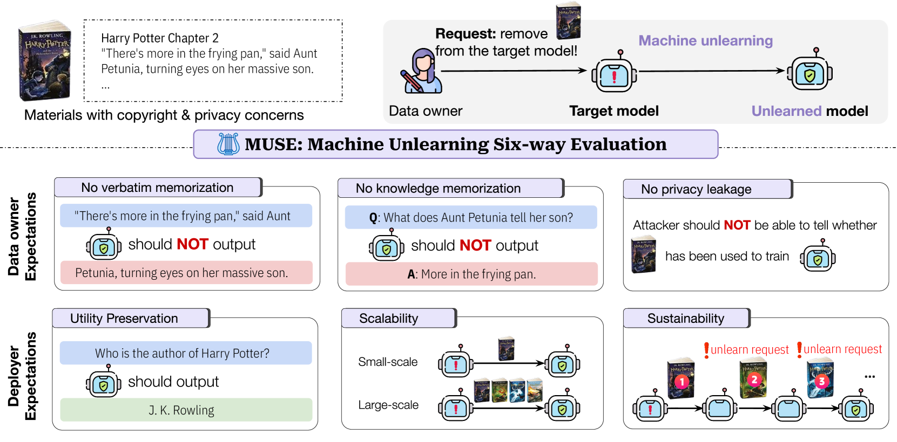
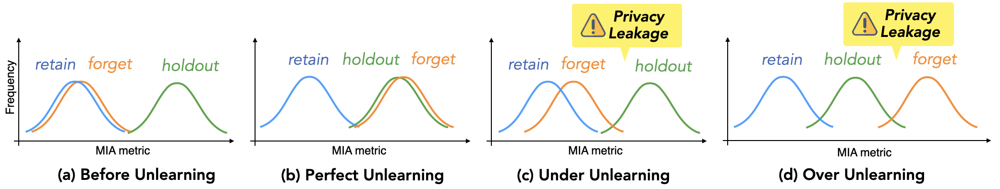
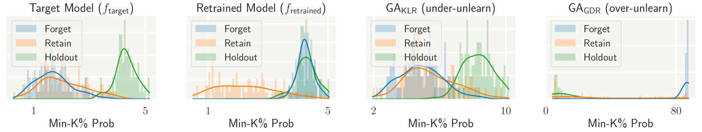
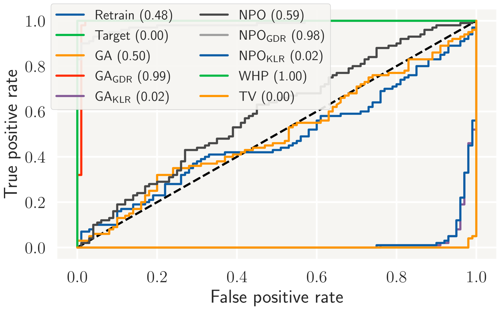
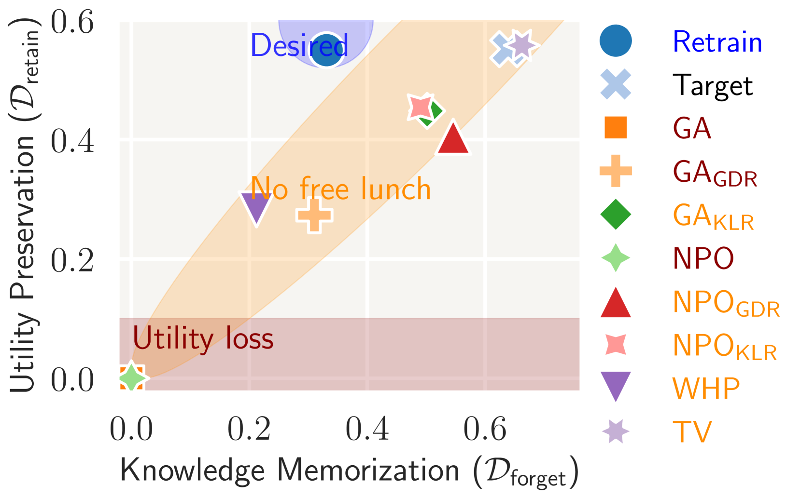
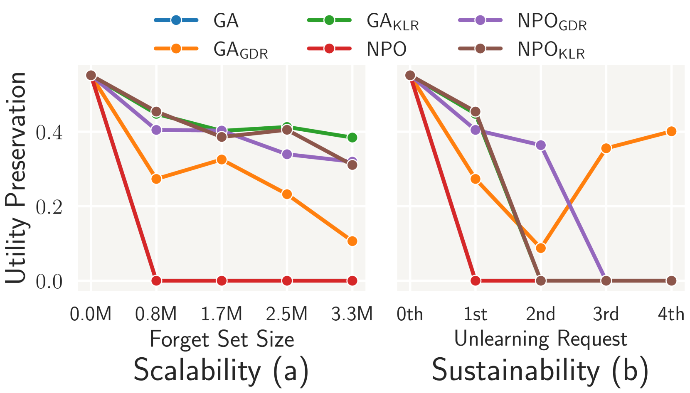

# MUSE：语言模型的机器遗忘六维评估

发布时间：2024年07月08日

`LLM应用` `隐私保护` `数据安全`

> MUSE: Machine Unlearning Six-Way Evaluation for Language Models

# 摘要

> 语言模型在处理大量文本数据时，可能涉及隐私和版权问题。数据所有者出于这些考虑，可能要求从模型中删除特定数据。然而，现代模型中精确遗忘特定数据点是不可行的，这促使了近似遗忘算法的发展。传统上，这些算法的评估范围有限，未能全面衡量其成功和实用性。为此，我们提出了MUSE基准，该基准定义了遗忘模型应具备的六项特性，包括防止记忆、保护隐私、保持效用等。我们测试了八种算法在遗忘《哈利·波特》和新闻文章时的表现，发现多数算法能防止记忆，但仅一种能有效避免隐私泄露。现有算法普遍未能满足部署者的期望，因其常降低模型效用，且难以应对连续或大规模的遗忘请求。我们的研究揭示了现有算法的关键问题，并发布了评估基准以推动进一步研究。

> Language models (LMs) are trained on vast amounts of text data, which may include private and copyrighted content. Data owners may request the removal of their data from a trained model due to privacy or copyright concerns. However, exactly unlearning only these datapoints (i.e., retraining with the data removed) is intractable in modern-day models. This has led to the development of many approximate unlearning algorithms. The evaluation of the efficacy of these algorithms has traditionally been narrow in scope, failing to precisely quantify the success and practicality of the algorithm from the perspectives of both the model deployers and the data owners. We address this issue by proposing MUSE, a comprehensive machine unlearning evaluation benchmark that enumerates six diverse desirable properties for unlearned models: (1) no verbatim memorization, (2) no knowledge memorization, (3) no privacy leakage, (4) utility preservation on data not intended for removal, (5) scalability with respect to the size of removal requests, and (6) sustainability over sequential unlearning requests. Using these criteria, we benchmark how effectively eight popular unlearning algorithms on 7B-parameter LMs can unlearn Harry Potter books and news articles. Our results demonstrate that most algorithms can prevent verbatim memorization and knowledge memorization to varying degrees, but only one algorithm does not lead to severe privacy leakage. Furthermore, existing algorithms fail to meet deployer's expectations because they often degrade general model utility and also cannot sustainably accommodate successive unlearning requests or large-scale content removal. Our findings identify key issues with the practicality of existing unlearning algorithms on language models, and we release our benchmark to facilitate further evaluations: muse-bench.github.io

[Arxiv](https://arxiv.org/abs/2407.06460)