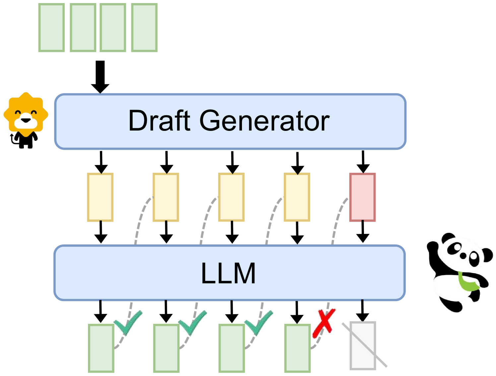

# 融合、集成与协作：大型语言模型时代协同策略探析

发布时间：2024年07月08日

`LLM理论` `人工智能`

> Merge, Ensemble, and Cooperate! A Survey on Collaborative Strategies in the Era of Large Language Models

# 摘要

> 大型语言模型（LLM）的卓越成就引领自然语言处理（NLP）研究进入新纪元。尽管LLM能力各异，但不同语料库训练的模型各有千秋，这为提升其整体效能和灵活性带来挑战。为此，近期研究聚焦于LLM间的协作策略。本文全面梳理这一前沿领域，阐释协作的深层动机。我们将其策略细分为合并、集成与合作三大类：合并通过参数融合多模型，集成整合各模型输出，合作则让不同模型在特定任务中各展所长。我们深入剖析这些策略，并展望其应用前景。同时，勾勒未来研究蓝图，期望推动LLM协作研究，助力NLP技术飞跃。

> The remarkable success of Large Language Models (LLMs) has ushered natural language processing (NLP) research into a new era. Despite their diverse capabilities, LLMs trained on different corpora exhibit varying strengths and weaknesses, leading to challenges in maximizing their overall efficiency and versatility. To address these challenges, recent studies have explored collaborative strategies for LLMs. This paper provides a comprehensive overview of this emerging research area, highlighting the motivation behind such collaborations. Specifically, we categorize collaborative strategies into three primary approaches: Merging, Ensemble, and Cooperation. Merging involves integrating multiple LLMs in the parameter space. Ensemble combines the outputs of various LLMs. Cooperation} leverages different LLMs to allow full play to their diverse capabilities for specific tasks. We provide in-depth introductions to these methods from different perspectives and discuss their potential applications. Additionally, we outline future research directions, hoping this work will catalyze further studies on LLM collaborations and paving the way for advanced NLP applications.

[Arxiv](https://arxiv.org/abs/2407.06089)