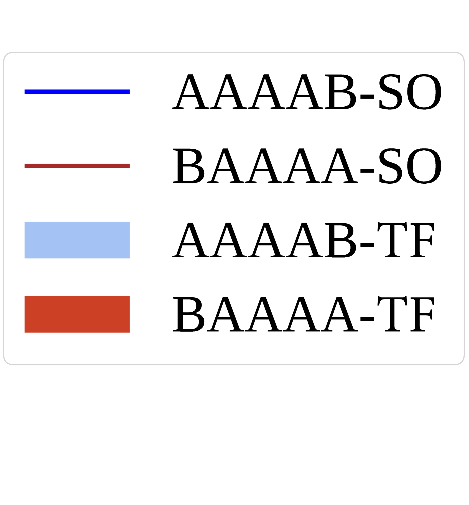

# 视觉-语言模型中的多对象幻觉现象

发布时间：2024年07月08日

`LLM应用` `计算机视觉` `人工智能`

> Multi-Object Hallucination in Vision-Language Models

# 摘要

> 大型视觉语言模型 (LVLMs) 常因对象幻觉而产生图像中不存在的对象。本研究深入探讨了多对象幻觉现象，特别是在模型同时处理多个对象时可能出现的误感知问题。为此，我们提出了基于识别的对象探测评估 (ROPE)，一种自动化评估方法，它考虑图像内对象类别的分布，并通过视觉指向提示来减少歧义。实证研究表明：(1) LVLMs 在处理多对象时幻觉更频繁。(2) 对象类别的分布影响幻觉行为，暗示模型可能依赖捷径和虚假相关性。(3) 幻觉行为受数据特性和模型内在因素的影响。我们旨在提升 LVLMs 对现实场景中多对象的识别与推理能力，并量化我们在解决幻觉问题上的进展。

> Large vision language models (LVLMs) often suffer from object hallucination, producing objects not present in the given images. While current benchmarks for object hallucination primarily concentrate on the presence of a single object class rather than individual entities, this work systematically investigates multi-object hallucination, examining how models misperceive (e.g., invent nonexistent objects or become distracted) when tasked with focusing on multiple objects simultaneously. We introduce Recognition-based Object Probing Evaluation (ROPE), an automated evaluation protocol that considers the distribution of object classes within a single image during testing and uses visual referring prompts to eliminate ambiguity. With comprehensive empirical studies and analysis of potential factors leading to multi-object hallucination, we found that (1) LVLMs suffer more hallucinations when focusing on multiple objects compared to a single object. (2) The tested object class distribution affects hallucination behaviors, indicating that LVLMs may follow shortcuts and spurious correlations.(3) Hallucinatory behaviors are influenced by data-specific factors, salience and frequency, and model intrinsic behaviors. We hope to enable LVLMs to recognize and reason about multiple objects that often occur in realistic visual scenes, provide insights, and quantify our progress towards mitigating the issues.

[Arxiv](https://arxiv.org/abs/2407.06192)