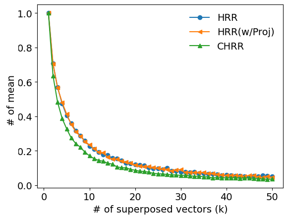

# 随机循环向量在多标签学习中的应用

发布时间：2024年07月08日

`LLM应用` `机器学习` `数据挖掘`

> Multi-label Learning with Random Circular Vectors

# 摘要

> 极端多标签分类 (XMC) 任务旨在训练一个分类器，从庞大的标签库中筛选出与特定数据最匹配的标签子集。尽管深度神经网络 (DNNs) 在此领域已取得显著成就，但面对海量输出标签，DNN 的训练成本依然高昂。本文提出了一种创新方法，利用随机圆形向量（每个分量以复数振幅表示）来优化这一难题。在我们的框架下，通过构建一个全连接的最终输出层，直接预测低维圆形向量，该向量编码了数据实例的标签集，从而为 DNN 设计了适用于 XMC 的输出层和损失函数。实验表明，圆形向量在标签编码和检索方面优于传统实值向量。进一步在真实 XMC 数据集上的测试证实，圆形向量的这些优势不仅显著提升了任务性能，还将输出层规模缩减了高达 99%。

> The extreme multi-label classification~(XMC) task involves learning a classifier that can predict from a large label set the most relevant subset of labels for a data instance. While deep neural networks~(DNNs) have demonstrated remarkable success in XMC problems, the task is still challenging because it must deal with a large number of output labels, which make the DNN training computationally expensive. This paper addresses the issue by exploring the use of random circular vectors, where each vector component is represented as a complex amplitude. In our framework, we can develop an output layer and loss function of DNNs for XMC by representing the final output layer as a fully connected layer that directly predicts a low-dimensional circular vector encoding a set of labels for a data instance. We conducted experiments on synthetic datasets to verify that circular vectors have better label encoding capacity and retrieval ability than normal real-valued vectors. Then, we conducted experiments on actual XMC datasets and found that these appealing properties of circular vectors contribute to significant improvements in task performance compared with a previous model using random real-valued vectors, while reducing the size of the output layers by up to 99%.

[Arxiv](https://arxiv.org/abs/2407.05656)