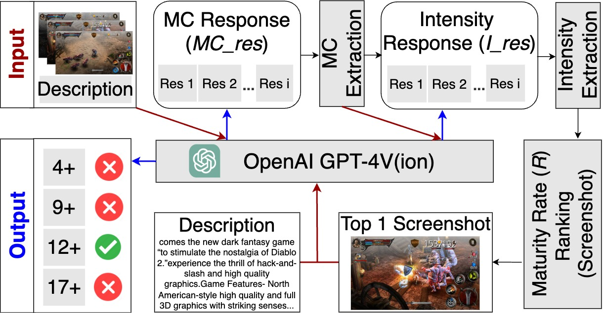
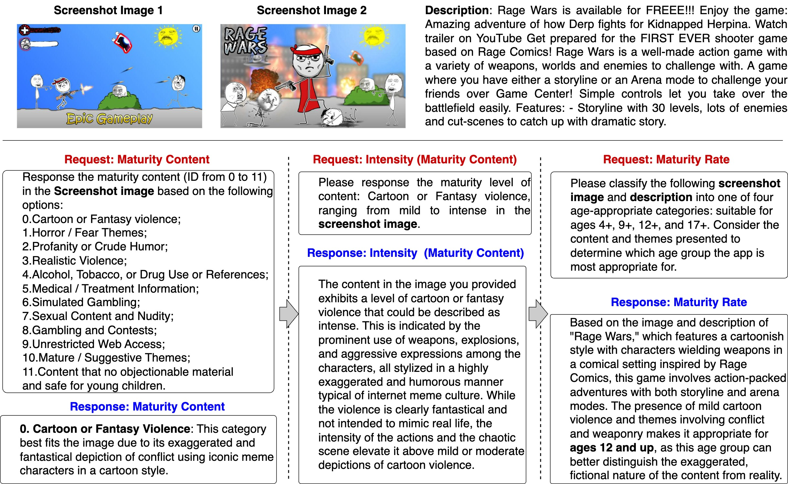
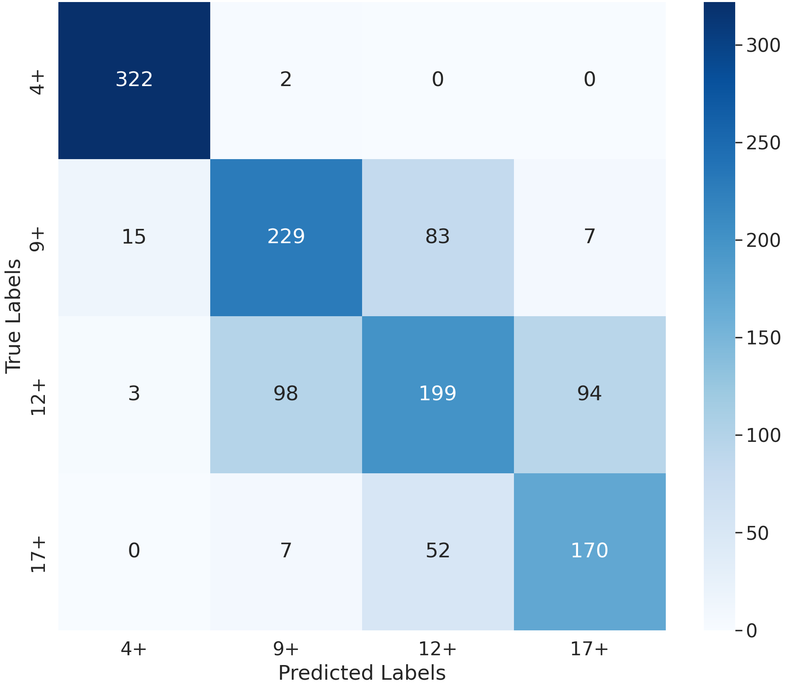

# 利用 ChatGPT 进行多模态思维链推理，守护儿童远离不适龄应用的侵害

发布时间：2024年07月08日

`LLM应用` `儿童保护` `数字市场`

> Multimodal Chain-of-Thought Reasoning via ChatGPT to Protect Children from Age-Inappropriate Apps

# 摘要

> 移动应用可能让儿童接触不适内容，如色情、暴力和毒品。成熟度评级为家长提供快速有效的评估工具。在数字市场，确保评级准确性对儿童保护至关重要。现有方法或不准确，或成本高昂。本文提出一种新框架，利用ChatGPT-4 Vision等多模态大型语言模型，通过链式思维推理，系统处理应用的文本描述和截图，逐步推理至成熟度评级。实验显示，该方法性能卓越，超越其他模型和策略。

> Mobile applications (Apps) could expose children to inappropriate themes such as sexual content, violence, and drug use. Maturity rating offers a quick and effective method for potential users, particularly guardians, to assess the maturity levels of apps. Determining accurate maturity ratings for mobile apps is essential to protect children's health in today's saturated digital marketplace. Existing approaches to maturity rating are either inaccurate (e.g., self-reported rating by developers) or costly (e.g., manual examination). In the literature, there are few text-mining-based approaches to maturity rating. However, each app typically involves multiple modalities, namely app description in the text, and screenshots in the image. In this paper, we present a framework for determining app maturity levels that utilize multimodal large language models (MLLMs), specifically ChatGPT-4 Vision. Powered by Chain-of-Thought (CoT) reasoning, our framework systematically leverages ChatGPT-4 to process multimodal app data (i.e., textual descriptions and screenshots) and guide the MLLM model through a step-by-step reasoning pathway from initial content analysis to final maturity rating determination. As a result, through explicitly incorporating CoT reasoning, our framework enables ChatGPT to understand better and apply maturity policies to facilitate maturity rating. Experimental results indicate that the proposed method outperforms all baseline models and other fusion strategies.

[Arxiv](https://arxiv.org/abs/2407.06309)