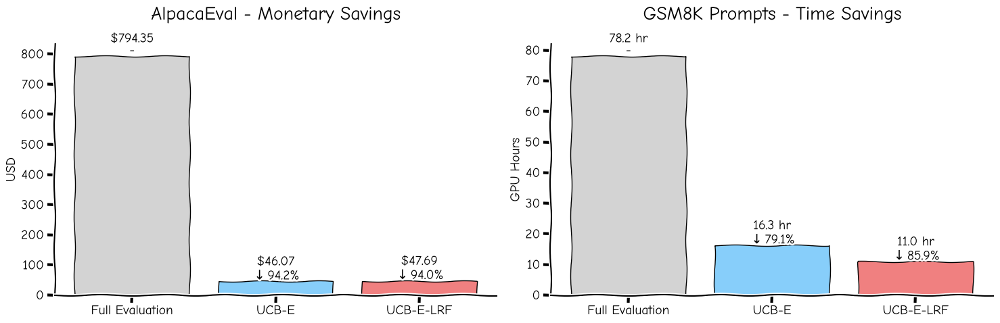
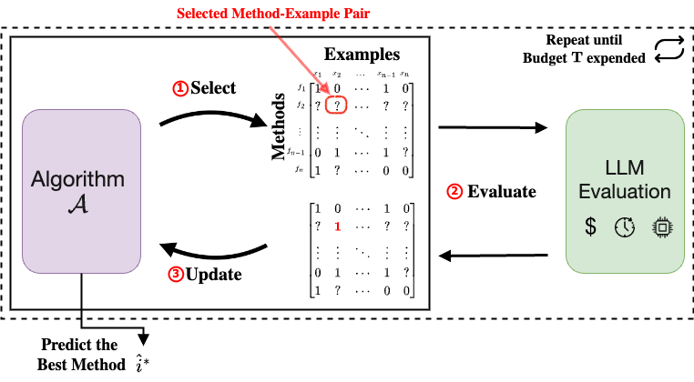
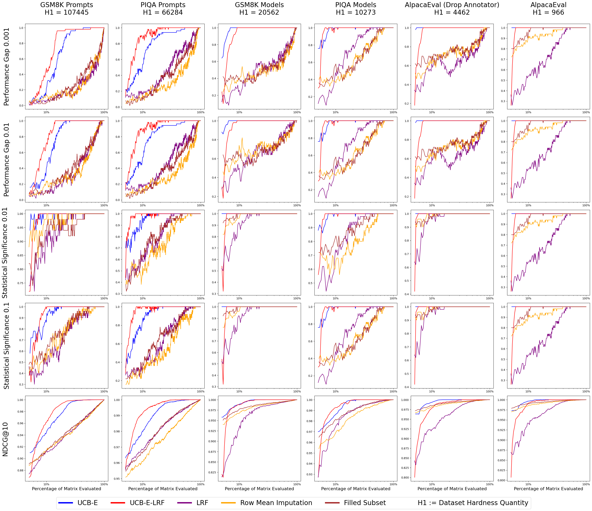
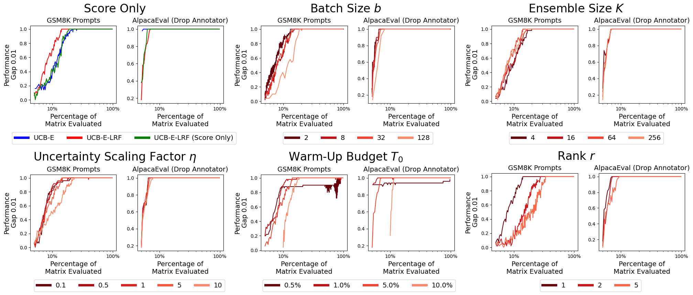
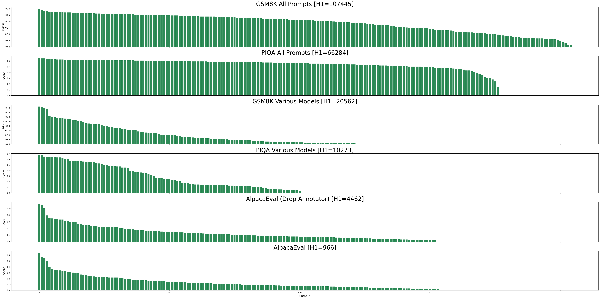

# 加速语言模型评估之道

发布时间：2024年07月08日

`LLM理论` `计算机科学` `人工智能`

> On Speeding Up Language Model Evaluation

# 摘要

> 大型语言模型（LLM）在自然语言处理（NLP）领域独领风骚，横扫各类任务的顶尖水平。然而，从训练到推理的每一步，都需精心抉择，构成一场复杂的组合搜索。例如，为求任务之巅，我们常需在全测试集上逐一试炼预训练模型、提示语及超参数。此番全面评估，既耗时又耗资，因LLM的推理与评估皆需大量资源。本文直面这一挑战，旨在有限预算内寻觅最佳评估之道。我们巧妙运用多臂老虎机框架，循序渐进地挑选待评对，结合多臂老虎机算法与低秩分解，大幅削减资源需求。实验证明，我们的算法仅以5-15%的常规资源，便能慧眼识珠，将成本削减至85-95%。

> Large language models (LLMs) currently dominate the field of natural language processing (NLP), representing the state-of-the-art across a diverse array of tasks. Developing a model of this nature, from training to inference, requires making numerous decisions which define a combinatorial search problem. For example, selecting the optimal pre-trained LLM, prompt, or hyperparameters to attain the best performance for a task often requires evaluating multiple candidates on an entire test set. This exhaustive evaluation can be time-consuming and costly, as both inference and metric computation with LLMs are resource-intensive. In this paper, we address the challenge of identifying the best method within a limited budget for evaluating methods on test examples. By leveraging the well-studied multi-armed bandit framework, which sequentially selects the next method-example pair to evaluate, our approach, combining multi-armed bandit algorithms with low-rank factorization, significantly reduces the required resources. Experiments show that our algorithms can identify the top-performing method using only 5-15\% of the typically needed resources, resulting in an 85-95\% reduction in cost.

[Arxiv](https://arxiv.org/abs/2407.06172)