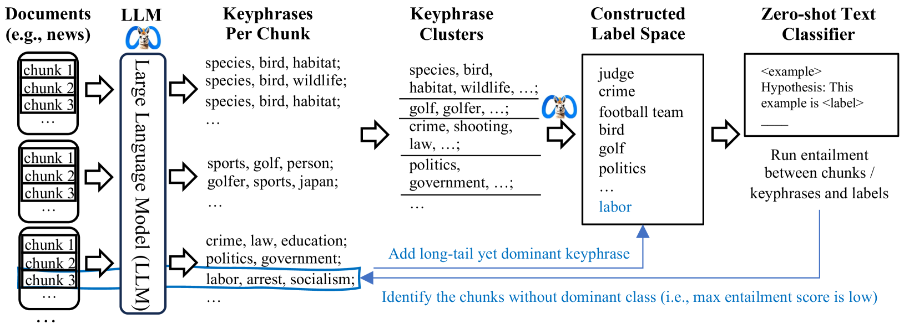
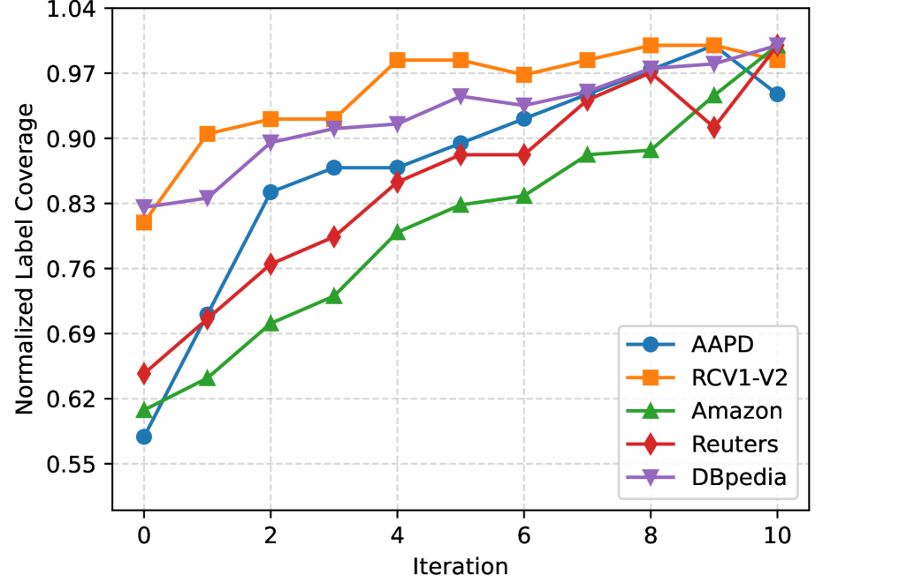
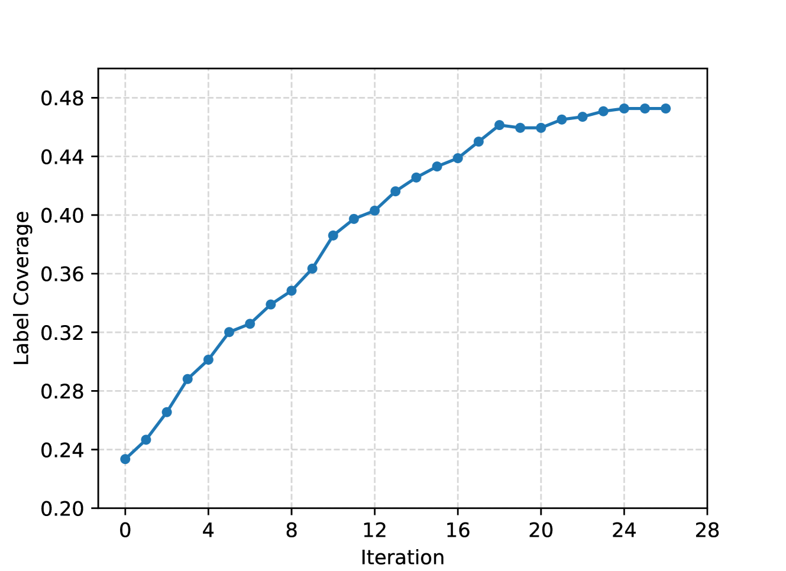

# 极弱监督下的开放世界多标签文本分类

发布时间：2024年07月08日

`LLM应用` `文本分类` `数据挖掘`

> Open-world Multi-label Text Classification with Extremely Weak Supervision

# 摘要

> 在极弱监督下，我们探索了开放世界的多标签文本分类，用户仅提供简要描述而无需任何标签。我们发现多数文档有一个主导类，而长尾标签偶尔也会成为主导。基于此，我们利用用户描述引导大型语言模型提取关键词，通过聚类构建标签空间，并运用零-shot分类器精确定位文档，以发现更多长尾标签。这一迭代过程最终形成了X-MLClass方法，显著提升了标签空间覆盖率，如在AAPD数据集上提升了40%，并实现了顶尖的多标签分类准确性。

> We study open-world multi-label text classification under extremely weak supervision (XWS), where the user only provides a brief description for classification objectives without any labels or ground-truth label space. Similar single-label XWS settings have been explored recently, however, these methods cannot be easily adapted for multi-label. We observe that (1) most documents have a dominant class covering the majority of content and (2) long-tail labels would appear in some documents as a dominant class. Therefore, we first utilize the user description to prompt a large language model (LLM) for dominant keyphrases of a subset of raw documents, and then construct a (initial) label space via clustering. We further apply a zero-shot multi-label classifier to locate the documents with small top predicted scores, so we can revisit their dominant keyphrases for more long-tail labels. We iterate this process to discover a comprehensive label space and construct a multi-label classifier as a novel method, X-MLClass. X-MLClass exhibits a remarkable increase in ground-truth label space coverage on various datasets, for example, a 40% improvement on the AAPD dataset over topic modeling and keyword extraction methods. Moreover, X-MLClass achieves the best end-to-end multi-label classification accuracy.

[Arxiv](https://arxiv.org/abs/2407.05609)