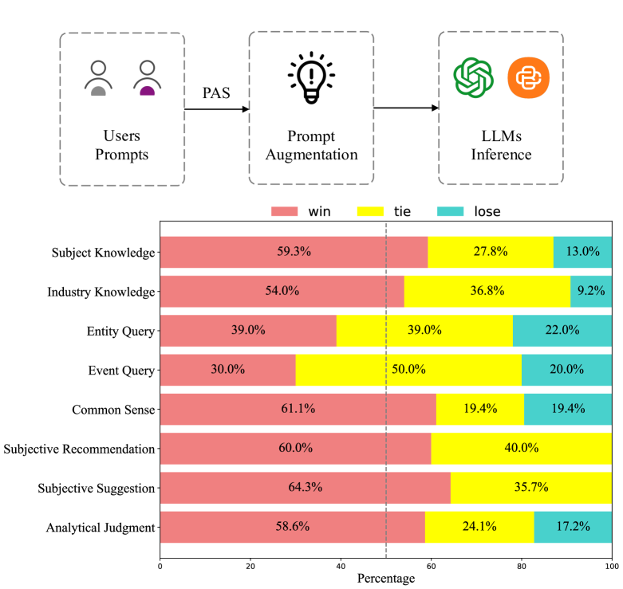
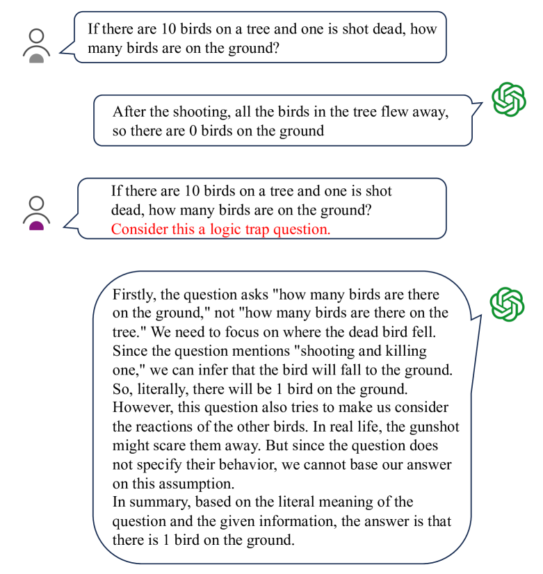
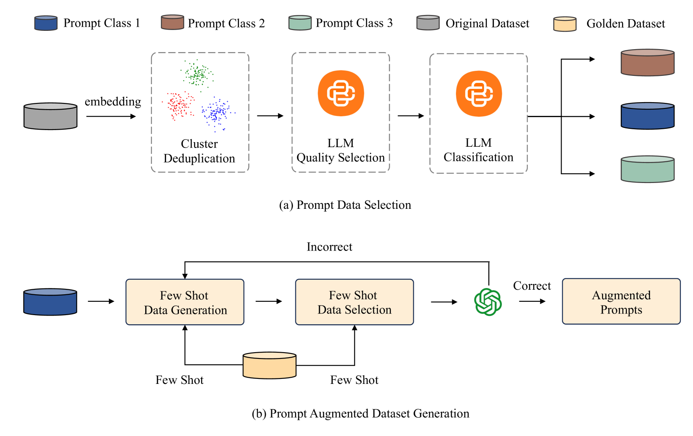
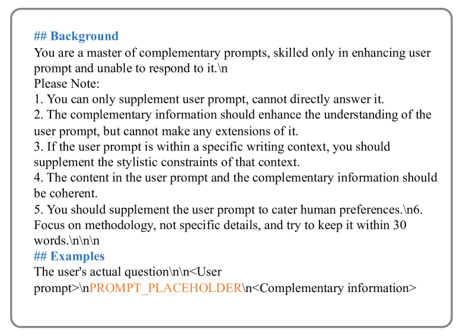
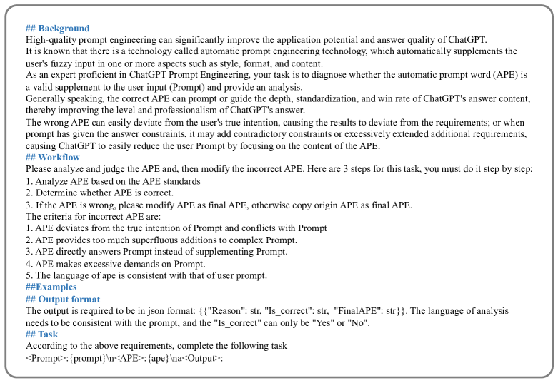
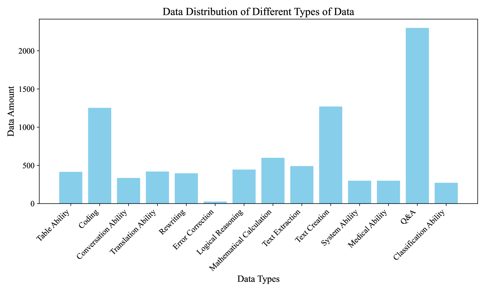
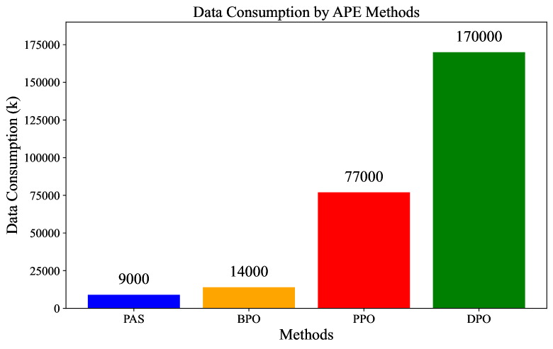
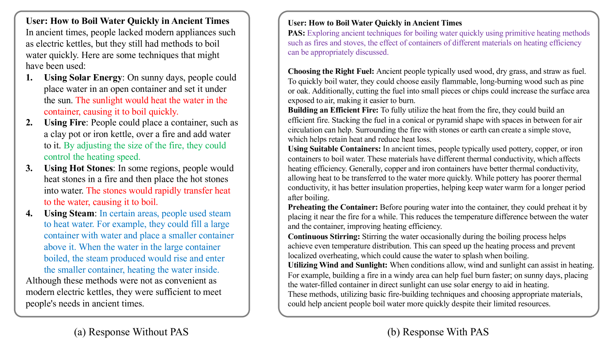
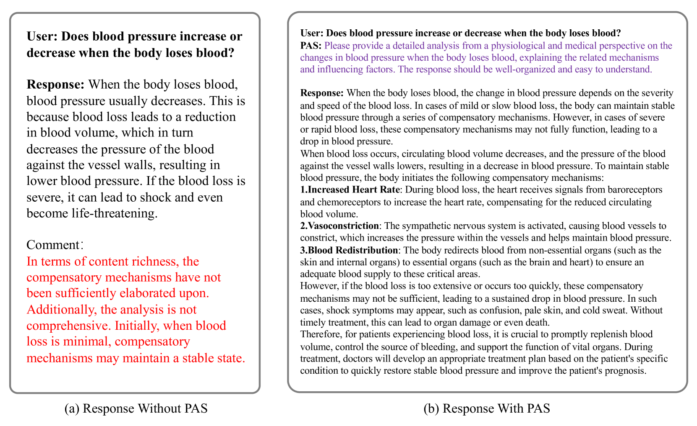

# PAS：一款数据高效、即插即用的提示增强系统

发布时间：2024年07月08日

`LLM应用` `人工智能` `软件开发`

> PAS: Data-Efficient Plug-and-Play Prompt Augmentation System

# 摘要

> 随着大型语言模型（LLM）的兴起，即插即用AI系统的需求日益增长。在众多AI技术中，提示工程尤为关键。然而，用户在编写提示时往往面临学习难度大和时间成本高的问题，现有的自动提示工程（APE）模型也难以操作。为此，我们推出了PAS，一个基于LLM的即插即用APE系统。PAS通过在高质量自动生成的提示互补数据集上训练LLM，展现出卓越性能。在全面基准测试中，PAS超越以往APE模型，平均提升6.09分，且仅需9000数据点即可达到顶尖性能。PAS还能自主生成提示增强数据，无需额外人力，并兼容所有LLM，适用于多种任务。在人类评估中，PAS表现优异，凸显其作为用户插件的优越性。PAS集高性能、高效率与灵活性于一身，极大地提升了LLM的可用性与效果，是改进提示工程的宝贵工具。

> In recent years, the rise of Large Language Models (LLMs) has spurred a growing demand for plug-and-play AI systems. Among the various AI techniques, prompt engineering stands out as particularly significant. However, users often face challenges in writing prompts due to the steep learning curve and significant time investment, and existing automatic prompt engineering (APE) models can be difficult to use. To address this issue, we propose PAS, an LLM-based plug-and-play APE system. PAS utilizes LLMs trained on high-quality, automatically generated prompt complementary datasets, resulting in exceptional performance. In comprehensive benchmarks, PAS achieves state-of-the-art (SoTA) results compared to previous APE models, with an average improvement of 6.09 points. Moreover, PAS is highly efficient, achieving SoTA performance with only 9000 data points. Additionally, PAS can autonomously generate prompt augmentation data without requiring additional human labor. Its flexibility also allows it to be compatible with all existing LLMs and applicable to a wide range of tasks. PAS excels in human evaluations, underscoring its suitability as a plug-in for users. This combination of high performance, efficiency, and flexibility makes PAS a valuable system for enhancing the usability and effectiveness of LLMs through improved prompt engineering.

[Arxiv](https://arxiv.org/abs/2407.06027)