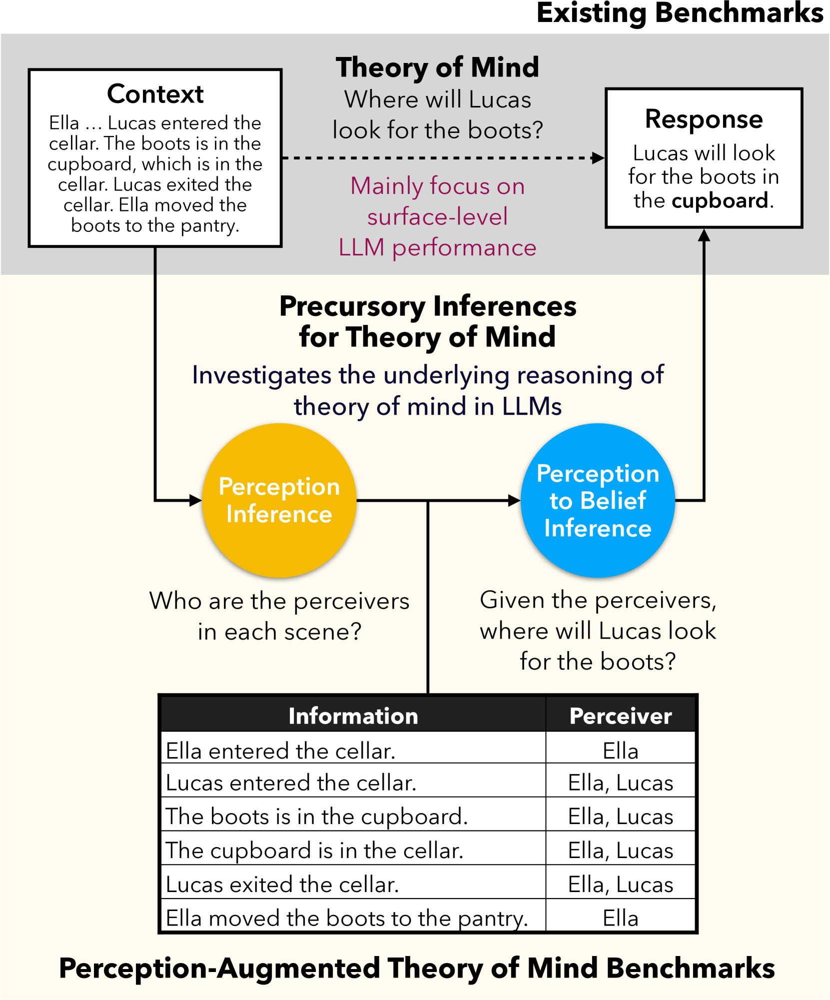
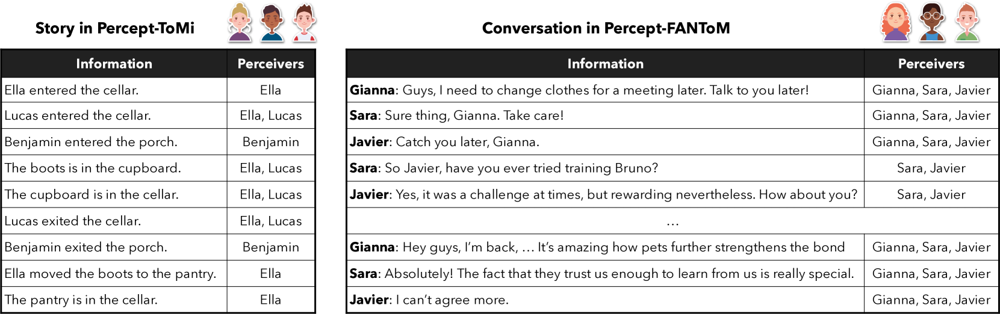
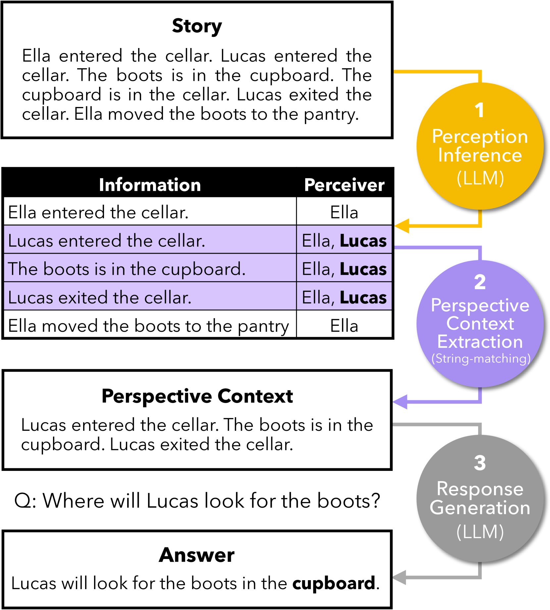
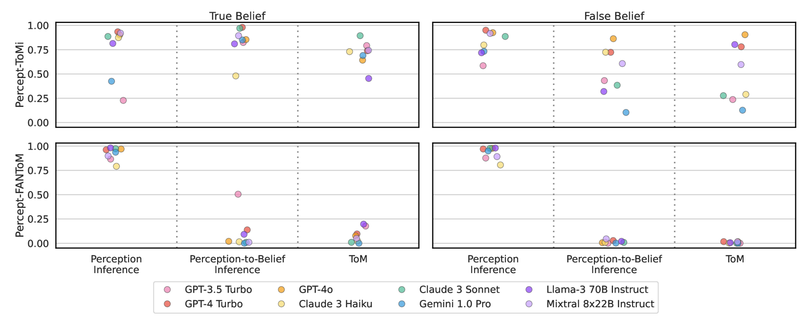
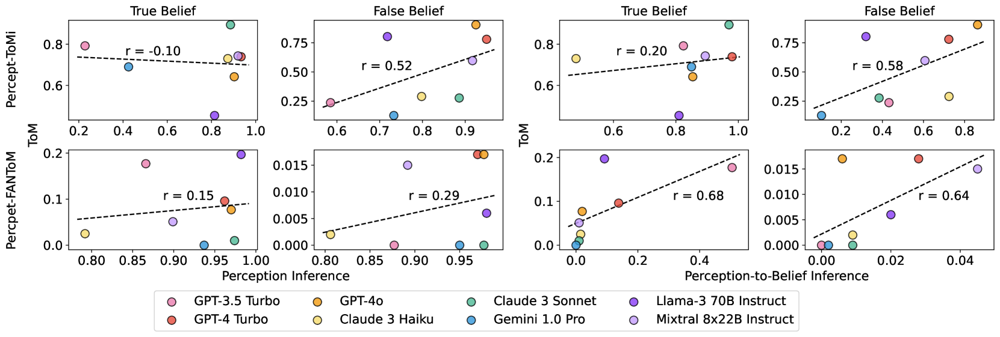

# 从感知到信念：探究大型语言模型中心智理论的先导推断

发布时间：2024年07月08日

`LLM理论` `人工智能` `心理学`

> Perceptions to Beliefs: Exploring Precursory Inferences for Theory of Mind in Large Language Models

# 摘要

> 人类自然地发展出理解他人心理状态和信念的心智理论 (ToM)，但大型语言模型 (LLM) 在这方面表现不佳。我们通过评估 LLM 中的关键 ToM 先驱——感知推理和感知到信念推理，来深化对 LLM 的 ToM 能力的理解。为此，我们创建了两个数据集，Percept-ToMi 和 Percept-FANToM，分别注释角色的感知，以评估这些先驱推理。评估显示，LLM 在感知推理上表现良好，但在感知到信念推理上能力有限。基于此，我们提出了 PercepToM，一种结合 LLM 强大感知推理能力并增强其感知到信念推理的新方法。实验证明，PercepToM 显著提升了 LLM 在错误信念场景中的性能。

> While humans naturally develop theory of mind (ToM), the capability to understand other people's mental states and beliefs, state-of-the-art large language models (LLMs) underperform on simple ToM benchmarks. We posit that we can extend our understanding of LLMs' ToM abilities by evaluating key human ToM precursors -- perception inference and perception-to-belief inference -- in LLMs. We introduce two datasets, Percept-ToMi and Percept-FANToM, to evaluate these precursory inferences for ToM in LLMs by annotating characters' perceptions on ToMi and FANToM, respectively. Our evaluation of eight state-of-the-art LLMs reveals that the models generally perform well in perception inference while exhibiting limited capability in perception-to-belief inference (e.g., lack of inhibitory control). Based on these results, we present PercepToM, a novel ToM method leveraging LLMs' strong perception inference capability while supplementing their limited perception-to-belief inference. Experimental results demonstrate that PercepToM significantly enhances LLM's performance, especially in false belief scenarios.

[Arxiv](https://arxiv.org/abs/2407.06004)