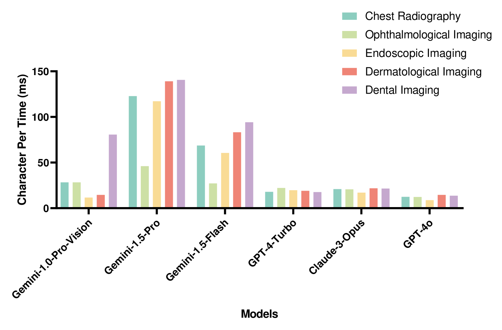

# 多模态大型语言模型在医学图像与自由文本报告数据挖掘中的应用潜力

发布时间：2024年07月08日

`LLM应用` `人工智能`

> Potential of Multimodal Large Language Models for Data Mining of Medical Images and Free-text Reports

# 摘要

> 医学图像与放射报告对诊断至关重要，定量分析在此尤为关键。然而，数据多样性与跨源异质性对现有数据挖掘方法的泛化能力构成挑战。多模态大型语言模型（MLLMs）如Gemini与GPT-4，已在多个领域引发变革，医疗领域亦受其深远影响。本研究全面评估了Gemini、GPT-4及四款流行大型模型在14个医学影像数据集上的表现，涵盖五类影像（皮肤病、放射、牙科、眼科、内窥镜）及三类报告数据集，涉及疾病分类、病变分割、解剖定位、疾病诊断、报告生成与病变检测等多项任务。实验显示，Gemini系列在报告生成与病变检测上表现卓越，但在疾病分类与解剖定位上存在挑战；GPT系列则在病变分割与解剖定位上表现优异，但在疾病诊断与病变检测上遇到难题。此外，Gemini与GPT系列均有模型展现出高效的生成能力。尽管这些模型有望减轻医生负担、缓解医疗资源压力并促进医工合作，但在临床应用前，仍需进行重大改进与全面验证。

> Medical images and radiology reports are crucial for diagnosing medical conditions, highlighting the importance of quantitative analysis for clinical decision-making. However, the diversity and cross-source heterogeneity of these data challenge the generalizability of current data-mining methods. Multimodal large language models (MLLMs) have recently transformed many domains, significantly affecting the medical field. Notably, Gemini-Vision-series (Gemini) and GPT-4-series (GPT-4) models have epitomized a paradigm shift in Artificial General Intelligence (AGI) for computer vision, showcasing their potential in the biomedical domain. In this study, we evaluated the performance of the Gemini, GPT-4, and 4 popular large models for an exhaustive evaluation across 14 medical imaging datasets, including 5 medical imaging categories (dermatology, radiology, dentistry, ophthalmology, and endoscopy), and 3 radiology report datasets. The investigated tasks encompass disease classification, lesion segmentation, anatomical localization, disease diagnosis, report generation, and lesion detection. Our experimental results demonstrated that Gemini-series models excelled in report generation and lesion detection but faces challenges in disease classification and anatomical localization. Conversely, GPT-series models exhibited proficiency in lesion segmentation and anatomical localization but encountered difficulties in disease diagnosis and lesion detection. Additionally, both the Gemini series and GPT series contain models that have demonstrated commendable generation efficiency. While both models hold promise in reducing physician workload, alleviating pressure on limited healthcare resources, and fostering collaboration between clinical practitioners and artificial intelligence technologies, substantial enhancements and comprehensive validations remain imperative before clinical deployment.

[Arxiv](https://arxiv.org/abs/2407.05758)